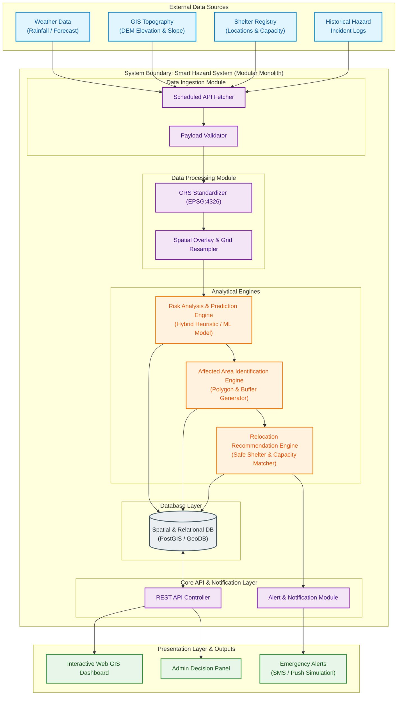

# Stage 1.1 — High-Level Architecture Design
**Project:** Smart Hazard Risk Prediction and Relocation System  
**Event:** Smart India Hackathon (SIH) 2026  
**Document Status:** Approved Architecture baseline for Stage 1 (System Design)  
**File Path:** `docs/Stage-1-System-Design/01-High-Level-Architecture.md`

---

## Executive Summary

The **Smart Hazard Risk Prediction and Relocation System** is designed to provide disaster management authorities, emergency response teams, and local citizens with early warnings, spatial vulnerability assessments, and automated safe-location relocation recommendations during natural hazards (e.g., floods, landslides, extreme rainfall events).

This document establishes the **Stage 1.1 High-Level Architecture**. It defines the core system boundaries, actors, data pipelines, module interactions, outputs, MVP scope, and architecture rationale. The architecture is intentionally designed as a **Modular Monolith** to maximize development velocity, maintainability, and feasibility for a student hackathon team while remaining cleanly extensible for enterprise-scale national rollout.

---

## 1. System Boundary & Problem Scope

### 1.1 Problem Context
Natural disasters often cause loss of life and property due to three critical gaps:
1. **Isolated Data Streams:** Weather forecasts, elevation models, historical disaster logs, and shelter data exist in silos.
2. **Delayed Risk Assessment:** Raw data is rarely transformed into immediate actionable spatial risk scores prior to event onset.
3. **Uncoordinated Evacuation/Relocation:** Citizens and emergency managers lack real-time recommendations for the nearest safe shelters matched against projected flood/landslide zones and route accessibility.

### 1.2 System Boundary Definition
The system boundary defines what is **Inside** the software platform versus what remains **External** (integrated via interfaces).

```
+-----------------------------------------------------------------------------------+
|                                 SYSTEM BOUNDARY                                   |
|                                                                                   |
|  [ Data Ingestion Module ]  --> [ GIS & Data Processing ] --> [ Risk Engine ]     |
|                                                                      |            |
|  [ Frontend Dashboard ]    <--  [ API & Logic Gateway ]    <-- [ Relocation ]     |
|         |                                                            |            |
|  [ Alerting Module ]       <-----------------------------------------+            |
|         |                                                                         |
|  [ Spatial & Relational DB ]                                                      |
+-----------------------------------------------------------------------------------+
       ^                                                                   |
       | Data Streams (Inbound)                                            | Notifications (Outbound)
+-------------------------------+                                 +------------------+
| External Systems              |                                 | External Clients |
| - Weather Forecast APIs       |                                 | - Web Browsers   |
| - GIS / Satellite Repos       |                                 | - SMS Gateway    |
| - Historical Incident DBs     |                                 | - Admin Alerts   |
+-------------------------------+                                 +------------------+
```

* **Inside the System Boundary:**
  * Automated data fetching, validation, and spatial alignment (raster/vector matching).
  * Hazard risk computation algorithms (predictive ML & heuristic weighted models).
  * Spatial analysis for affected area polygon generation & spatial buffer mapping.
  * Relocation optimization engine (shelter scoring, proximity matching, capacity constraint tracking).
  * Unified REST API backend and interactive GIS Web Dashboard.
  * Internal notification dispatch logic.

* **Outside the System Boundary (External Dependencies):**
  * Raw sensor networks, weather satellites, and third-party API availability.
  * Physical telecommunication networks (cellular SMS infrastructure, web browsers).
  * Physical disaster response actions, emergency vehicles, and on-ground deployment logistics.

---

## 2. System Actors & Stakeholders

The system caters to three primary human actors and one internal system actor:

| Actor | Primary Responsibilities & Interaction | Key Needs |
| :--- | :--- | :--- |
| **Disaster Management Officials (Admins)** | Oversees regional hazard risk maps, reviews automated relocation plans, issues official evacuation alerts, updates shelter availability status. | High-level regional risk summary, real-time alert dispatch control, decision support dashboard. |
| **First Responders & Field Teams** | Receives spatial hazard warnings, tracks safe relocation points, assists in citizen evacuation routing. | Mobile-friendly access, clear spatial boundary markers of hazard zones, shelter capacity metrics. |
| **General Citizens / Public** | Views regional risk status, searches for nearest safe shelters, receives evacuation alerts and safe navigation routes. | Simple UI, high-contrast visual indicators (Green/Yellow/Red risk zones), fast shelter lookup. |
| **System Scheduler (Automated)** | Triggers periodic background data ingestion pipelines, executes scheduled risk scoring runs, monitors external API health. | Reliable execution, error reporting, low resource overhead. |

---

## 3. Major External Data Sources & Categories

The platform ingests multi-domain data to compute hazard risk and compute relocation routes. At this architectural stage, data is classified into six high-level categories:

```
                                    +-----------------------------------+
                                    |     EXTERNAL DATA CATEGORIES      |
                                    +-----------------------------------+
                                                      |
        +------------------+------------------+-------+-------+-------------------+------------------+
        |                  |                  |               |                   |                  |
        v                  v                  v               v                   v                  v
+---------------+  +---------------+  +---------------+  +---------------+  +---------------+  +---------------+
|  1. Historical|  |  2. Weather & |  |  3. GIS &     |  | 4. Demographic|  | 5. Relocation |  |  6. Real-Time |
|     Hazard    |  | Environmental |  | Topographic   |  |   & Population|  |  Infrastructure|  | Sensor/Report |
+---------------+  +---------------+  +---------------+  +---------------+  +---------------+  +---------------+
```

1. **Historical Hazard Data:**
   * Past disaster occurrences (dates, coordinates, flood extent polygons, landslide locations).
   * Historical loss records, rainfall thresholds associated with past incidents.
2. **Weather & Environmental Data:**
   * Real-time and forecasted rainfall intensity (mm/hr), total 24h/72h precipitation accumulation.
   * Temperature, humidity, wind speed, river gauge levels, soil moisture estimates.
3. **GIS & Geographical / Topographical Data:**
   * Digital Elevation Models (DEM) for elevation, slope, and terrain aspect.
   * Land Use / Land Cover (LULC) maps (urban, forest, water bodies, agricultural land).
   * Hydrology networks (river lines, drainage basins, watershed boundaries).
   * Soil type and percolation characteristics.
4. **Population & Demographic Data:**
   * Census grid datasets (population density per sq. km).
   * Vulnerability metrics (high-density residential zones, informal settlements).
5. **Infrastructure & Relocation Site Data:**
   * Registered relief shelters, schools, community centers, elevated grounds.
   * Attributes: Max capacity, current occupancy, elevation, available facilities (water, medical, power).
   * Road network spatial data (highways, primary roads, secondary access routes).
6. **Real-Time Community/Crowdsourced Incident Reports (Optional MVP feed):**
   * Incident geotags submitted by field officers (e.g., road blocked, river overflowing).

---

## 4. End-to-End System Data Flow

The complete data lifecycle follows a unidirectional processing pipeline from raw ingestion to client visualization:

```
  +---------------------------------------------------------------------------------------+
  | 1. DATA SOURCES                                                                       |
  | External Weather APIs | Elevation Rasters | Spatial Boundaries | Shelter Registry    |
  +---------------------------------------------------------------------------------------+
                                              |
                                              v
  +---------------------------------------------------------------------------------------+
  | 2. DATA INGESTION                                                                     |
  | Scheduled Fetchers | HTTP Connectors | File Readers | Data Validation & Sanitization |
  +---------------------------------------------------------------------------------------+
                                              |
                                              v
  +---------------------------------------------------------------------------------------+
  | 3. DATA PROCESSING & SPATIAL ALIGNMENT                                                |
  | CRS Standardization (EPSG:4326) | Spatial Resampling | Clipping | Feature Overlay    |
  +---------------------------------------------------------------------------------------+
                                              |
                                              v
  +---------------------------------------------------------------------------------------+
  | 4. RISK ANALYSIS & PREDICTION ENGINE                                                  |
  | ML Inference / Rule-Based Scoring | Grid Risk Matrix | Multi-Factor Risk Calculation   |
  +---------------------------------------------------------------------------------------+
                                              |
                                              v
  +---------------------------------------------------------------------------------------+
  | 5. AFFECTED AREA IDENTIFICATION                                                       |
  | Risk Threshold Filtering | Polygon Generation | Spatial Buffer & Vulnerability Overlay|
  +---------------------------------------------------------------------------------------+
                                              |
                                              v
  +---------------------------------------------------------------------------------------+
  | 6. RELOCATION RECOMMENDATION ENGINE                                                   |
  | Safe Zone Filtering | Shelter Proximity Match | Capacity Routing & Distance Score     |
  +---------------------------------------------------------------------------------------+
                                              |
                                              v
  +---------------------------------------------------------------------------------------+
  | 7. CORE BACKEND & API GATEWAY                                                         |
  | Spatial DB Persistence | Response Caching | REST API Endpoint Controllers             |
  +---------------------------------------------------------------------------------------+
                                              |
                                              v
  +---------------------------------------------------------------------------------------+
  | 8. DASHBOARD & ALERT DISPATCH                                                         |
  | Leaflet/Mapbox GIS Layers | Risk Level Widgets | Admin Control Panel | Push/SMS Alerts |
  +---------------------------------------------------------------------------------------+
```

---

## 5. Major System Components & Modules

The system is structured as a **Modular Monolith**. Each component represents a logical domain module with clear interfaces.

```
+--------------------------------------------------------------------------------------------+
|                                    MODULAR MONOLITH CORE                                  |
|                                                                                            |
|  +------------------------+  +------------------------+  +------------------------------+  |
|  | Data Ingestion Module  |  | Data Processing Module |  | Risk Engine                  |  |
|  | - Scheduled Fetcher    |  | - Spatial Transformer  |  | - Feature Extractor          |  |
|  | - API Ingestion Client |  | - CRS Standardizer     |  | - Model Inference / Rules    |  |
|  | - Schema Validator     |  | - Grid Alignment Engine|  | - Risk Score Generator       |  |
|  +------------------------+  +------------------------+  +------------------------------+  |
|                                                                                            |
|  +------------------------+  +------------------------+  +------------------------------+  |
|  | Affected Area Engine   |  | Relocation Engine      |  | Alert & Notification Module  |  |
|  | - Threshold Filter     |  | - Shelter Evaluator    |  | - Alert Rule Evaluator       |  |
|  | - Polygon Generator    |  | - Proximity & Capacity |  | - Notification Dispatcher    |  |
|  | - Buffer Zone Mapper   |  | - Route Recommender    |  |   (Push / SMS / Email)       |  |
|  +------------------------+  +------------------------+  +------------------------------+  |
|                                                                                            |
|  +--------------------------------------------------------------------------------------+  |
|  | Core API & Backend Controller Layer                                                  |  |
|  | - REST Controllers | Auth Services | Cache Management | Data Access Layer (DAL)          |  |
|  +--------------------------------------------------------------------------------------+  |
+--------------------------------------------------------------------------------------------+
                                              |
                     +------------------------+------------------------+
                     |                                                 |
                     v                                                 v
      +-----------------------------+                   +-----------------------------+
      | Database Layer              |                   | Presentation Layer          |
      | - Relational Store          |                   | - Web GIS Dashboard         |
      | - Spatial Extension         |                   | - Admin Control Portal      |
      | - Time-Series Risk Logs     |                   | - Citizen Portal (Mobile UI)|
      +-----------------------------+                   +-----------------------------+
```

### Module Descriptions:

1. **Data Ingestion Module:**
   * **Role:** Connects to external data endpoints, pulls weather and incident feeds on a configurable cron schedule, validates incoming schemas, and drops raw payloads into the staging store.

2. **Data Processing Module (Spatial Processing):**
   * **Role:** Standardizes geographic coordinates (transforms all spatial vectors and rasters to WGS 84 / EPSG:4326), overlays weather data over elevation/slope vectors, and performs spatial aggregation into uniform grid cells.

3. **Risk Engine (Analysis & Prediction):**
   * **Role:** Takes pre-processed grid features (rainfall intensity, slope, elevation, historical hazard weight) and calculates a Normalized Risk Score (0.0 to 1.0) and Risk Level (Low, Medium, High, Critical) for each region grid cell.

4. **Affected Area Identification Engine:**
   * **Role:** Filters grid cells exceeding threshold risk values, merges adjacent high-risk cells into geographic polygons (GeoJSON format), and generates surrounding hazard buffer zones.

5. **Relocation & Safe-Location Recommendation Engine:**
   * **Role:** Identifies active shelters located strictly outside affected high-risk polygons. Computes distance, elevation differential, and capacity limits to recommend the top 3 optimal safe shelters for any selected vulnerable zone.

6. **Alert & Notification Module:**
   * **Role:** Evaluates risk changes post-computation. If a region transitions to "High" or "Critical" risk, it generates alert broadcasts for admins and dispatches mock notification messages.

7. **Core API & Backend Service Layer:**
   * **Role:** Manages business logic, orchestrates workflows, provides RESTful JSON/GeoJSON endpoints, handles authentication, and queries the database.

8. **Database Layer (Spatial & Relational Data Store):**
   * **Role:** Persists administrative boundaries, registered shelter metadata, historical risk run logs, user records, and spatial geometry indices.

9. **Frontend Dashboard (Presentation Layer):**
   * **Role:** Interactive Web GIS client displaying vector hazard overlays, risk heatmaps, shelter pins, safe evacuation routes, analytics charts, and admin action buttons.

---

## 6. Inter-Component Communication Architecture

To maintain simplicity while ensuring background compute tasks do not freeze web user requests, communication is divided into **In-Process Direct Calls** and **Asynchronous Job Execution**.

```
+------------------------------------------------------------------------------------+
|                               IN-PROCESS MONOLITH                                  |
|                                                                                    |
|  [ Web API Requests ]  --->  [ Backend Controller ]  --->  [ Database Access Layer]|
|                                      |                                  ^          |
|                                      | In-Process Call                  |          |
|                                      v                                  | Read     |
|                              [ Core Services ]                          | Write    |
|                                      |                                  |          |
|                                      v                                  |          |
|  [ Scheduled Cron ]    --->  [ Background Job Manager ] ---------------+          |
|                              (Ingestion -> Processing                              |
|                               -> Risk -> Relocation)                               |
+------------------------------------------------------------------------------------+
```

### Communication Protocols & Mechanisms:
* **Web UI <-> Backend API:** Standard HTTP/REST protocols exchanging JSON for standard data and GeoJSON for geographic vector features.
* **Backend API <-> Database:** Synchronous database driver connections using standard SQL/Spatial queries with standard connection pooling.
* **API Controller <-> Core Services:** Direct, synchronous, strongly typed in-memory method invocations inside the monolithic runtime space.
* **Scheduled Pipeline Execution:** An internal background task runner (e.g., task scheduler executing inside Python/Node runtime process) triggers data ingestion and risk computations asynchronously every $N$ hours/minutes without blocking incoming user HTTP web traffic.

---

## 7. End-to-End Data Processing Lifecycle

Here is the exact step-by-step journey of data through the system:

```
[External Sources]
      |
      | 1. Scheduled HTTP Pull (e.g. Rainfall forecast JSON / GeoTIFF)
      v
[Data Ingestion Module]
      |
      | 2. Raw Json payload validated against expected schema
      v
[Data Processing Module]
      |
      | 3. Reproject coordinates to EPSG:4326, clip raster to regional ROI boundary
      v
[Risk Engine]
      |
      | 4. Compute Risk Index: Risk = f(Rainfall, Slope, Elevation, Historical Weight)
      v
[Affected Area Engine]
      |
      | 5. Spatial thresholding (Risk > 0.70) -> Combine cells into GeoJSON Polygons
      v
[Relocation Engine]
      |
      | 6. Query shelters WHERE elevation > flood_level AND status = ACTIVE AND distance = MIN
      v
[Database Layer]
      |
      | 7. Save Risk Execution Record ID, Store GeoJSON polygons & shelter assignments
      v
[Frontend Dashboard]
      |
      | 8. Client fetches GET /api/v1/risk-map -> Renders color-coded vector map & alerts
      v
[User / Decision Maker]
```

---

## 8. Defined System Outputs

The system produces standard, actionable outputs consumed by the frontend dashboard and external clients:

| Output Category | Format | Contents / Description |
| :--- | :--- | :--- |
| **Risk Score & Level** | JSON / Numeric | Normalized score (0.00 to 1.00) and categorical level: `LOW` (<0.35), `MEDIUM` (0.35–0.65), `HIGH` (0.66–0.85), `CRITICAL` (>0.85). |
| **Affected Area Polygons** | GeoJSON (MultiPolygon) | Georeferenced boundary vector outlining identified high-risk zones and secondary buffer zones. |
| **Hazard Context Info** | JSON Payload | Hazard type (e.g., Flash Flood), forecasted intensity (e.g., 85mm rainfall/3h), projected time-to-impact (e.g., +6 Hours). |
| **Prediction Metadata** | JSON Payload | Algorithm version/type, confidence index (%), execution timestamp, input data freshness metadata. |
| **Relocation Recommendations** | JSON List / GeoJSON Pins | Top 3 recommended safe shelters per vulnerable zone including shelter name, capacity status, straight-line/road distance (km), and safe route line geometry. |
| **Dashboard Visualization** | Visual GIS Map | Interactive map with choropleth risk overlays, shelter markers, elevation contours, and drill-down risk charts. |
| **Alert Notifications** | Text / JSON Broadcast | Formatted disaster warnings (e.g., *"CRITICAL RISK: District North flooding predicted in 4 hrs. Proceed to Shelter B (Community Center)."*). |

---

## 9. Scope Separation: Must Have (MVP) vs. Future Scope

To ensure project feasibility for SIH within hackathon timelines, clear boundaries are drawn between the initial Minimum Viable Product (MVP) and future extensions.

```
+-------------------------------------------------------------------------------------+
|                                 SCOPE BREAKDOWN                                     |
+-------------------------------------------------------------------------------------+
|                     MUST HAVE (MVP SCOPE)                                           |
|  - Regional Pilot Scope (Target 1-2 vulnerable districts or river basins)          |
|  - Single Core Hazard Focus (e.g., Flood & Heavy Rainfall Risk)                     |
|  - Ingestion of Weather Forecast & Static Elevation (DEM) data                       |
|  - Hybrid Risk Scoring (Weighted Spatial Overlay & Heuristic Rules)                  |
|  - GeoJSON Affected Polygon Generation & Buffer Mapping                              |
|  - Shelter Proximity Lookup (Proximity, Elevation Check, Max Capacity constraint)   |
|  - Interactive Web GIS Dashboard (Leaflet / Mapbox UI)                              |
|  - Simulated SMS / Email Alert Dispatch Trigger                                     |
|  - Modular Monolith Architecture                                                    |
+-------------------------------------------------------------------------------------+
                                         |
                                         v
+-------------------------------------------------------------------------------------+
|                     FUTURE / OPTIONAL EXTENSIONS                                    |
|  - Multi-Hazard Expansion (Landslides, Cyclones, Wildfires)                         |
|  - Pan-India National Scale Data Pipeline                                           |
|  - Real-time IoT Water Level Sensor Integration & Telemetry                         |
|  - Deep Learning Satellite Image Segmentation (e.g., SAR Flood Mapping)             |
|  - Dynamic Traffic-Aware Evacuation Routing (OSRM / Live Traffic Integration)       |
|  - Offline Native Mobile App for Field Responders                                   |
|  - Automated Drone Evacuation Survey Integration                                    |
+-------------------------------------------------------------------------------------+
```

---

## 10. Architectural Simplicity & Monolithic Justification

### 10.1 Preferred Paradigm: Modular Monolith
For the SIH MVP, the system is designed as a **Modular Monolith** running inside a single application process containing strictly separated logical modules.

### 10.2 Why NOT Microservices / Event-Driven / Kubernetes for MVP?
* **DevOps Overhead Avoidance:** Microservices require container orchestration (Kubernetes), message brokers (Kafka/RabbitMQ), service discovery, distributed tracing, and complex deployment pipelines. For a hackathon team, this consumes 60% of development effort on infrastructure rather than solving the core disaster management problem.
* **Zero Network Overhead Between Modules:** Data processing and risk calculations occur via high-speed in-memory calls rather than serializing data over RPC/HTTP network sockets.
* **Single Deployment Unit:** The entire application backend builds and deploys as a single container or server process.
* **Easy Future Refactoring:** Because code modules are strictly bounded by domain interfaces, any individual module (e.g., Risk Engine) can be extracted into an independent microservice later if traffic warrants it.

---

## 11. High-Level Architecture Diagram (Mermaid)



---

## 12. Student & Judge Explanation Guide

When presenting this architecture to an **SIH Judge**, use this structured pitch script:

> **"Judges, our architecture is designed with three core principles: Practicality, Modular Design, and Actionable Output.**
>
> 1. **Data Ingestion & Processing:** We ingest real-time weather forecasts alongside static terrain elevation data. Our processing module transforms raw geospatial feeds into a unified coordinate space (EPSG:4326 grid).
> 2. **Risk Engine:** Instead of relying on raw data visualization alone, our Risk Engine calculates a normalized Risk Index (0.0 to 1.0) combining slope, elevation, historical flood zones, and precipitation rate.
> 3. **Actionable Relocation:** Once high-risk polygons are identified, the system doesn't just warn users—the Relocation Engine automatically queries nearby shelters, filtering out any shelter located inside the hazard zone or lacking capacity, and generates recommended safe routes.
> 4. **Modular Monolith Design:** We deliberately chose a Modular Monolith. This ensures lightning-fast development during the hackathon, zero network latency between internal processing steps, and simple deployment, while keeping modules cleanly separated so any engine can be scaled into a microservice in the future."

---

## 13. Why This Architecture? (Key Architectural Decisions)

Here are the 7 practical justifications for selecting this architecture:

1. **High Hackathon Velocity:** A Modular Monolith allows a small team to build, test, and debug the entire application locally without configuring complex container orchestration networking.
2. **Region-Agnostic & Scalable Design:** The system uses geographic boundary clipping masks. The MVP can run for a single pilot district, and expanding to an entire state simply requires providing a larger boundary configuration file without altering backend code.
3. **Decoupled Heavy Processing from Web Requests:** Spatial aggregation and risk calculations run asynchronously via scheduled background tasks, ensuring the REST API responds instantly to user map requests.
4. **GIS Industry Standards Interoperability:** By enforcing GeoJSON and standard spatial coordinate reference systems (EPSG:4326 WGS 84), the architecture integrates seamlessly with standard web mapping libraries (Leaflet, Mapbox, OpenLayers).
5. **Deterministic Fallback Capabilities:** The Risk Engine uses a hybrid design. If complex ML inference fails or input data is incomplete, it falls back to a deterministic rule-based weighted overlay model, guaranteeing that the dashboard never crashes during a live demo.
6. **Low Resource Footprint & Cost Efficiency:** The entire system stack can run on standard lightweight cloud instances or local laptops, making hosting cost-effective and accessible for evaluation.
7. **Clean Separation of Concerns:** Domain modules (Ingestion, Processing, Risk, Relocation) interact exclusively through clean programmatic interfaces, preventing "spaghetti code" and enabling team members to work on different modules concurrently.

---

## 14. Architecture Assumptions

To avoid hidden ambiguities, the system design relies on the following explicit assumptions:

1. **Data Availability:** Public weather forecast APIs (or mock stubs) and Digital Elevation Models (DEM) are accessible for the chosen pilot region.
2. **Spatial Projection Standard:** All spatial layers can be transformed into or consumed in the WGS 84 (EPSG:4326) geographic coordinate reference system.
3. **Pilot Scope Constraint:** The MVP evaluation will be demonstrated on a defined pilot region (e.g., 1–2 vulnerable districts/river basins) to demonstrate computational correctness before scaling.
4. **Internet Connectivity:** The application server has outbound HTTP internet access to pull external weather data feeds periodically.
5. **Static Infrastructure Locations:** Registered relief shelters have fixed geolocations, known maximum capacities, and static elevation values stored in the database prior to run-time.
6. **Synchronous Dashboard Access:** Users accessing the web dashboard have standard web browsers with WebGL/HTML5 canvas support for rendering map overlays.

---

## 15. Open Decisions for Later Stages

In alignment with Stage 1 engineering principles, the following tactical details are **intentionally left open** and will be finalized in subsequent design sub-stages:

| Domain | Open Decision | Target Stage for Finalization |
| :--- | :--- | :--- |
| **Data Providers & APIs** | Selection between specific weather APIs (e.g., Open-Meteo vs. OpenWeatherMap vs. IMD feeds) and DEM resolutions (30m SRTM vs. 90m DEM). | Stage 1.2 (Data Architecture) |
| **ML Risk Algorithm** | Choosing exact predictive algorithm details (Random Forest Classifier vs. Analytical Hierarchy Process [AHP] vs. Gradient Boosting). | Stage 2 (Algorithm & Model Design) |
| **Database Technology** | Selection between PostgreSQL + PostGIS extension vs. SQLite + SpatiaLite vs. MongoDB GeoJSON store. | Stage 1.3 (Storage Architecture) |
| **GIS Libraries & Frontend Tech** | Final tech stack selection for GIS rendering (Leaflet vs. Mapbox GL JS vs. Cesium) and processing (Geopandas vs. GDAL vs. Shapely). | Stage 1.4 (Technology Stack) |
| **Detailed API Schemas** | OpenAPI / Swagger endpoint definitions, exact URL routes, request/response payload contracts. | Stage 3 (API & Component Design) |
| **Deployment Infrastructure** | Selection of cloud provider (AWS/GCP/Azure/Docker Container host) and environment setup. | Stage 4 (Deployment & DevOps) |

---

## 16. Summary & Next Steps

This document completes **Stage 1.1 — High-Level Architecture**.

### Verification Checklist:
- [x] System boundary clearly defined.
- [x] Major actors identified.
- [x] External data categories categorized.
- [x] End-to-end pipeline mapped.
- [x] Modular Monolith architecture chosen and justified.
- [x] System outputs specified.
- [x] MUST HAVE (MVP) separated from Future Scope.
- [x] High-level Mermaid diagram created and explained.
- [x] Assumptions and open decisions documented.
- [x] Region-scalable for future expansion.

**Next Milestone:** Proceed to **Stage 1.2 — Data Pipeline & Ingestion Architecture**.
