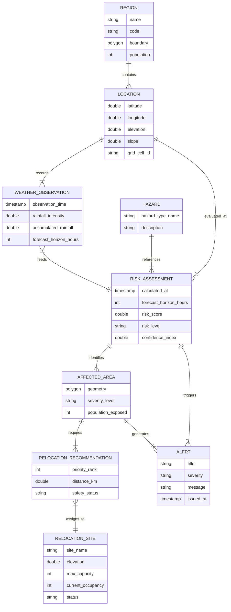

# Stage 1.2 — Domain Model Design

**Project:** Smart Hazard Risk Prediction and Relocation System  
**Event:** Smart India Hackathon (SIH) 2026  
**Document Status:** Approved Domain Model Specification (Updated Post-Architecture Review)  
**File Path:** `docs/Stage-1-System-Design/02-Domain-Model.md`

---

## Executive Summary

The **Domain Model** establishes the fundamental real-world business concepts, entities, responsibilities, and structural relationships governing the **Smart Hazard Risk Prediction and Relocation System**. 

While Stage 1.1 (*High-Level Architecture*) defined the software boundaries, modules, and pipeline flows, Stage 1.2 translates the real-world problem of natural disaster management (floods and extreme weather events) into a clean, technology-agnostic conceptual model. This domain model serves as the single source of truth for domain vocabulary and logic across software architects, backend developers, frontend engineers, and GIS data specialists.

Following the Stage 1.2 Architectural Review, the domain model has been streamlined into a **minimalist 9-entity MVP model** designed specifically for feasibility and clarity during the SIH 2026 hackathon.

---

## 1. Core Domain Entities

To maintain architectural simplicity for the SIH 2026 Minimum Viable Product (MVP), we establish a minimalist set of **9 core domain entities**. Each entity reflects a distinct, real-world business concept rather than a technical software artifact.

### 1.1 Region (MVP Core)
* **What it Represents:** An administrative or geographical boundary (e.g., District, Taluka, Watershed Basin, or Municipal Zone) subject to disaster monitoring and emergency management.
* **Why the System Needs It:** Disaster response and governance operate on administrative boundaries. The system needs `Region` as an aggregation anchor for population metrics, administrative authority, and high-level risk dashboards.
* **Conceptual Contents:** Regional name, administrative code, geographical boundary outline (bounding box/polygon), total population, primary contact authorities.
* **Scope:** **MVP Core Entity**.

### 1.2 Location (MVP Core)
* **What it Represents:** A spatial coordinate unit on the earth's surface within a monitored Region, representing both **discrete point coordinates** (latitude/longitude points) and **spatial grid cell units** (e.g., 1km × 1km raster cells) used for spatial risk calculation.
* **Why the System Needs It:** Disasters do not affect entire regions uniformly. The system requires spatial point and grid cell coordinates to evaluate localized elevation, terrain slope, weather readings, and shelter placements. Developers should note that `Location` is not merely a street address, but a fundamental GIS spatial unit.
* **Conceptual Contents:** Latitude, longitude, elevation, slope angle, grid cell index, regional association.
* **Scope:** **MVP Core Entity**.

### 1.3 Hazard (MVP Core - Reference Data)
* **What it Represents:** A category or phenomenon of natural threat that can cause harm to human life, property, or infrastructure (e.g., Flood / Heavy Rainfall).
* **Why the System Needs It:** Serves as a static reference classification for risk scoring rules and physical metrics. In the MVP, `Hazard` acts as static reference data focused on Flood and Heavy Rainfall, while keeping the architecture cleanly extensible to additional hazards (e.g., Landslide, Cyclone) in future phases.
* **Conceptual Contents:** Hazard type name, description, primary risk metrics tracked (e.g., rainfall accumulation, water stage level).
* **Scope:** **MVP Core Entity (Static Reference Data)**.

### 1.4 Weather / Environmental Observation (MVP Core)
* **What it Represents:** Real-time or forecasted meteorological and environmental measurements recorded or ingested at a given location/grid cell at a specific time.
* **Why the System Needs It:** Hazard risk computation relies directly on real-time and forecasted environmental metrics (e.g., rainfall intensity, accumulated precipitation, river stage levels).
* **Conceptual Contents:** Ingestion timestamp, forecast horizon (+3h, +6h, +24h), rainfall intensity (mm/hr), total accumulated rainfall (mm), water stage level, data source metadata.
* **Scope:** **MVP Core Entity**.

### 1.5 Risk Assessment (MVP Core - Unified Real-Time & Forecast)
* **What it Represents:** The system-calculated evaluation of disaster vulnerability and threat level for a specific spatial area at a given point in time, encompassing **both real-time (present) and forecasted (future) risk projections**.
* **Why the System Needs It:** Translates raw environmental observations and static terrain features into actionable disaster metrics (Risk Score and Risk Level). Rather than creating a separate "Prediction" entity, a single `Risk Assessment` entity represents both present and future risk via a `forecast_horizon_hours` parameter:
  * `0` = Real-time current assessment
  * `3` = 3-Hour forward forecast
  * `6` = 6-Hour forward forecast
  * `24` = 24-Hour forward forecast
* **Conceptual Contents:** Assessment timestamp, forecast horizon hours, target spatial area reference, overall normalized risk score (0.00 to 1.00), derived categorical risk level (Low, Medium, High, Critical), model confidence index, calculation version reference.
* **Scope:** **MVP Core Entity**.

### 1.6 Affected Area (MVP Core)
* **What it Represents:** A contiguous geographical spatial zone (polygon/buffer zone) identified as experiencing or predicted to experience unsafe risk levels (`HIGH` or `CRITICAL`).
* **Why the System Needs It:** Citizens and emergency managers require visual, spatial boundary outlines showing where evacuation is necessary and which areas are compromised. Downstream shelter recommendations and alerts attach directly to these polygons.
* **Conceptual Contents:** Spatial polygon geometry (GeoJSON MultiPolygon), severity level, spatial area size, estimated population exposed, risk assessment reference.
* **Scope:** **MVP Core Entity**.

### 1.7 Relocation Site (MVP Core)
* **What it Represents:** A designated safe physical shelter, community building, school, elevated facility, or relief camp suitable for housing evacuated citizens.
* **Why the System Needs It:** Emergency response requires knowing where people can safely go during a disaster event.
* **Conceptual Contents:** Site name, location coordinates, elevation, maximum capacity, current occupancy count, operational status (Active, Full, Inactive), basic amenities available (water, power, medical).
* **Scope:** **MVP Core Entity**.

### 1.8 Relocation Recommendation (MVP Core)
* **What it Represents:** An automated action recommendation pairing a vulnerable/affected area or population group to the most suitable safe `Relocation Site`(s).
* **Why the System Needs It:** During panic, citizens and authorities need clear, optimized guidance on which shelter to navigate to, avoiding overcrowded or inaccessible sites.
* **Conceptual Contents:** Associated affected area, assigned relocation site, proximity distance, route safety status, recommended priority order (Top 1, Top 2, Top 3).
* **Scope:** **MVP Core Entity**.

### 1.9 Alert (MVP Core)
* **What it Represents:** An official disaster warning notification generated when a Risk Assessment or Affected Area breaches safety thresholds.
* **Why the System Needs It:** Critical updates must be actively pushed to decision-makers, field officers, and citizens to trigger emergency response protocols.
* **Conceptual Contents:** Alert title, severity level, target region/affected area, issue timestamp, message body, target audience (Admins, Field Responders, Public).
* **Scope:** **MVP Core Entity**.

---

### Future Scope Entities (Deferred)

The following entities are recognized as valuable for enterprise disaster platforms but are **explicitly deferred to Future Scope** to keep the SIH MVP lightweight:

1. **Hazard Event (Future Scope):** Formal event lifecycle state management (e.g., event declaration, active tracking, subsiding, historical archiving). For the MVP, event and time context is handled natively via `Risk Assessment` timestamps and temporal metrics.
2. **Risk Factor (Future Scope):** Granular weighted feature variables (slope weight, soil percolation rate, population density index) for explainable multi-criteria ML models.
3. **Crowdsourced Incident Report (Future Scope):** Field-verified disaster reports submitted by citizens and emergency responders.
4. **Evacuation Route Segment (Future Scope):** Detailed turn-by-turn road network graph topology.
5. **Sensor Telemetry Device (Future Scope):** Physical IoT sensor hardware metadata and diagnostic status.

---

## 2. Entity Responsibilities

The primary business responsibilities of each entity in the MVP are summarized below:

| Entity | Primary Business Responsibility | MVP Scope |
| :--- | :--- | :--- |
| **Region** | Represents administrative boundaries, governance scope, and high-level population metrics. | **MVP Core** |
| **Location** | Represents spatial point coordinates, terrain elevation, slope, and uniform raster grid cell units. | **MVP Core** |
| **Hazard** | Provides static reference classification for disaster types (e.g., Flood & Heavy Rainfall) and evaluation rules. | **MVP Core (Ref)** |
| **Weather Observation** | Captures real-time and forecasted meteorological data (rainfall, stage levels) feeding the system. | **MVP Core** |
| **Risk Assessment** | Evaluates and holds calculated threat scores and risk levels for both current (0h) and forecasted (+3h, +6h, +24h) horizons. | **MVP Core** |
| **Affected Area** | Defines spatial geographic boundaries (polygons) of high-risk zones requiring evacuation. | **MVP Core** |
| **Relocation Site** | Maintains shelter infrastructure metadata, capacity, occupancy, elevation, and availability status. | **MVP Core** |
| **Relocation Recommendation** | Computes and stores actionable assignments pairing vulnerable areas to safe shelters. | **MVP Core** |
| **Alert** | Formats and dispatches disaster warnings to target stakeholders upon threshold breach. | **MVP Core** |
| **Hazard Event** | Tracks formal administrative event declarations and historical disaster event lifecycles. | *Future Scope* |
| **Risk Factor** | Represents granular weighted variables for explainable multi-criteria risk scoring models. | *Future Scope* |
| **Crowdsourced Incident Report** | Captures field-verified geotagged disaster reports from citizens and emergency responders. | *Future Scope* |

---

## 3. Relationships

The operational relationships between the 9 core MVP domain entities are structured below:

```
[Region] 1 ────< contains >──── N [Location]
                                     │ 1
                                     │
                                     v records
                                    N
[Hazard (Ref)] 1 ──< categorizes >── N [Weather Observation]
                                         │ N
                                         │
                                         v feeds
                                        1
                                [Risk Assessment] (0h, +3h, +6h, +24h)
                                         │ 1
                                         │
                                         v identifies
                                        1..N
                                   [Affected Area]
                                      │ 1      │ 1
                                      │        │
                     generates alert  │        │ generates
                                      v        v
                                   [Alert]   [Relocation Recommendation]
                                                  │ N
                                                  │
                                                  v points to
                                                 1..N
                                             [Relocation Site]
```

### Detailed Relationship Definitions:

1. **Region → Location**
   * **Relationship:** Region *contains* Locations.
   * **Cardinality:** `1 : N` (One Region contains multiple spatial grid cells / coordinate points).
   * **Justification:** Administrative regions consist of uniform spatial raster grid cells or discrete point locations.

2. **Location → Weather Observation**
   * **Relationship:** Location *records / receives* Weather Observations.
   * **Cardinality:** `1 : N` (One Location receives time-series environmental readings).
   * **Justification:** Weather stations and satellite grid forecasts record metrics at specific spatial coordinates.

3. **Weather Observation & Location → Risk Assessment**
   * **Relationship:** Weather Observations & Location features *feed* Risk Assessment.
   * **Cardinality:** `N : 1` (Multiple environmental readings over time feed a Risk Assessment calculation).
   * **Justification:** The Risk Engine processes weather data, slope, and elevation to compute risk scores.

4. **Hazard → Risk Assessment**
   * **Relationship:** Hazard *classifies / grounds* Risk Assessment.
   * **Cardinality:** `1 : N` (Static hazard reference data defines evaluation rules for risk assessments).
   * **Justification:** Risk assessments evaluate risk against defined physical hazard characteristics (e.g., Flood).

5. **Risk Assessment → Affected Area**
   * **Relationship:** Risk Assessment *identifies* Affected Areas.
   * **Cardinality:** `1 : N` (A risk assessment run across present or future horizons identifies high-risk spatial polygons).
   * **Justification:** High-risk grid cell clusters (`Risk Score > threshold`) are aggregated into vector polygons.

6. **Affected Area → Relocation Recommendation**
   * **Relationship:** Affected Area *generates* Relocation Recommendations.
   * **Cardinality:** `1 : N` (An affected area generates recommended safe shelter assignments).
   * **Justification:** Vulnerable populations in high-risk zones require evacuation routing options.

7. **Relocation Recommendation → Relocation Site**
   * **Relationship:** Relocation Recommendation *points to* Relocation Site.
   * **Cardinality:** `N : 1` (Multiple recommendations across different areas can point to the same safe shelter).
   * **Justification:** A single large shelter can serve multiple nearby affected zones up to its capacity limit.

8. **Risk Assessment / Affected Area → Alert**
   * **Relationship:** Risk Assessment / Affected Area *triggers* Alerts.
   * **Cardinality:** `1 : N` (High-risk status breaches trigger warning alerts across channels).
   * **Justification:** Threshold breaches necessitate alert generation for decision-makers and citizens.

---

## 4. Domain Boundaries

To enforce clean separation of concerns and maintain a **Modular Monolith** structure, the 9 core entities are grouped into **6 Logical Sub-Domains**:

```
+-----------------------------------------------------------------------------------+
|                                 DOMAIN BOUNDARIES                                 |
+-----------------------------------------------------------------------------------+
|                                                                                   |
|  [ 1. GIS & LOCATION DOMAIN ]           [ 2. HAZARD & DATA DOMAIN ]               |
|  - Region                               - Hazard (Reference Data)                 |
|  - Location (Points & Grid Cells)       - Weather Observation                     |
|                                                                                   |
|  [ 3. RISK DOMAIN ]                     [ 4. IMPACT DOMAIN ]                      |
|  - Risk Assessment (Current & Forecast) - Affected Area                           |
|                                                                                   |
|  [ 5. RELOCATION DOMAIN ]               [ 6. ALERT & NOTIFICATION DOMAIN ]        |
|  - Relocation Site                      - Alert                                   |
|  - Relocation Recommendation                                                      |
|                                                                                   |
+-----------------------------------------------------------------------------------+
```

### Domain Classification Rationale:

* **1. GIS & Location Domain (`Region`, `Location`):**
  * *Rationale:* Responsible exclusively for spatial topology, coordinate projection, administrative boundary definitions, and raster grid cell management.
* **2. Hazard & Data Domain (`Hazard`, `Weather Observation`):**
  * *Rationale:* Manages natural hazard static classification and incoming environmental data streams (rainfall, water stage levels).
* **3. Risk Domain (`Risk Assessment`):**
  * *Rationale:* Encapsulates risk calculation algorithms, ML inference execution, score normalization, and multi-horizon (+0h, +3h, +6h, +24h) risk evaluation.
* **4. Impact Domain (`Affected Area`):**
  * *Rationale:* Handles spatial thresholding, cell aggregation, and GeoJSON polygon geometry generation for high-risk zones.
* **5. Relocation Domain (`Relocation Site`, `Relocation Recommendation`):**
  * *Rationale:* Governs safe shelter registry, capacity optimization, elevation checks, and shelter matching.
* **6. Alert & Notification Domain (`Alert`):**
  * *Rationale:* Handles message creation, urgency evaluation, and warning notification delivery across roles.

---

## 5. Domain Model Diagram

The conceptual relationship between the **9 core MVP domain entities** across sub-domains is illustrated below using standard Mermaid notation:



---

## 6. Important Conceptual Distinctions

To eliminate confusion among developers and stakeholders, the following conceptual distinctions are explicitly defined:

### 6.1 Real-Time Risk vs. Forecasted Risk (Unified Risk Assessment)
* **Real-Time Risk:** The evaluation of risk status based on current environmental conditions at the present moment (`forecast_horizon_hours = 0`).
* **Forecasted Risk:** The forward-looking estimate of how risk will evolve into future time horizons (`forecast_horizon_hours = 3, 6, 24`).
* *Note:* Both real-time and forecasted risk are represented by the single unified `Risk Assessment` entity, avoiding entity duplication.

### 6.2 Hazard vs. Risk Assessment
* **Hazard:** The static classification of a natural threat type (e.g., *Flood / Heavy Rainfall*). It does not change dynamically during runtime.
* **Risk Assessment:** The dynamic, time-stamped calculation evaluating actual threat level and score (`0.00` to `1.00`) for a specific area.

### 6.3 Region vs. Location
* **Region:** A large administrative or geographic boundary polygon representing a governance zone (e.g., *Kamrup District*). Holds population totals and admin contacts.
* **Location:** A specific point coordinate (lat/long point) or spatial grid cell unit (e.g., 1km × 1km raster cell) holding localized terrain features (elevation, slope).

### 6.4 Affected Area vs. Region
* **Region:** The entire administrative area being monitored (which includes both safe and unsafe zones).
* **Affected Area:** A specific, dynamically generated spatial vector polygon outlining *only* the high-risk zones (`HIGH` or `CRITICAL`) requiring evacuation.

### 6.5 Relocation Site vs. Relocation Recommendation
* **Relocation Site:** The physical shelter facility itself (e.g., *Central High School Shelter*).
* **Relocation Recommendation:** The system's logical decision matching an affected population to a specific site, including distance, priority rank, and route safety.

### 6.6 Risk Score vs. Risk Level
* **Risk Score:** The continuous, normalized numeric outcome (e.g., `0.78` on a `0.00` to `1.00` scale) resulting from evaluating environmental and terrain metrics.
* **Risk Level:** The categorical severity classification (`LOW`, `MEDIUM`, `HIGH`, `CRITICAL`) derived deterministically from the risk score.

---

## 7. MVP vs. Future Scope

Entities are strictly partitioned into the 9 MVP Core entities and Future Scope extensions:

```
+------------------------------------------------------------------------------------+
|                                SCOPE SEPARATION                                    |
+------------------------------------------------------------------------------------+
|                     MUST HAVE (9 MVP CORE ENTITIES)                                |
|  1. Region                        6. Affected Area                                 |
|  2. Location                      7. Relocation Site                               |
|  3. Hazard (Reference Data)       8. Relocation Recommendation                     |
|  4. Weather Observation           9. Alert                                         |
|  5. Risk Assessment (0h & +N h)                                                    |
+------------------------------------------------------------------------------------+
                                         │
                                         v
+------------------------------------------------------------------------------------+
|                     FUTURE / OPTIONAL ENTITIES (DEFERRED)                          |
|  1. Hazard Event (Formal event lifecycle & administrative declarations)            |
|  2. Risk Factor (Extracted feature weights for explainable ML)                     |
|  3. Crowdsourced Incident Report (Citizen field feedback)                          |
|  4. Evacuation Route Segment (Detailed turn-by-turn road network graph)            |
|  5. Sensor Telemetry Device (Physical IoT hardware metadata)                       |
+------------------------------------------------------------------------------------+
```

---

## 8. Domain Rules

The domain model operates under strict business rules governing calculation, spatial safety, and relocation logic. **Numeric thresholds are intentionally omitted at this stage**, as exact cutoff values belong to later configuration stages:

1. **Geographical Anchoring:** Every `Risk Assessment` must belong strictly to a valid `Location` or `Region`.
2. **Temporal Horizon Parameterization:** Every `Risk Assessment` must explicitly specify its calculation timestamp and `forecast_horizon_hours` (`0` for real-time present evaluation, `>0` for future forecasts).
3. **Spatial Identifiability:** Every `Affected Area` must be geographically defined by valid spatial vector polygon coordinates (GeoJSON).
4. **Relocation Safety Exclusion:** A `Relocation Site` can only be recommended if it lies **strictly outside** any active high-risk `Affected Area` polygon.
5. **Relocation Elevation Rule (Architectural Assumption):** For flood-related hazards, a candidate `Relocation Site` should possess an elevation higher than the estimated flood/water stage level of the source `Affected Area`.
6. **Relocation Capacity Constraint:** A `Relocation Site` cannot accept new recommendations if its `current_occupancy` equals or exceeds its `max_capacity`.
7. **Risk Level Derivation:** Categorical risk levels (`LOW`, `MEDIUM`, `HIGH`, `CRITICAL`) must be deterministically derived from the computed normalized `Risk Score`.
8. **Alert Triggering Rule:** An `Alert` is automatically generated whenever a `Risk Assessment` or `Affected Area` transitions a region into `HIGH` or `CRITICAL` risk status.

---

## 9. Domain Model Assumptions

Domain design choices are categorized by certainty level:

### 9.1 Known Requirements (Verified)
* System must support spatial risk calculation for flood and heavy rainfall hazards.
* System must identify safe relocation shelters based on distance, elevation, and capacity.
* System must output vector-based risk boundary overlays (polygons) for dashboard visualization.
* System must support multi-role interaction (Admins, Responders, Citizens).

### 9.2 Architectural Assumptions (Design Decisions)
* Monolithic memory space is sufficient for handling spatial math during MVP without requiring distributed computing clusters.
* Weather observations will be ingested periodically via scheduled polling of external forecast APIs.
* Geographic coordinates will be standardized on **WGS 84 (EPSG:4326)** across all spatial entities.
* Elevation differential checks for shelter safety act as an architectural assumption subject to GIS data resolution.

### 9.3 Open Decisions (To be Finalized in Later Stages)
* Exact mathematical weights assigned to slope vs. rainfall in the risk score formula.
* Exact capacity allocation algorithms when multiple affected areas compete for the same shelter.
* Exact messaging protocols for public notification dispatch (SMS API vendor vs. browser WebPush).

---

## 10. Future Extensibility

The domain model is architected to accommodate future scaling without breaking existing entity contracts:

1. **Multiple Hazard Types:** The `Hazard` entity acts as a static reference anchor. Adding *Landslide*, *Cyclone*, or *Wildfire* requires registering new static `Hazard` types without modifying `Region`, `Relocation Site`, or `Alert` structures.
2. **Multiple Monitored Regions:** `Region` is decoupled from processing logic. The system can scale from a 2-district pilot to national pan-India coverage by adding new `Region` instances.
3. **Pluggable Prediction Engine:** `Risk Assessment` encapsulates output metrics for both present and future horizons. The underlying calculation mechanism can seamlessly swap from a simple heuristic rule engine to a complex Deep Learning model without changing entity relationships.
4. **Multi-Criteria Relocation Routing:** `Relocation Recommendation` points to `Relocation Site`. Additional constraints (e.g., road network traffic, accessibility for disabled citizens) can be added as recommendation scoring parameters without altering the core shelter entity.

---

## 11. Open Decisions

The following technical implementation details are **explicitly deferred** to subsequent technical design stages (Stage 2 and beyond):

* **Database Schemas & Tables:** No SQL table definitions, primary keys, or foreign key DDL scripts.
* **Java / Spring Boot Classes:** No `@Entity`, `@Table`, or Java POJO definitions.
* **API Endpoints & Controllers:** No REST route paths (`/api/v1/...`) or HTTP method specifications.
* **ML Model Implementation:** No Python scikit-learn / TensorFlow code or model artifact formats.
* **Numeric Threshold Values:** No hardcoded risk cutoffs (e.g., `Low = 0.0 - 0.3`).
* **GIS Engine Library:** No specific spatial library bindings (e.g., GeoTools vs. PostGIS vs. Shapely).

---

## 12. Domain Model Summary

In plain language:

> The **Smart Hazard Risk Prediction and Relocation System** continuously monitors administrative **Regions** and spatial **Locations** (covering both coordinate points and raster grid cells). Against static **Hazard** definitions (such as Flood and Heavy Rainfall), the system ingests **Weather Observations** and evaluates terrain features to produce a unified **Risk Assessment** covering present real-time risk ($0\text{h}$) and future forecast horizons ($+3\text{h}$, $+6\text{h}$, $+24\text{h}$). 
> 
> If risk levels become unsafe (`HIGH` or `CRITICAL`), the system delineates contiguous geographic **Affected Areas** requiring evacuation and automatically issues **Alerts**. Simultaneously, it evaluates registered safe **Relocation Sites** (checking shelter capacity, elevation safety, and proximity) to generate actionable **Relocation Recommendations**, guiding vulnerable citizens and emergency responders to safety.

---

### Verification Checklist (Updated Post-Review)
- [x] Document updated at `docs/Stage-1-System-Design/02-Domain-Model.md`.
- [x] Exactly 9 MVP core domain entities represented (`Region`, `Location`, `Hazard`, `Weather Observation`, `Risk Assessment`, `Affected Area`, `Relocation Site`, `Relocation Recommendation`, `Alert`).
- [x] `Prediction` merged into `Risk Assessment` via `forecast_horizon_hours` parameter.
- [x] `Hazard Event` moved to Future Scope; event context represented through `Risk Assessment` temporal parameters.
- [x] `Location` explicitly documented as covering geographic point coordinates AND spatial grid cells.
- [x] `Hazard` documented as static reference data for MVP Flood scope.
- [x] Mermaid ER diagram updated to reflect the 9-entity model.
- [x] No Java/Spring Boot code, database schema, or APIs created.
- [x] `docs/Stage-1-System-Design/01-High-Level-Architecture.md` preserved without modification.
