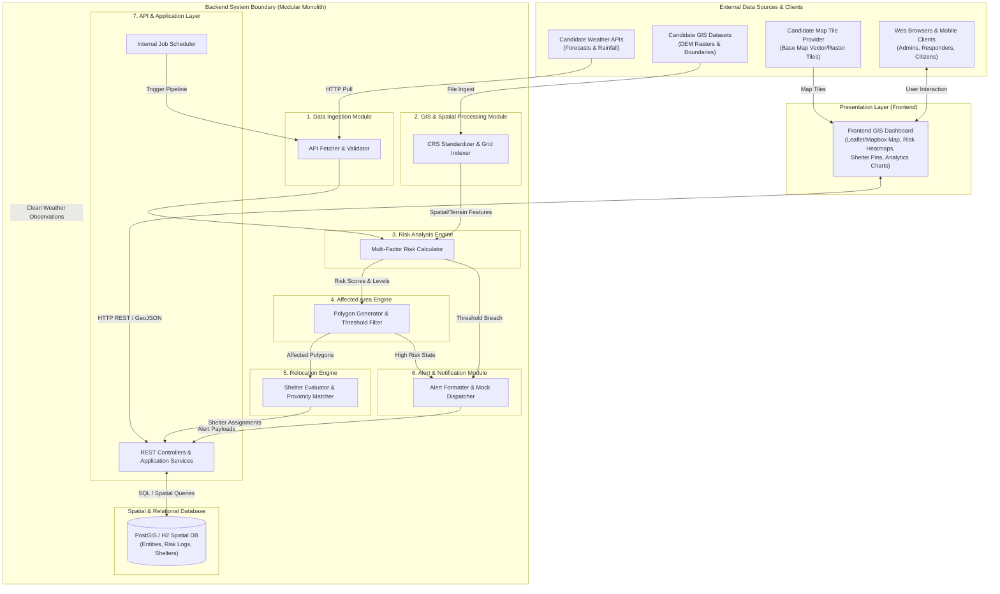

# Stage 1.3 — Module Boundaries Specification

**Project:** Smart Hazard Risk Prediction and Relocation System  
**Event:** Smart India Hackathon (SIH) 2026  
**Document Status:** Approved Module Boundaries Baseline for Stage 1 (System Design)  
**File Path:** `docs/Stage-1-System-Design/03-Module-Boundaries.md`

---

## Executive Summary

This document establishes the **Stage 1.3 Module Boundaries Specification** for the **Smart Hazard Risk Prediction and Relocation System**. Building upon the High-Level Architecture ([`01-High-Level-Architecture.md`](file:///Users/apple/Desktop/Namandeep%20Tripathi/My%20Projects/Hazard-Project/docs/Stage-1-System-Design/01-High-Level-Architecture.md)) and the 9-entity Domain Model ([`02-Domain-Model.md`](file:///Users/apple/Desktop/Namandeep%20Tripathi/My%20Projects/Hazard-Project/docs/Stage-1-System-Design/02-Domain-Model.md)), this specification defines:

1. The logical software modules inside our system.
2. The exact business responsibilities, inputs, outputs, and domain entity ownership of each module.
3. Inter-module dependency flows, data exchanges, and communication protocols.
4. The boundary separation between Frontend and Backend, as well as External Integrations.
5. Rationale for maintaining a clean **Modular Monolith** architecture for the SIH 2026 Minimum Viable Product (MVP).

---

## 1. Identification of Logical Modules

To achieve high cohesion and low coupling while remaining realistic for a hackathon MVP, the system is organized into **8 core logical modules** (7 backend modules and 1 presentation module):

```
+-----------------------------------------------------------------------------------+
|                               SYSTEM MODULE MATRIX                                |
+-----------------------------------------------------------------------------------+
|                                                                                   |
|  [ 1. Data Ingestion Module ]        [ 2. GIS & Spatial Processing Module ]       |
|  [ 3. Risk Analysis Engine ]         [ 4. Affected Area Engine ]                  |
|  [ 5. Relocation Engine ]            [ 6. Alert & Notification Module ]           |
|  [ 7. API & Application Layer ]      [ 8. Frontend GIS Dashboard (Presentation) ] |
|                                                                                   |
+-----------------------------------------------------------------------------------+
```

These 8 modules reflect a minimal, non-redundant architecture where each module owns a single business capability.

---

## 2. Module Responsibilities Matrix

The table below outlines the core responsibility, ownership scope, inputs, outputs, and associated domain entities for each module:

| Module | Primary Responsibility | Owns | Does NOT Own | Main Inputs | Main Outputs | Domain Entities |
| :--- | :--- | :--- | :--- | :--- | :--- | :--- |
| **1. Data Ingestion** | Ingests, validates, and normalizes raw external weather forecasts and environmental data. | Scheduled API fetchers, schema validation, raw payload staging. | Spatial coordinate projection, risk scoring math. | Candidate Weather APIs, Rainfall Forecast JSONs. | Validated Weather Observation Records. | `Weather Observation` |
| **2. GIS & Spatial Processing** | Manages spatial topologies, CRS transformations, and terrain/grid cell feature extraction. | CRS conversion (EPSG:4326), spatial grid cell index, regional boundary polygons, terrain elevation/slope. | Mathematical risk scoring formulas, weather API fetching, shelter matching. | Raw coordinate data, Candidate DEM Rasters. | Standardized Spatial Grid Cells, Slope/Elevation Features, & Regional Topologies. | `Region`, `Location` |
| **3. Risk Analysis Engine** | Computes normalized risk scores and categorical risk levels across Present (0h) and Forecast (+3h, +6h, +24h) horizons. | Multi-horizon risk scoring algorithm, risk weight matrices, hazard rule evaluation. | Spatial polygon generation, shelter selection, raw API pulling. | Validated Weather Observations (Data Ingestion) + Spatial/Terrain Features (GIS Module). | Computed Risk Assessment Records (Score & Level). | `Hazard`, `Risk Assessment` |
| **4. Affected Area Engine** | Filters high-risk grid cells and aggregates them into vector polygons. | Spatial threshold filtering, grid cell merging, GeoJSON polygon boundary generation. | Risk score calculation, shelter assignment. | Computed Risk Assessment Records, Spatial Grid Cells. | GeoJSON Affected Area Polygons & Exposed Population. | `Affected Area` |
| **5. Relocation Engine** | Evaluates shelter safety, proximity distance, and capacity limits to recommend safe evacuation sites. | Shelter registry metadata, elevation differential checks, capacity constraints, distance ranking. | Flood risk computation, user notification dispatch. | GeoJSON Affected Area Polygons, Shelter Registry Records. | Ranked Relocation Recommendations (Top 1, 2, 3). | `Relocation Site`, `Relocation Recommendation` |
| **6. Alert & Notification** | Formats and dispatches disaster warnings upon risk threshold breach. | Warning message formatting, notification rule evaluation, push/SMS mock dispatching. | Risk score calculation, spatial polygon generation. | Risk Assessment state changes, Affected Area Polygons. | Formatted Alert Broadcast Messages. | `Alert` |
| **7. API & Application Layer** | Exposes REST endpoints, orchestrates application use cases, handles auth, security, and persistence coordination. | REST Controllers, Application Service Orchestration, Auth/Security, Data Access Layer (DAL) coordination. | Domain calculation logic (delegates to core modules). | HTTP REST Requests (JSON/GeoJSON), Admin Actions. | HTTP REST Responses, Spatial DB persistence. | Serves all 9 Entities via Application Layer |
| **8. Frontend GIS Dashboard** | Provides interactive web visualization, map rendering, risk charts, and admin actions. | Web GIS Map UI (Leaflet/Mapbox), chart widgets, filter state, citizen view. | Business rules, risk math, spatial aggregation, DB queries. | REST API JSON/GeoJSON Payloads. | Rendered GIS Map Layers, Admin Evacuation Triggers. | Consumes UI representations |

---

## 3. Detailed Module Boundaries

### 3.1 Data Ingestion Module
* **Boundary & Ownership:** Owns scheduled external API polling, payload schema validation, error handling for external network timeouts, and staging raw environmental metrics.
* **Does NOT Own:** Coordinate transformations, spatial grid indexing, risk score math, persistent spatial database storage.
* **Inputs:** Candidate HTTP JSON weather forecast feeds.
* **Outputs:** Clean, validated `Weather Observation` records.

### 3.2 GIS & Spatial Processing Module
* **Boundary & Ownership:** Owns spatial geometry representation, coordinate reference system (CRS) standardization to **WGS 84 (EPSG:4326)**, terrain elevation/slope grid cell raster extraction, and administrative regional boundary containment checks.
* **Does NOT Own:** Weather API pulling, risk score formula execution, shelter capacity tracking.
* **Inputs:** Raw latitude/longitude points, candidate DEM elevation rasters, administrative boundary shapefiles.
* **Outputs:** Standardized spatial `Location` grid cells, terrain elevation/slope features, and `Region` boundary geometries.

### 3.3 Risk Analysis Engine
* **Boundary & Ownership:** Owns the multi-factor risk calculation algorithm ($Risk = f(Rainfall, Slope, Elevation, Historical Weight)$), score normalization ($0.00$ to $1.00$), risk level categorization (`LOW`, `MEDIUM`, `HIGH`, `CRITICAL`), and multi-horizon projection ($0\text{h}$, $+3\text{h}$, $+6\text{h}$, $+24\text{h}$).
* **Does NOT Own:** Raw data fetching, spatial polygon merging, UI rendering.
* **Inputs:** Clean `Weather Observation` metrics (from Data Ingestion) + Spatial/Terrain features (slope, elevation, grid cells from GIS Module).
* **Outputs:** `Risk Assessment` records with score, level, and forecast horizon.

### 3.4 Affected Area Engine
* **Boundary & Ownership:** Owns risk threshold filtering (identifying grid cells where `Risk Score > Threshold`), spatial clustering/aggregation of adjacent cells, and vector polygon (GeoJSON MultiPolygon) boundary construction for impacted zones.
* **Does NOT Own:** Risk score calculation, shelter assignment, alert dispatching.
* **Inputs:** `Risk Assessment` grid runs + `Location` spatial geometries.
* **Outputs:** `Affected Area` vector polygons with exposed population estimates.

### 3.5 Relocation Engine
* **Boundary & Ownership:** Owns safe shelter lookup, filtering shelters located strictly outside active `Affected Area` polygons, checking shelter elevation relative to predicted water levels, enforcing capacity constraints (`occupancy < max_capacity`), and computing proximity distance rankings (Top 1, Top 2, Top 3).
* **Does NOT Own:** Risk score computation, road network turn-by-turn routing graphs (deferred).
* **Inputs:** `Affected Area` vector polygons + `Relocation Site` registry records.
* **Outputs:** `Relocation Recommendation` assignments for vulnerable zones.

### 3.6 Alert & Notification Module
* **Boundary & Ownership:** Owns disaster warning message formatting, notification rule evaluation (triggering when risk transitions to `HIGH` or `CRITICAL`), and mock dispatching to administrators, field responders, and public clients.
* **Does NOT Own:** Risk evaluation, spatial polygon calculation.
* **Inputs:** Risk Assessment threshold breaches, Affected Area geometries.
* **Outputs:** Formatted `Alert` payloads dispatched to presentation clients and mock notification channels.

### 3.7 API & Application Layer
* **Boundary & Ownership:** Owns HTTP REST request routing, JSON/GeoJSON serialization, application security/authentication, use case orchestration, and Data Access Layer (DAL) persistence coordination.
* **Does NOT Own:** Mathematical risk algorithms or spatial polygon generation logic (delegates to domain modules).
* **Inputs:** HTTP requests from Frontend, internal background job triggers.
* **Outputs:** Structured JSON REST responses, SQL/Spatial DB read/write operations.

### 3.8 Frontend GIS Dashboard (Presentation)
* **Boundary & Ownership:** Owns web UI layout, interactive GIS map rendering (choropleth risk layers, shelter markers, affected polygon vectors), analytics chart controls, and user filter state.
* **Does NOT Own:** Any backend business logic, risk scoring, spatial vector geometry processing, or database access.
* **Inputs:** JSON/GeoJSON REST API endpoints.
* **Outputs:** Rendered visual map interface, user admin control interactions.

---

## 4. Domain Entity Ownership

To guarantee strict responsibility separation, each of the **9 MVP Domain Entities** is assigned to exactly **ONE primary owning module** that governs its business behavior:

| Domain Entity | Primary Owning Module | Ownership Rationale |
| :--- | :--- | :--- |
| **1. Region** | **GIS & Spatial Processing Module** | Owns administrative boundary polygons, spatial containment, and governance topology. |
| **2. Location** | **GIS & Spatial Processing Module** | Owns spatial point coordinates, terrain elevation, slope, and raster grid cell indices. |
| **3. Hazard** | **Risk Analysis Engine** | Owns static hazard reference classifications, evaluation metrics, and risk formula rules. |
| **4. Weather Observation** | **Data Ingestion Module** | Owns external weather stream ingestion, schema validation, and observation staging. |
| **5. Risk Assessment** | **Risk Analysis Engine** | Owns risk score computation, level derivation, confidence scoring, and multi-horizon projections. |
| **6. Affected Area** | **Affected Area Engine** | Owns spatial threshold filtering, grid cell aggregation, and GeoJSON polygon generation. |
| **7. Relocation Site** | **Relocation Engine** | Owns shelter infrastructure metadata, capacity, occupancy, elevation, and availability status. |
| **8. Relocation Recommendation** | **Relocation Engine** | Owns proximity distance ranking, shelter suitability matching, and capacity allocation logic. |
| **9. Alert** | **Alert & Notification Module** | Owns disaster warning formatting, broadcast rules, urgency classification, and dispatching. |

> **Note:** While other modules may consume or reference these entities (e.g., API & Application Layer serializes them for the UI), **only the primary owning module** contains the business logic to construct, calculate, or modify the entity state.

---

## 5. Module Dependencies

The dependency structure between logical modules feeds parallel inputs into the Risk Analysis Engine:

```
+-----------------------+     +--------------------------+
|  1. Data Ingestion    |     | 2. GIS & Spatial Process |
+-----------------------+     +--------------------------+
            │                              │
            │ (Weather Obs)                │ (Spatial/Terrain Features)
            └───────────────┬──────────────┘
                            v
                +-----------------------+
                | 3. Risk Engine        |
                +-----------------------+
                            │
                            v
                +-----------------------+
                | 4. Affected Area Eng  |
                +-----------------------+
                            │
             +--------------+--------------+
             │                             │
             v                             v
+-----------------------+     +-----------------------+
| 5. Relocation Engine  |     | 6. Alert & Notif      |
+-----------------------+     +-----------------------+
             │                             │
             +--------------+--------------+
                            │
                            v
                +-----------------------+
                | 7. API & App Layer    |
                +-----------------------+
                            │
                            v
                +-----------------------+
                | 8. Frontend Dashboard |
                +-----------------------+
```

### Key Dependency Guidelines:
* **Parallel Data Feed to Risk Engine:** `Weather Observation` data (from Data Ingestion) and `Spatial / Terrain Features` (from GIS & Spatial Processing) feed directly into the `Risk Analysis Engine` without forcing weather data through the GIS module.
* **No Circular Dependencies:** Processing flows strictly downstream towards Impact Aggregation $\rightarrow$ Relocation / Alerting $\rightarrow$ API & Application Layer $\rightarrow$ Presentation.
* **Decoupled Relocation & Alerting:** The `Relocation Engine` and `Alert Module` operate independently; neither depends on the other. Both consume outputs from the `Affected Area Engine` and `Risk Engine`.

---

## 6. Data Flow Between Modules

The end-to-end data lifecycle across module boundaries proceeds through the following interaction steps:

```
[Candidate Weather APIs] ─────> [1. Data Ingestion] ─────────┐ (Clean Weather Observations)
                                                             ↓
[Candidate GIS Datasets] ────> [2. GIS & Spatial Proc] ───> [3. Risk Analysis Engine]
                                                                     │
                                                                     │ (Risk Scores & Levels)
                                                                     v
                                                            [4. Affected Area Engine]
                                                                     │
                                                     +---------------+---------------+
                                                     │                               │
                                                     v                               v
                                          [5. Relocation Engine]          [6. Alert Module]
                                                     │                               │
                                                     +---------------+---------------+
                                                                     │
                                                                     v
                                                          [7. API & Application Layer]
                                                                     │
                                                                     v
                                                          [8. Frontend GIS Dashboard]
```

---

## 7. Synchronous vs. Asynchronous Communication

For the SIH 2026 MVP, communication protocols are categorized conceptually into **Synchronous In-Process Invocations** and **Asynchronous Scheduled Background Jobs**:

```
+------------------------------------------------------------------------------------+
|                               IN-PROCESS MONOLITH                                  |
+------------------------------------------------------------------------------------+
|                                                                                    |
|  [ Web UI Requests ]  --->  [ API & App Layer ]   ---> [ In-Memory Service Call ]   |
|                                      │                                 │           |
|                                      v                                 v           |
|  [ Internal Scheduler ] ---> [ Periodic Pipeline ] ---> [ Database Access Layer]   |
|                              (Ingestion -> Risk ->                                 |
|                               Relocation -> Alert)                                 |
|                                                                                    |
+------------------------------------------------------------------------------------+
```

### Architectural Decisions:
1. **User HTTP Web Traffic (Synchronous):** When a user views the dashboard or requests relocation options, the Frontend communicates with the Backend via standard **Synchronous HTTP REST requests**.
2. **Background Compute Pipeline (Periodic Background Processing):** Data ingestion, spatial risk calculation, polygon generation, and alert evaluation execute periodically via an **internal background scheduler running inside the monolithic process**.
   > **Note on Refresh Interval:** The exact background refresh frequency is deferred and will be finalized in a later technology/data-source design stage based on external data-source update frequencies, API rate limits, and operational system requirements.
3. **No Heavy External Message Brokers for MVP:** We explicitly **reject** external message brokers (such as Apache Kafka or RabbitMQ) for the MVP. In-memory method invocations inside a single application process provide zero network overhead, simpler debugging, and zero infrastructure deployment friction.

---

## 8. Modular Monolith Architectural Decision

### Decision: **Modular Monolith**
The backend software architecture for the MVP is strictly designated as a **Modular Monolith** running inside a single application process (e.g., Spring Boot), organized into strict package boundaries.

### Justification:
* **Zero DevOps Overhead:** Eliminates Kubernetes clusters, service discovery, API gateways, and distributed network tracing, allowing the student team to focus 100% on domain logic and UI execution.
* **In-Memory Speed:** Spatial matrix math and risk computations pass in-memory data structures directly between modules without binary/JSON network serialization overhead.
* **Simplified Demonstration & Setup:** The entire platform builds as a single unit and runs locally on a laptop using standard local storage or database tools.
* **Clean Future Microservice Refactoring:** Because module boundaries and entity ownership are strictly defined, any individual module (e.g., `Risk Analysis Engine`) can be extracted into an independent microservice in the future if traffic demands scale.

---

## 9. Frontend vs. Backend Boundary

A strict boundary separates presentation concerns from core backend execution:

```
+------------------------------------------+------------------------------------------+
|          FRONTEND RESPONSIBILITIES       |         BACKEND RESPONSIBILITIES         |
+------------------------------------------+------------------------------------------+
| - Render Map GIS layers (Leaflet/Mapbox) | - Ingest & clean weather API data        |
| - Render choropleth risk color overlays  | - Execute coordinate transformations     |
| - Display shelter pins & route lines     | - Compute mathematical risk scores       |
| - Render analytics charts & widgets      | - Delineate GeoJSON affected polygons    |
| - Manage UI filter selections & tabs     | - Execute shelter capacity/proximity math|
| - Handle user admin click interactions   | - Persist spatial data & logs            |
|                                          | - Expose REST JSON/GeoJSON endpoints     |
+------------------------------------------+------------------------------------------+
```

---

## 10. External System Boundaries

The system interacts with a minimal set of external service categories:

| External System Category | Interaction Type | Direction | Data Exchanged | MVP Status |
| :--- | :--- | :--- | :--- | :--- |
| **Candidate Weather APIs** | Polled HTTP GET | Inbound | Rainfall intensity, accumulation forecasts. | **Candidate / TBD** (e.g., Open-Meteo / IMD) |
| **Candidate GIS Topography Repositories** | Static File Load | Inbound | DEM elevation & slope rasters, District boundaries. | **Candidate / TBD** (e.g., USGS DEM / Bhuvan) |
| **Relocation Shelter Registry** | DB / Config File | Inbound | Shelter locations, capacity, elevation. | **Internal Seed Dataset / TBD** |
| **SMS / Email Gateway** | Mock Dispatcher | Outbound | Disaster warning alerts. | **Simulated Mock / TBD** |
| **Candidate Mapping Tiles API** | HTTP GET | Inbound | Base map raster/vector tiles. | **Candidate / TBD** (e.g., OpenStreetMap / Carto) |

> **Note:** Final selection of specific third-party API providers, data vendors, and map tile services will be finalized during the later Technology Decisions stage.

---

## 11. System Module Architecture Diagram

The overall software module architecture is presented below using standard Mermaid notation:



---

## 12. MVP Scope vs. Future Module Partitioning

```
+------------------------------------------------------------------------------------+
|                                MODULE SCOPE PARTITION                              |
+------------------------------------------------------------------------------------+
|                     MUST HAVE (MVP MODULES)                                        |
|  1. Data Ingestion Module                                                          |
|  2. GIS & Spatial Processing Module                                                |
|  3. Risk Analysis Engine                                                           |
|  4. Affected Area Engine                                                           |
|  5. Relocation Engine                                                              |
|  6. Alert & Notification Module (Mock Dispatch)                                    |
|  7. API & Application Layer                                                        |
|  8. Frontend GIS Dashboard                                                         |
+------------------------------------------------------------------------------------+
                                         │
                                         v
+------------------------------------------------------------------------------------+
|                     FUTURE / OPTIONAL MODULES (DEFERRED)                           |
|  1. IoT Sensor Telemetry Pipeline (Direct stream processing for water level sensors) |
|  2. Crowdsourced Field Incident Module (Citizen report ingestion & verification)   |
|  3. Dynamic Traffic-Aware Routing Module (Turn-by-turn road network graph & OSRM)  |
|  4. Deep Learning Image Segmentation Module (Satellite SAR flood extraction)       |
|  5. Multi-Channel SMS/Cell-Broadcast Gateway (Physical telco API integration)      |
+------------------------------------------------------------------------------------+
```

---

## 13. Avoidance of Over-Engineering

To protect project velocity for the hackathon, the module architecture explicitly enforces:

1. **No Microservices Overhead:** Single monolithic container deployment.
2. **No External Message Brokers:** In-memory method calls instead of Kafka/RabbitMQ.
3. **No Overlapping Entity Ownership:** Each entity has exactly one primary owning module.
4. **No Circular Dependencies:** Unidirectional processing pipeline.
5. **No Premature Routing Engine:** Straight-line spatial distance & elevation differential checks used for shelter matching instead of complex turn-by-turn road graph engines.

---

## 14. Architecture Consistency Verification

* **Alignment with Stage 1.1:** Every component in [`01-High-Level-Architecture.md`](file:///Users/apple/Desktop/Namandeep%20Tripathi/My%20Projects/Hazard-Project/docs/Stage-1-System-Design/01-High-Level-Architecture.md) maps cleanly to one of the 8 logical modules.
* **Alignment with Stage 1.2:** All 9 MVP Core Domain Entities in [`02-Domain-Model.md`](file:///Users/apple/Desktop/Namandeep%20Tripathi/My%20Projects/Hazard-Project/docs/Stage-1-System-Design/02-Domain-Model.md) have a unique, non-overlapping primary owning module.
* **Terminology Uniformity:** Consistent usage of `Region`, `Location`, `Risk Assessment`, `Affected Area`, `Relocation Site`, and `Relocation Recommendation` throughout.

---

## 15. Deferred Technical Decisions (Open Decisions)

The following implementation choices remain intentionally deferred to later design stages:

* **Programming Language & Packages:** Specific Java package paths (`com.hazard...`).
* **Database Technology & Schema:** Specific database engine selection (PostGIS vs. H2 Spatial) and DDL scripts.
* **Framework Classes & Annotations:** `@Service`, `@Repository`, or `@RestController` code definitions.
* **GIS Engine Library:** Specific spatial library bindings (GeoTools vs. PostGIS vs. Shapely).
* **API Endpoints:** Specific URI routes (`/api/v1/...`).
* **Exact Refresh Frequency:** Background job interval to be finalized based on provider rate limits.
* **Third-Party Providers:** Final selection of weather, map tile, and DEM providers.

---

## 16. Final Architectural Review & Verdict

### Architectural Summary Checklist
- **A. Final MVP Module List:** 8 Logical Modules (7 Backend + 1 Frontend).
- **B. Module Responsibility Summary:** Clear, non-overlapping boundaries covering Ingestion, GIS, Risk, Affected Area, Relocation, Alert, API & Application Layer, and UI.
- **C. Domain Entity Ownership Summary:** 100% unique primary ownership across all 9 MVP domain entities.
- **D. Module Dependency Summary:** Parallel feed into Risk Engine; strictly unidirectional downstream processing without circular references.
- **E. Modular Monolith Decision:** Fully justified for zero DevOps friction, in-memory speed, and simple local execution during SIH 2026.
- **F. Boundary Problems Avoided:** Clear separation between GIS spatial math, weather data ingestion, risk scoring, and shelter recommendation.
- **G. Over-Engineering Risks Avoided:** Rejection of microservices, message queues, and turn-by-turn road graph engines for MVP.
- **H. Deferred Open Decisions:** Database schemas, Java code, API endpoints, refresh frequencies, and provider selections cleanly deferred.

---

### Final Architectural Verdict: **APPROVED WITH MINOR CORRECTIONS**

> The **Stage 1.3 Module Boundaries Specification** is fully approved as the technical baseline for Stage 1 System Design. It provides a minimal, clean, robust, and extensible modular monolithic foundation ready for subsequent data architecture and component design.
