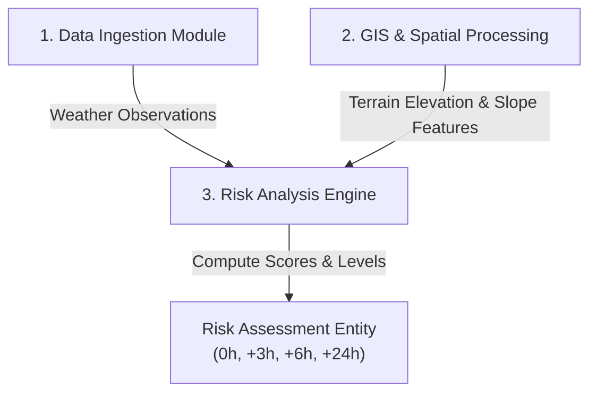
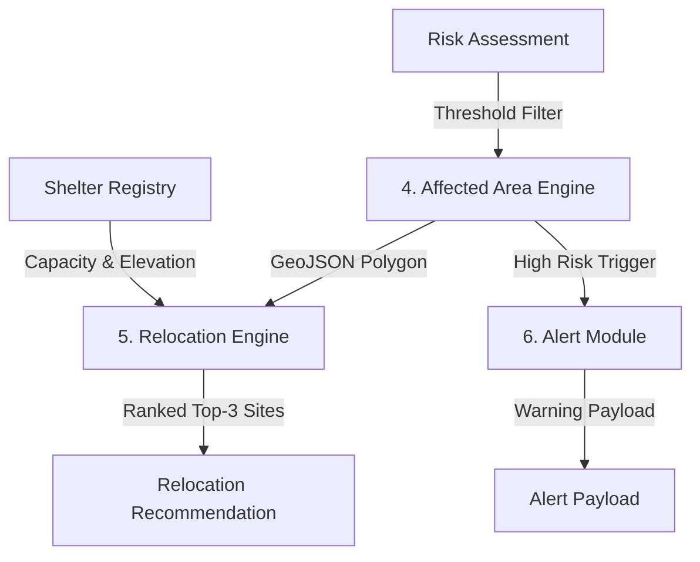
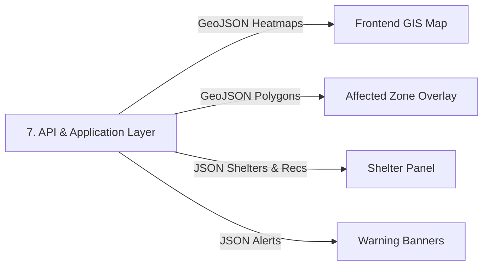
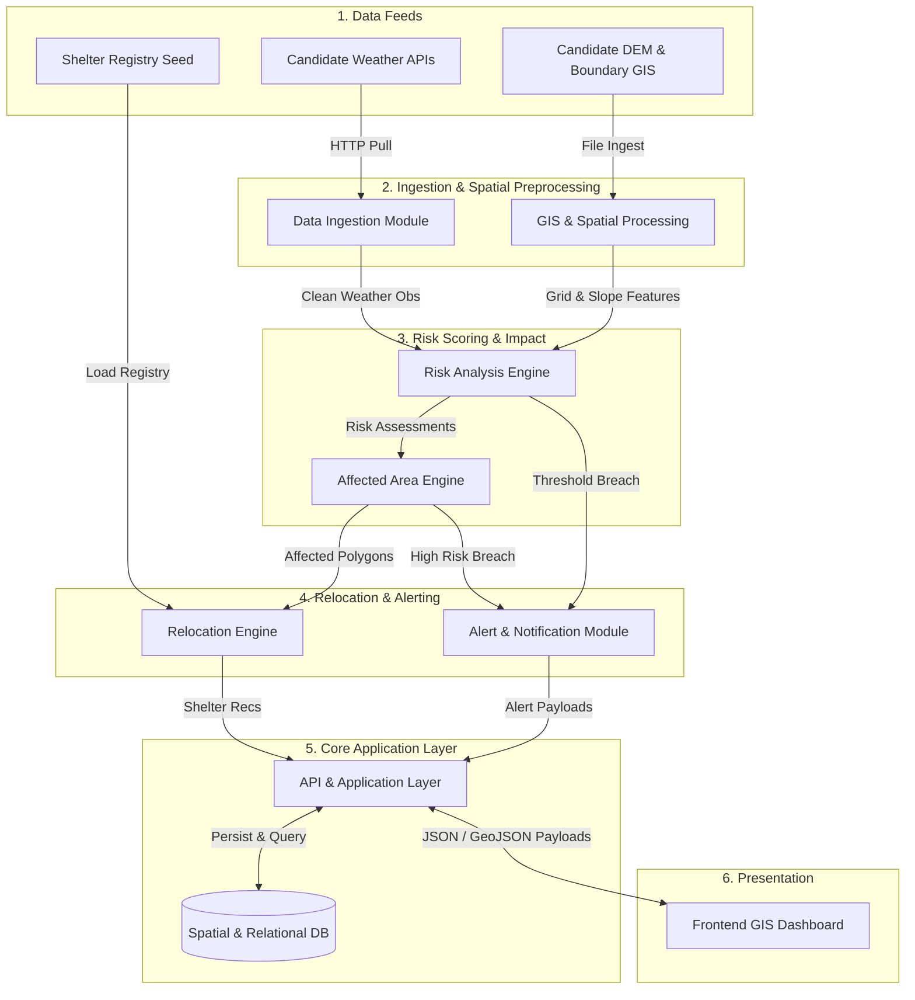

# Stage 1.4 — Data Flow Specification

**Project:** Smart Hazard Risk Prediction and Relocation System  
**Event:** Smart India Hackathon (SIH) 2026  
**Document Status:** Approved Data Flow Specification for Stage 1 (System Design)  
**File Path:** `docs/Stage-1-System-Design/04-Data-Flow.md`

---

## Executive Summary

This document defines the complete **Stage 1.4 Data Flow Specification** for the **Smart Hazard Risk Prediction and Relocation System**. Building directly upon the approved High-Level Architecture ([`01-High-Level-Architecture.md`](file:///Users/apple/Desktop/Namandeep%20Tripathi/My%20Projects/Hazard-Project/docs/Stage-1-System-Design/01-High-Level-Architecture.md)), 9-Entity Domain Model ([`02-Domain-Model.md`](file:///Users/apple/Desktop/Namandeep%20Tripathi/My%20Projects/Hazard-Project/docs/Stage-1-System-Design/02-Domain-Model.md)), and Module Boundaries ([`03-Module-Boundaries.md`](file:///Users/apple/Desktop/Namandeep%20Tripathi/My%20Projects/Hazard-Project/docs/Stage-1-System-Design/03-Module-Boundaries.md)), this document details:

1. How data originates, enters, passes through, and transforms across the 8 system modules.
2. How raw environmental and GIS datasets are ingested, validated, and mapped into domain objects.
3. How `Weather Observation` metrics and `Spatial / Terrain Features` independently feed the `Risk Analysis Engine`.
4. How `Risk Assessment` outputs generate `Affected Area` polygons, safe `Relocation Recommendation` assignments, and `Alert` notifications.
5. How data payloads are served conceptually from the `API & Application Layer` to the `Frontend GIS Dashboard`.

---

## 1. Objective & End-to-End Data Lifecycle Overview

The primary objective of the data pipeline is to transform raw external environmental readings and static terrain features into actionable disaster spatial overlays and evacuation recommendations. 

The complete data lifecycle follows a 7-stage unidirectional transformation model:

```
[1. External Data Sources]
           │
           │ (Raw HTTP Payloads & GIS Files)
           v
[2. Data Ingestion & GIS Processing] ──> (Clean Observations & Spatial Grid Features)
           │
           v
[3. Risk Analysis Engine] ───────────────> (Risk Scores & Categorical Levels: 0h, +3h, +6h, +24h)
           │
           v
[4. Affected Area Engine] ──────────────> (GeoJSON High-Risk Polygons & Population Impact)
           │
     ┌─────┴────────────────┐
     v                      v
[5. Relocation Engine]  [6. Alert Module]
     │                      │
     └─────┬────────────────┘
           v
[7. API & Application Layer] ───────────> (Structured JSON / GeoJSON Response Payloads)
           │
           v
[8. Frontend GIS Dashboard] ────────────> (Interactive Visual Map Layers & Alert Alerts)
```

---

## 2. External Data Sources & Categories

The MVP processes 6 core categories of data. In accordance with Stage 1 design principles, external third-party providers are maintained as **Candidate / TBD** until finalized in later technology selection stages:

| Data Category | Source Type | Purpose | Consumed By Module | MVP Scope | Status |
| :--- | :--- | :--- | :--- | :--- | :--- |
| **Weather & Rainfall Observations** | External HTTP API (JSON) | Real-time precipitation intensity (mm/hr), 24h accumulation. | **Data Ingestion** | MVP Core | Candidate / TBD *(e.g., Open-Meteo / IMD)* |
| **Weather Forecasts** | External HTTP API (JSON) | Forward-looking rainfall forecasts for +3h, +6h, +24h time horizons. | **Data Ingestion** | MVP Core | Candidate / TBD *(e.g., Open-Meteo / GFS)* |
| **Administrative Boundaries** | GIS Vector Files (GeoJSON/Shapefile) | District, Taluka, and Watershed regional boundary polygons. | **GIS & Spatial Processing** | MVP Core | Candidate / TBD *(e.g., Survey of India / Bhuvan)* |
| **Elevation & Slope Rasters** | Digital Elevation Model (DEM GeoTIFF) | Ground elevation, terrain slope angles, and watershed topology. | **GIS & Spatial Processing** | MVP Core | Candidate / TBD *(e.g., USGS DEM / SRTM)* |
| **Relocation Shelter Registry** | Seed File / DB Store | Safe shelter locations, capacity limits, current occupancy, facilities. | **Relocation Engine** | MVP Core | Internal Seed Dataset / TBD |
| **Base Map Raster Tiles** | Mapping Tile Server (HTTP) | Background cartographic map display for web UI. | **Frontend GIS Dashboard** | MVP Core | Candidate / TBD *(e.g., OpenStreetMap / Carto)* |

---

## 3. Data Ingestion Flow

The **Data Ingestion Module** handles inbound data streams from external providers without performing spatial transformations or risk scoring.

```
[Candidate External API] ──> [Raw JSON Payload] ──> [Schema Validation] ──> [Normalization] ──> [Weather Observation Entity]
```

### Ingestion Stages:
1. **Raw Payload Extraction:** The module periodically polls external candidate weather endpoints via HTTP GET.
2. **Schema & Null Validation:** 
   - Verifies incoming JSON schema integrity (required fields present: timestamp, latitude, longitude, rainfall metrics).
   - Handles missing or null values: missing rainfall values default to `0.0 mm/hr` with a degraded data quality flag; invalid timestamps or coordinate payloads are rejected and logged.
3. **Unit Normalization:**
   - Normalizes precipitation units to **millimeters per hour (mm/hr)** and accumulation to **millimeters (mm)**.
   - Normalizes all timestamps to **UTC ISO-8601 string format** (`YYYY-MM-DDTHH:mm:ssZ`).
4. **Internal Entity Construction:** Instantiates clean `Weather Observation` domain records containing:
   - `observation_time`
   - `rainfall_intensity`
   - `accumulated_rainfall`
   - `forecast_horizon_hours` (0 for current, >0 for forecast)
   - `data_quality_status` (`VALID`, `DEGRADED`)

---

## 4. Spatial Data Flow

The **GIS & Spatial Processing Module** manages geographic topology and terrain physics independently from weather ingestion.

```
[Raw GIS Files / Coordinate Inputs] ──> [CRS Standardization (EPSG:4326)] ──> [Grid Cell Indexing] ──> [Terrain Feature Extraction]
```

### Spatial Processing Pipeline:
1. **CRS Standardization:** All inbound administrative vectors and elevation rasters are reprojected to **WGS 84 (EPSG:4326)** coordinate reference standards.
2. **Regional Boundary Mapping:** Loads `Region` administrative boundary polygons (e.g., District / Sub-division boundaries) into spatial memory.
3. **Spatial Grid Cell Generation:** Divides monitored regional bounding boxes into uniform spatial grid cells (e.g., 1km × 1km raster cells). Each cell is assigned a unique `grid_cell_id` and spatial centroid `Location` (latitude, longitude).
4. **Terrain Feature Binding:** Samples underlying DEM rasters to compute and attach static terrain attributes to each `Location` grid cell:
   - `elevation` (meters above sea level)
   - `slope` (terrain slope angle in degrees)
5. **Spatial Association:** Ingested `Weather Observation` records are associated with spatial `Location` grid cells based on nearest-neighbor spatial interpolation or spatial grid overlap.

---

## 5. Risk Calculation Data Flow

The **Risk Analysis Engine** computes normalized hazard threat levels by combining data streams from **Data Ingestion** and **GIS Processing** in parallel:

```
[Data Ingestion Module] ────────┐
(Clean Weather Observations)    │
                                v
                    [Risk Analysis Engine] ──> [Risk Assessment Entity]
                                ^              (Score: 0.00-1.00, Level: LOW..CRITICAL,
                                │               Horizon: 0h, +3h, +6h, +24h)
[GIS & Spatial Processing] ─────┘
(Spatial Grid Cell Features:
 Elevation, Slope, Topology)
```

### Risk Calculation Pipeline:
1. **Multi-Input Feature Assembly:** For every `Location` grid cell, the engine pairs current/forecasted `Weather Observation` metrics (rainfall volume, intensity) with static terrain features (`elevation`, `slope`).
2. **Multi-Horizon Scoring Execution:** Executes risk score calculations across 4 distinct time horizons:
   - $T+0\text{h}$ (Real-time present risk assessment)
   - $T+3\text{h}$ (Short-term 3-hour forecast)
   - $T+6\text{h}$ (Medium-term 6-hour forecast)
   - $T+24\text{h}$ (Long-term 24-hour forecast)
3. **Score Normalization:** Computes a continuous `Risk Score` bounded between **`0.00` (Zero Threat)** and **`1.00` (Catastrophic Threat)**.
4. **Risk Level Derivation:** Categorizes the numeric score into categorical `Risk Level` bands according to configured thresholds (exact cutoffs TBD):
   - `LOW` (minimal/baseline risk, threshold cutoff TBD)
   - `MEDIUM` (moderate risk requiring elevated monitoring, threshold cutoff TBD)
   - `HIGH` (elevated risk requiring warning notifications, threshold cutoff TBD)
   - `CRITICAL` (severe risk requiring immediate evacuation protocols, threshold cutoff TBD)
5. **Entity Output:** Instantiates a unified `Risk Assessment` domain object for each grid cell and time horizon.

---

## 6. Affected Area Data Flow

The **Affected Area Engine** transforms cell-level risk scores into continuous geographic polygons suitable for dashboard visualization and evacuation planning:

```
[Risk Assessment Records] + [Grid Cell Geometries]
                        │
                        v
         [Risk Threshold Filtering (High-Risk Cells)]
                        │
                        v
         [Spatial Cell Clustering & Merging]
                        │
                        v
       [GeoJSON Affected Area Polygon Generation]
                        │
                        v
    [Population Exposure Overlay & Impact Calculation]
```

### Affected Area Generation Steps:
1. **Threshold Filtering:** Filters grid cells classified as high-risk or critical according to the configured risk threshold.
2. **Spatial Polygon Merging:** Groups adjacent high-risk grid cells and performs a spatial union operation to construct a unified vector boundary.
3. **Buffer Zone Mapping:** Generates secondary spatial buffer contours surrounding primary high-risk zones.
4. **GeoJSON Delineation:** Exports the boundary geometry as a standard **GeoJSON MultiPolygon** feature.
5. **Exposed Population Estimate:** Overlays the GeoJSON polygon against census population density grids to calculate total `population_exposed`.
6. **Entity Output:** Instantiates an `Affected Area` domain object.

---

## 7. Relocation Data Flow

The **Relocation Engine** matches `Affected Area` polygons to safe `Relocation Site` shelters without attempting complex turn-by-turn road navigation:

```
[Affected Area Polygon] + [Relocation Site Registry]
                        │
                        v
         [Safety Filtering (Must be OUTSIDE Affected Polygon)]
                        │
                        v
         [Elevation Check (Shelter Elevation > Flood Stage Level)]
                        │
                        v
         [Capacity Check (Current Occupancy < Max Capacity)]
                        │
                        v
         [Proximity Distance Ranking (Straight-Line / Spatial Dist)]
                        │
                        v
        [Relocation Recommendation Entity (Top 1, Top 2, Top 3)]
```

### Relocation Recommendation Pipeline:
1. **Candidate Shelter Retrieval:** Fetches all registered shelters (`Relocation Site` entities) in the region.
2. **Spatial Exclusion Filter:** Rejects any shelter located **inside or within the configured spatial buffer distance** of an active `Affected Area` polygon.
3. **Elevation Differential Check:** *(Architectural Assumption)* Verifies candidate shelter ground elevation is strictly higher than the estimated flood water stage level of the source affected zone.
4. **Capacity Filter:** Rejects shelters where `current_occupancy >= max_capacity` or operational status is `INACTIVE`.
5. **Proximity Scoring & Ranking:** Calculates straight-line spatial distance from the centroid of the `Affected Area` to eligible shelters. Ranks the top 3 closest, safe shelters.
6. **Entity Output:** Instantiates `Relocation Recommendation` objects linking the affected area to assigned shelters (`priority_rank = 1, 2, 3`).

---

## 8. Alert Data Flow

The **Alert & Notification Module** formats and dispatches disaster warnings when risk evaluations breach safety thresholds:

```
[Risk Assessment / Affected Area State Change]
                        │
                        v
         [Notification Rule Evaluation (HIGH or CRITICAL)]
                        │
                        v
          [Alert Message & Target Payload Generation]
                        │
                        v
       [Mock Dispatch to API Layer & Presentation Clients]
```

### Alert Generation Pipeline:
1. **Trigger Evaluation:** Monitors `Risk Assessment` outputs. Triggers an alert pipeline whenever a monitored region or area transitions into `HIGH` or `CRITICAL` risk status.
2. **Payload Formatting:** Formats alert parameters into human-readable and machine-readable structures:
   - `title`: *"CRITICAL HAZARD WARNING: Heavy Flood Risk in Kamrup North"*
   - `severity`: `CRITICAL`
   - `message`: *"Flooding predicted within 3 hours. Recommended evacuation to Central High School Shelter."*
   - `target_audience`: `PUBLIC`, `ADMINS`, `FIELD_RESPONDERS`
3. **Dispatch Execution:** Dispatches formatted `Alert` objects to the API layer for UI banner rendering and mock SMS notification logs.

---

## 9. Backend to Frontend Data Flow

The **API & Application Layer** serializes internal domain entities into standardized HTTP JSON and GeoJSON responses consumed by the **Frontend GIS Dashboard**:

```
[Core Backend Entities: Risk, Affected Area, Shelters, Alerts]
                        │
                        v
      [API & Application Layer Serialization]
                        │
                        v
    [Structured JSON & GeoJSON REST Response Payloads]
                        │
                        v
  [Frontend GIS Dashboard (Leaflet / Mapbox Map & Charts)]
```

### Conceptual Payload Representations (No API Endpoints Specified):

* **Risk Map Layer Payload (GeoJSON):**
  Contains spatial grid cell features color-coded by `risk_level` (`LOW` = Green, `MEDIUM` = Yellow, `HIGH` = Orange, `CRITICAL` = Red), including normalized score and forecast horizon.
* **Affected Area Polygons Payload (GeoJSON):**
  Vector outlines of high-risk evacuation zones with attributes: `severity_level`, `population_exposed`, `calculated_at`.
* **Shelter Markers Payload (JSON):**
  List of active shelters with coordinates, `site_name`, `elevation`, `max_capacity`, `current_occupancy`, and `status`.
* **Relocation Recommendations Payload (JSON):**
  Actionable pairings: `affected_area_id` $\rightarrow$ Top 3 shelter assignments with `distance_km` and `priority_rank`.
* **Alert Broadcast Payload (JSON):**
  Active warning banners detailing `title`, `message`, `severity`, and `issued_at`.

---

## 10. Complete End-to-End System Data Flow

The complete system pipeline—from external provider pull to UI map rendering—is summarized in the master data flow diagram below:

```
                  +-----------------------------------+
                  | Candidate External Weather APIs   |
                  +-----------------------------------+
                                    │
                                    │ 1. Raw Forecast JSON Feeds
                                    v
                  +-----------------------------------+
                  |   1. Data Ingestion Module        |
                  +-----------------------------------+
                                    │
                                    │ 2. Cleaned Weather Observations
                                    v
+-----------------------+     +-----------------------------------+
| Candidate GIS Files   | ──> | 2. GIS & Spatial Processing       |
+-----------------------+     +-----------------------------------+
                                    │
                                    │ 3. Spatial & Terrain Features
                                    v
                  +-----------------------------------+
                  |     3. Risk Analysis Engine       |
                  +-----------------------------------+
                                    │
                                    │ 4. Risk Assessment (Score, Level, Horizon)
                                    v
                  +-----------------------------------+
                  |     4. Affected Area Engine       |
                  +-----------------------------------+
                                    │
                                    │ 5. GeoJSON High-Risk Polygons
                                    v
         +--------------------------+--------------------------+
         │                                                     │
         v                                                     v
+-----------------------------------+               +-----------------------------------+
|     5. Relocation Engine          |               |   6. Alert & Notification Module  |
+-----------------------------------+               +-----------------------------------+
         │                                                     │
         │ 6a. Relocation Recommendations                      │ 6b. Alert Payloads
         v                                                     v
+---------------------------------------------------------------------------------------+
|                       7. API & Application Layer                                      |
|                       - Rest Controllers & Service Orchestration                      |
|                       - Persistence to Spatial / Relational DB                        |
+---------------------------------------------------------------------------------------+
                                    │
                                    │ 7. JSON / GeoJSON Payloads (HTTP REST)
                                    v
+---------------------------------------------------------------------------------------+
|                       8. Frontend GIS Dashboard (Presentation)                        |
|                       - Interactive Map Layers (Risk Heatmaps, Affected Polygons)     |
|                       - Shelter Markers & Recommendation Panels                        |
|                       - Disaster Warning Banners & Risk Analytics Charts              |
+---------------------------------------------------------------------------------------+
```

---

## 11. Data Transformation Matrix

The table below details every data transformation stage across the pipeline:

| Pipeline Stage | Input Data | Transformation Applied | Output Data | Responsible Module |
| :--- | :--- | :--- | :--- | :--- |
| **1. Ingestion** | Raw HTTP Weather JSON Payloads | Null value checks, unit conversion to mm/hr & ISO-8601 timestamps. | `Weather Observation` Domain Objects | **Data Ingestion Module** |
| **2. Spatial Grid Preprocessing** | DEM Rasters & Regional Vectors | Reproject CRS to EPSG:4326, generate 1km grid cells, extract slope & elevation. | `Location` Grid Cells & `Region` Boundaries | **GIS & Spatial Processing** |
| **3. Risk Computation** | Weather Observations + Slope & Elevation | Execute multi-factor scoring formula across 0h, +3h, +6h, +24h horizons; normalize 0.00-1.00. | `Risk Assessment` Domain Objects | **Risk Analysis Engine** |
| **4. Impact Delineation** | Grid Risk Assessments + Grid Geometries | Filter high-risk grid cells exceeding threshold, merge adjacent cells into polygons, overlay population density. | `Affected Area` GeoJSON Polygons | **Affected Area Engine** |
| **5. Shelter Matching** | Affected Polygons + Shelter Registry | Spatial exclusion check, elevation safety check, capacity filter, proximity ranking. | `Relocation Recommendation` Objects | **Relocation Engine** |
| **6. Alert Formatting** | Risk State Changes (`HIGH`/`CRITICAL`) | Format message title, body, severity level, and target audience roles. | `Alert` Broadcast Objects | **Alert & Notification Module** |
| **7. API Orchestration** | Core Domain Objects | Domain payload serialization into standard JSON / GeoJSON REST structures. | HTTP REST Response Payloads | **API & Application Layer** |
| **8. Presentation Rendering** | REST Response Payloads | Parse GeoJSON vectors, render Leaflet/Mapbox choropleths, map markers, and UI charts. | Rendered Interactive Web UI | **Frontend GIS Dashboard** |

---

## 12. Data Ownership Mapping

In strict alignment with Stage 1.3, each of the **9 MVP Domain Entities** is uniquely owned by exactly one primary module:

| Domain Entity | Primary Owning Module | Data Ownership Role |
| :--- | :--- | :--- |
| **1. Region** | **GIS & Spatial Processing Module** | Primary owner of administrative boundary geometries and regional metadata. |
| **2. Location** | **GIS & Spatial Processing Module** | Primary owner of spatial coordinates, elevation, slope, and grid cell indices. |
| **3. Hazard** | **Risk Analysis Engine** | Primary owner of static hazard classifications and evaluation metrics. |
| **4. Weather Observation** | **Data Ingestion Module** | Primary owner of validated meteorological readings and forecast feeds. |
| **5. Risk Assessment** | **Risk Analysis Engine** | Primary owner of computed risk scores, categorical levels, and horizon projections. |
| **6. Affected Area** | **Affected Area Engine** | Primary owner of high-risk vector polygons, buffer zones, and population exposure. |
| **7. Relocation Site** | **Relocation Engine** | Primary owner of shelter facility metadata, capacity, occupancy, and status. |
| **8. Relocation Recommendation** | **Relocation Engine** | Primary owner of shelter assignment rankings, distance math, and suitability decisions. |
| **9. Alert** | **Alert & Notification Module** | Primary owner of warning notification messages, severity rules, and broadcast payloads. |

---

## 13. Error & Data Quality Handling

The pipeline specifies clean architectural fallback behaviors for data quality anomalies:

* **External API Unavailability:** If candidate weather endpoints fail or time out, the Ingestion Module flags data quality as `DEGRADED` and utilizes the last cached observation payload for up to a defined fallback window before raising a system warning.
* **Missing Weather Readings:** Null precipitation fields are imputed as `0.0 mm/hr` with a `DEGRADED` quality tag rather than throwing runtime null pointer exceptions.
* **Invalid Coordinates:** Input records containing latitude/longitude values outside valid geographical ranges (e.g., lat $> 90^\circ$ or long $> 180^\circ$) are dropped at ingestion and recorded in an error log.
* **Missing DEM Rasters:** If elevation data is missing for a grid cell, slope is assumed flat ($0^\circ$) and elevation is flagged as unverified, preventing risk scoring crashes.
* **Shelter Capacity Exhaustion:** If all nearby shelters reach 100% capacity (`current_occupancy >= max_capacity`), the Relocation Engine expands its spatial search radius and flags recommendations with a `CAPACITY_WARNING` status.

---

## 14. Data Freshness & Lifecycle

Data components operate under distinct lifecycle update patterns:

```
+------------------------------------------------------------------------------------+
|                               DATA FRESHNESS SPECTRUM                              |
+------------------------------------------------------------------------------------+
| STATIC DATA (Loaded once / Seeded):                                                |
| - Administrative Region Boundaries                                                 |
| - DEM Elevation & Terrain Slope Rasters                                            |
| - Hazard Reference Definitions                                                     |
| - Relocation Shelter Infrastructure Locations                                      |
|                                                                                    |
| PERIODIC DATA (Ingested via background scheduler):                                 |
| - Weather Observations & Rainfall Intensity                                        |
| - Weather Forecast Streams (+3h, +6h, +24h)                                        |
|                                                                                    |
| DYNAMIC CALCULATED DATA (Recomputed post-ingestion):                               |
| - Grid Cell Risk Assessments (0h, +3h, +6h, +24h)                                  |
| - GeoJSON Affected Area Vector Polygons                                            |
| - Relocation Recommendations & Priority Rankings                                   |
| - Active Disaster Warnings & Alerts                                                |
+------------------------------------------------------------------------------------+
```

> **Note on Refresh Interval:** The exact background refresh frequency for periodic data ingestion and risk re-computation is explicitly deferred and will be finalized in a later technology/data-source design stage based on data-source update frequencies, API rate limits, and operational system requirements.

---

## 15. Real-Time vs. Forecasted Data Integration

Risk computation integrates present and future data into a single unified `Risk Assessment` entity:

* **Real-Time Data ($T+0\text{h}$):** Uses real-time weather observations to compute current risk status. Immediate evacuation alerts and active shelter recommendations attach to $0\text{h}$ assessments.
* **Forecasted Data ($T+3\text{h}, +6\text{h}, +24\text{h}$):** Uses forecasted precipitation to project risk into the future. Allows authorities to view projected risk heatmaps on the dashboard hours before physical flood onset.
* **Unified Representation:** Both present and future risks share the exact same entity structure (`Risk Assessment`), distinguished cleanly by the `forecast_horizon_hours` attribute (`0`, `3`, `6`, `24`).

---

## 16. Data Flow Diagrams

### Diagram A: External Data Ingestion to Backend Pipeline


### Diagram B: Parallel Data Feed into Risk Analysis Engine


### Diagram C: Risk to Impact, Relocation, and Alert Pipeline


### Diagram D: Backend to Frontend Data Service Flow


### Diagram E: Complete Master End-to-End System Data Flow


---

## 17. MVP Scope vs. Future Data Flows

```
+------------------------------------------------------------------------------------+
|                               DATA FLOW SCOPE PARTITION                            |
+------------------------------------------------------------------------------------+
|                     MUST HAVE (MVP DATA FLOWS)                                     |
|  - Candidate Weather API JSON Ingestion & Normalization                            |
|  - DEM Elevation & Slope Grid Feature Preprocessing                                |
|  - Parallel Feed into Risk Engine (0h, +3h, +6h, +24h Risk Assessments)           |
|  - GeoJSON Affected Area Vector Polygon Delineation                                |
|  - Shelter Exclusion, Elevation & Capacity Filtered Proximity Matching             |
|  - Simulated Disaster Warning Alert Formatting                                     |
|  - REST JSON / GeoJSON Payload Delivery to Frontend GIS Dashboard                  |
+------------------------------------------------------------------------------------+
                                         │
                                         v
+------------------------------------------------------------------------------------+
|                     FUTURE DATA FLOWS (DEFERRED)                                   |
|  - Live IoT River Sensor Telemetry Stream Ingestion (MQTT / WebSockets)             |
|  - Crowdsourced Citizen Incident Report Ingestion & Field Verification             |
|  - Deep Learning SAR Satellite Image Flood Extraction                              |
|  - Dynamic Traffic-Aware Turn-by-Turn Evacuation Route Graph Traversal             |
|  - Cellular SMS Broadcast Gateway Carrier Protocol Dispatch                        |
+------------------------------------------------------------------------------------+
```

---

## 18. Deferred Technical Decisions (Open Decisions)

The following technical implementation choices remain explicitly deferred to later design stages:

* **Specific Third-Party Data Providers:** Final selection of weather API vendor, DEM raster provider, and map tile provider.
* **Exact Refresh Frequency:** Background job interval (to be decided based on provider rate limits).
* **Mathematical Formula & Weights:** Exact coefficients for rainfall vs. slope in the risk formula.
* **Exact Risk Cutoff Thresholds:** Exact numeric score cutoffs for `LOW`, `MEDIUM`, `HIGH`, `CRITICAL`.
* **Database Engine & DDL Schemas:** SQL table definitions and spatial database engine choice.
* **API Route URIs:** REST endpoint URL paths (`/api/v1/...`).

---

## 19. Final Architectural Review & Verdict

### Architectural Summary Checklist
- **A. Final End-to-End Data Flow Summary:** Unidirectional 7-stage transformation pipeline from raw external feeds to interactive UI GIS map layers.
- **B. Major Data Inputs:** Candidate Weather APIs, Candidate DEM Rasters, Administrative Boundaries, Shelter Registry.
- **C. Major Data Transformations:** JSON normalization $\rightarrow$ Spatial CRS reprojection $\rightarrow$ Parallel Risk Scoring ($0\text{h}$ to $+24\text{h}$) $\rightarrow$ High-Risk Cell Polygon Union $\rightarrow$ Proximity Shelter Ranking $\rightarrow$ GeoJSON Payload Serialization.
- **D. Major Data Outputs:** GeoJSON Risk Heatmaps, GeoJSON Affected Polygons, JSON Shelter Pins, JSON Relocation Recommendations, JSON Disaster Alerts.
- **E. Data Ownership Summary:** 100% unique primary module ownership across all 9 MVP domain entities, strictly matching Stage 1.3.
- **F. Error / Data Quality Handling Summary:** Clean fallbacks defined for API timeouts, missing weather fields, invalid coordinates, missing rasters, and full shelter capacity.
- **G. Deferred Open Decisions:** Data providers, exact refresh intervals, mathematical weights, risk thresholds, database schemas, and API URLs cleanly deferred.

---

### Final Architectural Verdict: **APPROVED**

> The **Stage 1.4 Data Flow Specification** is fully approved as the technical baseline for Stage 1 System Design. It completes the architectural conceptual foundation, linking the High-Level Architecture, Domain Model, and Module Boundaries into a unified, actionable data processing pipeline ready for Stage 2 technical implementation design.
