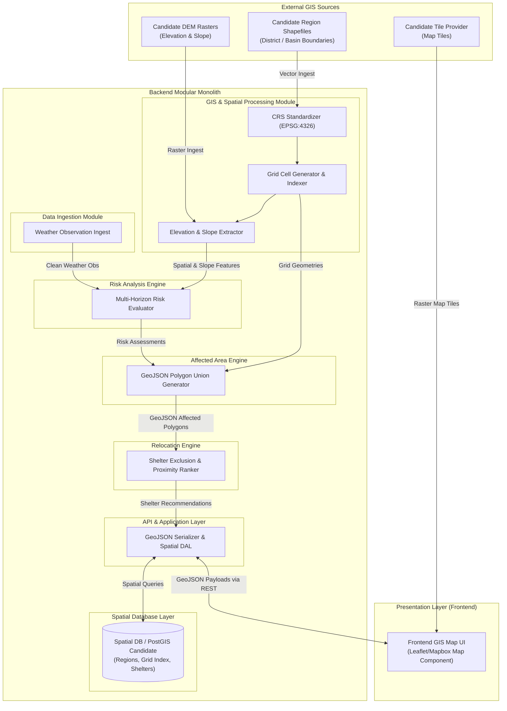

# Stage 1.5 — GIS Architecture Specification

**Project:** Smart Hazard Risk Prediction and Relocation System  
**Event:** Smart India Hackathon (SIH) 2026  
**Document Status:** Approved GIS Architecture Baseline for Stage 1 (System Design)  
**File Path:** `docs/Stage-1-System-Design/05-GIS-Architecture.md`

---

## Executive Summary

This document establishes the **Stage 1.5 GIS Architecture Specification** for the **Smart Hazard Risk Prediction and Relocation System**. Building directly upon the approved High-Level Architecture ([`01-High-Level-Architecture.md`](file:///Users/apple/Desktop/Namandeep%20Tripathi/My%20Projects/Hazard-Project/docs/Stage-1-System-Design/01-High-Level-Architecture.md)), 9-Entity Domain Model ([`02-Domain-Model.md`](file:///Users/apple/Desktop/Namandeep%20Tripathi/My%20Projects/Hazard-Project/docs/Stage-1-System-Design/02-Domain-Model.md)), Module Boundaries ([`03-Module-Boundaries.md`](file:///Users/apple/Desktop/Namandeep%20Tripathi/My%20Projects/Hazard-Project/docs/Stage-1-System-Design/03-Module-Boundaries.md)), and Data Flow Specification ([`04-Data-Flow.md`](file:///Users/apple/Desktop/Namandeep%20Tripathi/My%20Projects/Hazard-Project/docs/Stage-1-System-Design/04-Data-Flow.md)), this document defines:

1. The conceptual representation of spatial data across the Earth's surface.
2. The strict responsibility boundaries separating GIS spatial processing from the Risk, Affected Area, and Relocation engines.
3. The spatial data structures for `Region`, `Location`, `Grid Cell`, `Affected Area`, and `Relocation Site`.
4. How terrain features (elevation, slope) and weather observations are spatially mapped into the pipeline.
5. The spatial mechanisms supporting high-risk polygon generation, shelter exclusion buffers, and proximity calculations.
6. Conceptual GIS data layers, coordinate reference system (CRS) standards, and frontend/backend boundaries.

---

## 1. Objective & Spatial Architecture Overview

The primary objective of the GIS Architecture is to provide a robust, standardized spatial foundation that enables location-aware risk prediction and safe shelter recommendations.

The GIS subsystem addresses 6 core spatial capabilities:
1. **Spatial Representation:** Modeling administrative boundaries (`Region`), point locations, and uniform grid cells (`Location`).
2. **Coordinate Normalization:** Standardizing multi-source spatial data to a common Coordinate Reference System (**WGS 84 / EPSG:4326**).
3. **Terrain Feature Extraction:** Extracting elevation and slope attributes from terrain rasters and associating them with spatial grid cells.
4. **Spatial Data Supply to Risk Engine:** Preparing clean `Spatial / Terrain Feature Sets` for the `Risk Analysis Engine` without performing risk scoring inside the GIS module.
5. **Impact Delineation Support:** Assisting the `Affected Area Engine` in performing spatial aggregation of high-risk cells into vector polygons (GeoJSON MultiPolygons).
6. **Relocation Spatial Analysis:** Assisting the `Relocation Engine` with spatial containment checks, buffer zone exclusions, elevation checks, and straight-line proximity distance rankings.

---

## 2. GIS Responsibility Boundary

To prevent architectural drift and over-engineering, strict boundaries are enforced between GIS processing and domain computation modules:

```
+-----------------------------------------------------------------------------------+
|                            MODULE RESPONSIBILITY BOUNDARY                         |
+-----------------------------------------------------------------------------------+
|                                                                                   |
|  [ GIS & SPATIAL PROCESSING MODULE ]                                              |
|  - Owns CRS standardization, spatial topology, and geometry transformations.      |
|  - Owns Region boundaries, Location grid cells, and terrain feature extraction.   |
|  - DOES NOT calculate the final risk score or risk levels.                        |
|                                                                                   |
|  [ RISK ANALYSIS ENGINE ]                                                         |
|  - Owns mathematical risk scoring, risk level derivation, and forecast horizons.  |
|  - DOES NOT own GIS geometry processing or spatial polygon union math.            |
|                                                                                   |
|  [ AFFECTED AREA ENGINE ]                                                         |
|  - Owns risk threshold filtering, cell clustering, and vector polygon creation.   |
|  - Uses GIS geometry capabilities for polygon spatial union operations.           |
|                                                                                   |
|  [ RELOCATION ENGINE ]                                                            |
|  - Owns shelter suitability logic, capacity allocation, and recommendation ranking|
|  - Uses GIS spatial operations (distance, exclusion buffer, elevation check).     |
|                                                                                   |
+-----------------------------------------------------------------------------------+
```

### Architectural Guarantees:
* **GIS does NOT calculate Risk:** The GIS module extracts and formats spatial features (elevation, slope, coordinates), but never computes risk scores.
* **Risk Engine does NOT manage GIS Geometries:** The Risk Engine consumes feature matrices and returns scores; it does not process spatial shapefiles or GeoJSON polygons.

---

## 3. Conceptual Spatial Data Model

The system represents spatial real-world entities through 5 primary conceptual domain structures:

| Entity | Conceptual Geometry Type | Primary Spatial Attributes | Primary Module Owner |
| :--- | :--- | :--- | :--- |
| **Region** | Polygon / MultiPolygon | Boundary coordinates, administrative code, regional area, population. | **GIS & Spatial Processing** |
| **Location** | Point / Raster Grid Cell | Latitude, longitude, elevation (m), slope angle (°), grid cell ID. | **GIS & Spatial Processing** |
| **Affected Area** | MultiPolygon | Vector boundary geometry, spatial area ($km^2$), exposed population. | **Affected Area Engine** |
| **Relocation Site** | Point | Facility latitude, longitude, ground elevation (m), spatial location. | **Relocation Engine** |
| **Weather Observation** | Point / Grid Centroid | Latitude, longitude, station ID / grid coordinate. | **Data Ingestion Module** |

> **Note:** Geometry types are conceptual representations. Physical SQL/PostGIS geometry types (e.g., `ST_Polygon`, `ST_Point`) belong to Stage 1.8 Database Strategy.

---

## 4. Region Model

A **`Region`** represents an administrative or natural geographic boundary (e.g., District, Taluka, Watershed, or River Basin) used for governance and high-level aggregation.

```
[Region Polygon]
      │
      │ 1 : N Containment
      v
[Spatial Grid Cells / Locations]
```

### Spatial Characteristics of Region:
* **Containment Anchor:** Serves as the top-level spatial container. A `Region` contains multiple sub-unit grid cells (`Location`).
* **Aggregation Purpose:** Provides the spatial scope for:
  - Dashboard regional summaries and choropleth views.
  - Total regional population exposure calculations.
  - Administrative authority emergency alert targeting.
* **Geometry:** Represented conceptually as a closed 2D 2D **Polygon** or **MultiPolygon** outlining administrative borders.

---

## 5. Location and Grid Model

The **`Location`** entity provides a dual representation of spatial reality, bridging discrete point coordinates and uniform spatial grid cells:

```
+-----------------------------------------------------------------------------------+
|                              DUAL LOCATION MODEL                                  |
+-----------------------------------------------------------------------------------+
|                                                                                   |
|  1. DISCRETE POINT LOCATION:                                                      |
|     - Latitude / Longitude point coordinates                                       |
|     - Used for shelter sites, weather stations, and citizen positions.             |
|                                                                                   |
|  2. UNIFORM SPATIAL GRID CELL:                                                    |
|     - Regular 2D spatial grid unit (e.g., candidate 1km × 1km raster cell)         |
|     - Assigned a unique `grid_cell_id` and spatial centroid coordinate.            |
|     - Used for uniform terrain sampling and risk engine matrix scoring.           |
|                                                                                   |
+-----------------------------------------------------------------------------------+
```

### Spatial Grid Design Principles:
* **Uniform Spatial Indexing:** Dividing monitored regions into a regular spatial grid allows continuous environmental fields (rainfall, slope) to be processed systematically.
* **Grid Resolution:** The exact spatial grid cell resolution (e.g., 1km × 1km vs. 500m × 500m) is **deferred as a Candidate / TBD parameter** to be finalized in later data selection stages based on DEM raster resolution and computational performance.

---

## 6. Coordinate Reference System (CRS) Standard

To guarantee spatial alignment across heterogeneous external datasets (weather forecasts, satellite DEMs, administrative shapefiles), the system enforces a single internal spatial standard:

```
[Inbound Shapefiles / Rasters (Multi-CRS)] ──> [CRS Normalization] ──> [WGS 84 / EPSG:4326]
```

### CRS Specifications:
* **Canonical CRS:** WGS 84 (EPSG:4326) is the canonical coordinate reference system for internal spatial interchange and GeoJSON/API payloads. Inbound datasets may use different coordinate reference systems and will be transformed into the canonical CRS during ingestion or spatial preprocessing when required.
* **Interchange Standard:** All GeoJSON payloads exchanged between Backend modules and the Frontend GIS Dashboard strictly adhere to EPSG:4326 coordinates (`[longitude, latitude]`).

---

## 7. Terrain Data & Feature Extraction

Terrain features are extracted by the GIS subsystem and attached to spatial grid cells before being passed to the Risk Analysis Engine:

```
[DEM Rasters (Candidate USGS / SRTM)] ──> [GIS Processing Module] ──> [Location Features]
                                                                        - Elevation (m)
                                                                        - Slope Angle (°)
                                                                              │
                                                                              v
                                                                    [Risk Analysis Engine]
```

### Terrain Processing Pipeline:
1. **DEM Raster Loading:** Ingests Digital Elevation Model (DEM) rasters covering the monitored region.
2. **Elevation Extraction:** Samples raster cell values to assign ground `elevation` (meters above sea level) to each `Location` grid cell centroid.
3. **Slope Derivation:** Computes spatial elevation gradient across adjacent grid cells to calculate local terrain `slope` (in degrees).
4. **Feature Output:** Packages elevation and slope into a standardized `Spatial / Terrain Feature Set` associated with each `grid_cell_id`.

---

## 8. Weather-to-Spatial Mapping

The GIS architecture defines how point-based or grid-based weather observations map onto spatial `Location` grid cells:

```
[Weather Ingestion Feed]
(Point / Forecast Grid)
           │
           v
[Spatial Matching Mechanism] ──> Assigns Weather Attributes to Nearest Location Grid Cells
                                 - Rainfall Intensity (mm/hr)
                                 - Accumulated Rainfall (mm)
                                 - Forecast Horizon (0h, +3h, +6h, +24h)
```

### Conceptual Mapping Scenarios:
1. **Candidate Weather Station Points:** Point-based weather observations are mapped to spatial grid cells using spatial nearest-neighbor assignment or Inverse Distance Weighting (IDW) interpolation.
2. **Candidate Forecast Gridded Feeds:** Gridded weather forecast rasters are resampled and aligned to match the system's `Location` grid cells via spatial grid overlap.

---

## 9. GIS-to-Risk Engine Spatial Interface

The interface between GIS Processing and the Risk Analysis Engine is strictly defined as a **data supply contract**:

```
+-----------------------------------+     +-----------------------------------+
| 1. Data Ingestion Module          |     | 2. GIS & Spatial Processing       |
| - Clean Weather Observations      |     | - Location Grid Cell Coordinates  |
| - Rainfall Intensity & Forecasts  |     | - Terrain Elevation (m)           |
|                                   |     | - Terrain Slope Angle (°)         |
+-----------------------------------+     +-----------------------------------+
                  │                                         │
                  └────────────────────┬────────────────────┘
                                       v
                     +-----------------------------------+
                     | 3. Risk Analysis Engine           |
                     | - Evaluates Multi-Factor Risk Math|
                     | - Computes Score (0.00 - 1.00)    |
                     | - Derives Risk Levels & Horizons  |
                     +-----------------------------------+
```

### Interface Contract:
* GIS supplies: `(grid_cell_id, latitude, longitude, elevation, slope, region_id)`.
* Ingestion supplies: `(grid_cell_id, observation_time, rainfall_intensity, accumulated_rainfall, forecast_horizon)`.
* Risk Engine consumes both datasets independently and outputs `Risk Assessment` records.

---

## 10. Affected Area Generation

The **Affected Area Engine** utilizes GIS spatial aggregation capabilities to transform discrete high-risk grid cells into continuous vector polygons:

```
[Risk Assessments (High-Risk Cells)] ──> [Filter Exceeding Threshold] ──> [Spatial Clustering] ──> [Polygon Union] ──> [GeoJSON Affected Area]
```

### Spatial Polygon Aggregation Pipeline:
1. **Grid Cell Filtering:** Identifies grid cells classified as high-risk or critical according to configured risk thresholds.
2. **Spatial Adjacency Evaluation:** Evaluates 8-neighbor spatial connectivity (Moore neighborhood) to cluster adjacent high-risk cells.
3. **Spatial Polygon Union:** Merges adjacent grid cell square geometries into a continuous 2D boundary polygon.
4. **Buffer Zone Mapping:** Constructs surrounding secondary spatial buffer zones around primary impact polygons.
5. **GeoJSON Delineation:** Exports the vector boundary as a **GeoJSON MultiPolygon** containing geometry coordinates and exposed population metadata.

---

## 11. Relocation Spatial Support

The **Relocation Engine** relies on GIS spatial operations to evaluate shelter suitability and proximity:

```
[Affected Area GeoJSON Polygon] + [Relocation Site Coordinates]
                                │
                                v
                [1. Spatial Buffer Exclusion Check]
                                │
                                v
                [2. Elevation Differential Check]
                                │
                                v
                [3. Straight-Line Proximity Ranking]
                                │
                                v
             [Top-3 Ranked Relocation Recommendations]
```

### Supported Spatial Operations:
* **Spatial Exclusion Check (Buffer Exclusion):** Verifies that a `Relocation Site` point coordinate lies **strictly outside** the `Affected Area` polygon and its surrounding spatial exclusion buffer distance.
* **Elevation Check:** Verifies candidate shelter ground elevation is strictly higher than the estimated water/flood stage level of the source affected area.
* **Straight-Line Proximity Distance:** Computes Euclidean or Haversine spatial distance between the `Affected Area` polygon centroid and candidate shelter point coordinates to rank top-3 nearest safe shelters.

---

## 12. Conceptual GIS Data Layers

The platform organizes geospatial information into 6 conceptual GIS data layers:

| Layer Name | Layer Purpose | Source Type | Refresh Type | Consumer |
| :--- | :--- | :--- | :--- | :--- |
| **1. Base Map Layer** | Background cartographic map rendering for web UI. | External Tile Provider | Static | Frontend Dashboard |
| **2. Administrative Boundary Layer** | District, Taluka, and Watershed regional boundary vectors. | Candidate Vector Files | Static | GIS Module & UI |
| **3. Terrain Layer** | DEM elevation rasters and derived terrain slope rasters. | Candidate DEM Rasters | Static | GIS Module |
| **4. Risk Grid Layer** | Spatial grid cell layer color-coded by computed `Risk Score` & `Risk Level`. | System Computed | Dynamic / Periodic | Risk Engine & UI |
| **5. Affected Area Layer** | Vector polygons (GeoJSON) representing high-risk evacuation zones. | System Computed | Dynamic / Periodic | Relocation & UI |
| **6. Relocation Site Layer** | Point markers representing safe shelters, capacity, and occupancy. | Internal Registry | Static / Operational | Relocation & UI |

---

## 13. Static vs. Dynamic GIS Data Classification

GIS data components are categorized by operational update frequency:

```
+------------------------------------------------------------------------------------+
|                               GIS DATA CLASSIFICATION                              |
+------------------------------------------------------------------------------------+
| STATIC GIS DATA (Seeded / Ingested once at system setup):                          |
| - Administrative Region Boundary Polygons                                          |
| - Digital Elevation Model (DEM) Rasters                                            |
| - Derived Terrain Slope Rasters                                                    |
| - Registered Relocation Shelter Coordinates                                        |
|                                                                                    |
| DYNAMIC / COMPUTED GIS DATA (Recomputed post-ingestion):                           |
| - Grid Cell Risk Heatmaps (0h, +3h, +6h, +24h)                                     |
| - Affected Area Vector Polygons (GeoJSON MultiPolygons)                            |
| - Relocation Shelter Buffer Exclusion Zones                                        |
| - Active Disaster Warning Alert Boundary Geometries                                |
+------------------------------------------------------------------------------------+
```

---

## 14. GIS Data Quality & Error Handling

The GIS architecture specifies robust fallbacks for spatial anomalies:

* **CRS Mismatch:** Inbound vector/raster files missing CRS metadata or using non-standard projections are flagged and reprojected to EPSG:4326 before entering the processing pipeline.
* **Invalid Geometries:** Self-intersecting or unclosed region polygons are repaired using standard spatial geometry validation (e.g., polygon cleaning) prior to spatial queries.
* **Missing Elevation Data:** If a grid cell falls outside DEM coverage, its slope is assumed flat ($0^\circ$) and an unverified elevation flag is attached, preventing spatial processing crashes.
* **Missing Shelter Coordinates:** Shelter registry entries with missing or corrupt lat/long coordinates are excluded from relocation matching and logged for admin review.

---

## 15. GIS Storage Capabilities

At a conceptual level, the storage layer must support geospatial capabilities:

* **Spatial Primitive Storage:** Storing 2D Points (shelters, locations) and 2D Polygons / MultiPolygons (regions, affected areas).
* **Spatial Indexing:** Supporting spatial indexing (e.g., R-Tree / QuadTree indexing) for high-speed point-in-polygon and bounding box containment queries.
* **GeoJSON Interchange:** Native capability to export spatial query results into standard GeoJSON structures.

> **Candidate Capability:** PostGIS spatial database extension is recognized as a candidate spatial storage engine. Final database selection belongs to **Stage 1.8 Database Strategy**.

---

## 16. GIS Library & Technology Classification

In accordance with Stage 1 principles, specific third-party GIS software libraries are categorized as **Candidate / TBD** for evaluation in **Stage 1.10 Technology Decisions**:

* **Backend Spatial Libraries (Candidates / TBD):** GeoTools, JTS Topology Suite, GDAL/OGR wrappers.
* **Spatial Database Capabilities (Candidates / TBD):** PostGIS extension, H2 Spatial.
* **Frontend Web Mapping Libraries (Candidates / TBD):** Leaflet.js, Mapbox GL JS, OpenLayers.

---

## 17. GIS Frontend vs. Backend Boundary

A strict line of demarcation separates backend GIS computation from frontend map visualization:

```
+------------------------------------------+------------------------------------------+
|            BACKEND GIS BOUNDARY          |           FRONTEND GIS BOUNDARY          |
+------------------------------------------+------------------------------------------+
| - Owns authoritative spatial coordinates | - Renders background cartographic tiles  |
| - Executes CRS standardization           | - Renders GeoJSON risk heatmaps & vectors|
| - Extracts elevation & slope features    | - Displays shelter markers & popups      |
| - Delineates Affected Area polygons      | - Handles user zoom, pan, & click events |
| - Calculates shelter proximity distance  | - Renders legend & analytics charts       |
| - Serializes spatial objects to GeoJSON  | - DOES NOT calculate hazard risk scores  |
+------------------------------------------+------------------------------------------+
```

---

## 18. Complete End-to-End GIS Data Pipeline

The flow of spatial information across the complete system is illustrated below:

```
[Candidate DEM Rasters & Regional Vectors] ──> [1. GIS & Spatial Processing]
                                                         │
                                                         │ (Elevation, Slope, Grid Cells)
                                                         v
[Candidate Weather APIs] ──> [Data Ingestion] ──> [2. Risk Analysis Engine]
                                                         │
                                                         │ (Risk Assessment Scores)
                                                         v
                                              [3. Affected Area Engine]
                                                         │
                                                         │ (GeoJSON Affected Polygons)
                                                         v
[Shelter Registry Coordinates] ───────────────> [4. Relocation Engine]
                                                         │
                                                         │ (Proximity Distance Ranking)
                                                         v
                                              [5. API & Application Layer]
                                                         │
                                                         │ (REST GeoJSON Payloads)
                                                         v
                                              [6. Frontend GIS Dashboard]
```

---

## 19. GIS Architecture Diagram

The overall GIS software architecture is presented below using standard Mermaid notation:



---

## 20. MVP Scope vs. Future GIS Capabilities

```
+------------------------------------------------------------------------------------+
|                                GIS SCOPE PARTITION                                 |
+------------------------------------------------------------------------------------+
|                     MUST HAVE (MVP GIS CAPABILITIES)                               |
|  - WGS 84 (EPSG:4326) Coordinate Reference System Standardization                  |
|  - Administrative Region Boundary Polygon Import & Containment Mapping             |
|  - Spatial Grid Cell Indexing & Centroid Representation                            |
|  - Digital Elevation Model (DEM) Elevation & Slope Extraction                      |
|  - Point & Grid Weather Observation Spatial Mapping                                |
|  - GeoJSON MultiPolygon Affected Area Generation & Buffer Zone Mapping             |
|  - Shelter Exclusion Buffer Filtering & Elevation Differential Verification        |
|  - Straight-Line / Spatial Proximity Distance Ranking                              |
|  - GeoJSON Payload Serialization for Web GIS Dashboard                             |
+------------------------------------------------------------------------------------+
                                         │
                                         v
+------------------------------------------------------------------------------------+
|                     FUTURE GIS CAPABILITIES (DEFERRED)                             |
|  - Deep Learning Satellite Image Segmentation (e.g., SAR Flood Extent Extraction)  |
|  - Advanced Spatial Kriging & Inverse Distance Weighting (IDW) Interpolation       |
|  - Real-Time IoT Sensor Telemetry Spatial Mapping                                  |
|  - Turn-by-Turn Road Network Graph Topology & Routing Engine (OSRM / GraphHopper)  |
|  - High-Resolution Dynamic Hydrological Flow & River Stage Hydrodynamic Modeling   |
+------------------------------------------------------------------------------------+
```

---

## 21. Open Decisions (Deferred to Later Stages)

The following GIS implementation choices remain explicitly deferred:

* **Exact GIS Software Library:** Final choice of Java GIS libraries (GeoTools vs. JTS).
* **Exact Spatial Database Engine:** Final selection of database spatial extensions (PostGIS vs. H2 Spatial).
* **Exact Spatial Grid Resolution:** Final grid cell size (e.g., 1km × 1km vs. 500m × 500m).
* **Exact GIS Datasets:** Final selection of third-party DEM raster sources and administrative boundary shapefiles.
* **Exact Web Mapping Library:** Final choice of frontend map renderer (Leaflet vs. Mapbox GL JS).

---

## 22. Architectural Consistency Verification

* **Alignment with Stage 1.1:** Standardizes on EPSG:4326 and supports vector hazard overlays as specified in [`01-High-Level-Architecture.md`](file:///Users/apple/Desktop/Namandeep%20Tripathi/My%20Projects/Hazard-Project/docs/Stage-1-System-Design/01-High-Level-Architecture.md).
* **Alignment with Stage 1.2:** Supports dual `Location` representation (points & grid cells) and maintains `Region` boundaries as specified in [`02-Domain-Model.md`](file:///Users/apple/Desktop/Namandeep%20Tripathi/My%20Projects/Hazard-Project/docs/Stage-1-System-Design/02-Domain-Model.md).
* **Alignment with Stage 1.3:** Respects logical module boundaries; GIS does not calculate risk scores and Risk Engine does not process geometry as specified in [`03-Module-Boundaries.md`](file:///Users/apple/Desktop/Namandeep%20Tripathi/My%20Projects/Hazard-Project/docs/Stage-1-System-Design/03-Module-Boundaries.md).
* **Alignment with Stage 1.4:** Provides parallel terrain feature feeds into the Risk Engine without hardcoded numeric thresholds as specified in [`04-Data-Flow.md`](file:///Users/apple/Desktop/Namandeep%20Tripathi/My%20Projects/Hazard-Project/docs/Stage-1-System-Design/04-Data-Flow.md).

---

## 23. Final Review & Verdict

### Summary Checklist:
- **A. GIS Architecture Summary:** Standardized spatial infrastructure feeding terrain features to the Risk Engine and providing polygon union and buffer capabilities to Affected Area and Relocation engines.
- **B. Spatial Data Model Summary:** Clear conceptual representations for `Region` (Polygon), `Location` (Point/Grid Cell), `Affected Area` (MultiPolygon), and `Relocation Site` (Point).
- **C. GIS / Risk Boundary:** GIS extracts features; Risk Engine computes risk scores. GIS never calculates risk scores.
- **D. GIS / Affected Area Boundary:** Risk Engine outputs scores; Affected Area Engine uses GIS geometry operations to build GeoJSON MultiPolygons.
- **E. GIS / Relocation Boundary:** Relocation Engine owns business suitability; GIS provides exclusion buffers, elevation checks, and proximity distance rankings.
- **F. GIS Data Layers:** 6 clean layers (Base Map, Boundaries, Terrain, Risk Grid, Affected Areas, Relocation Sites).
- **G. MVP vs. Future:** Core vector/raster capabilities in MVP; satellite SAR and road-network routing deferred.
- **H. Open Decisions:** Libraries, databases, grid resolution, datasets cleanly deferred.
- **I. Consistency Check:** 100% consistent across Stages 1.1, 1.2, 1.3, and 1.4.

---

### Final Architectural Verdict: **APPROVED**

> The **Stage 1.5 GIS Architecture Specification** is fully approved as the technical baseline for Stage 1 System Design. It provides a minimal, clean, robust, and extensible spatial foundation ready for subsequent component and data architecture stages.
