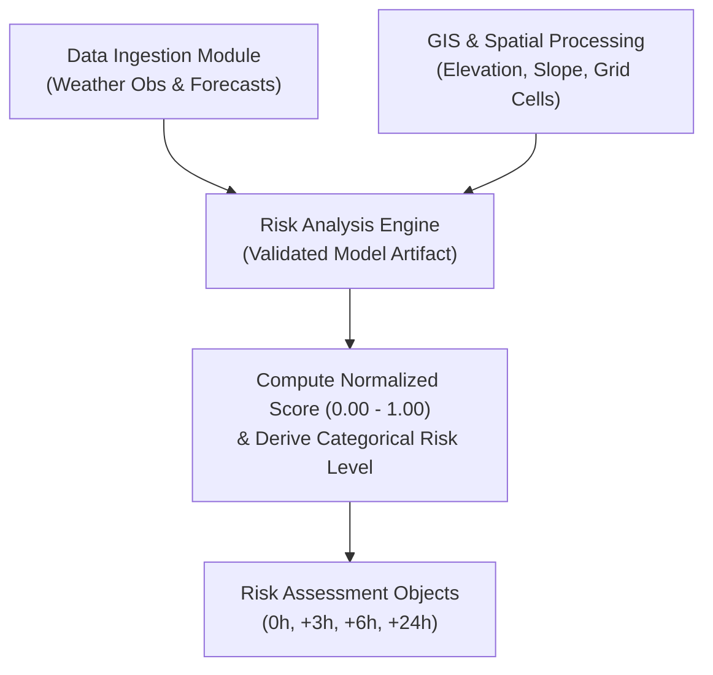
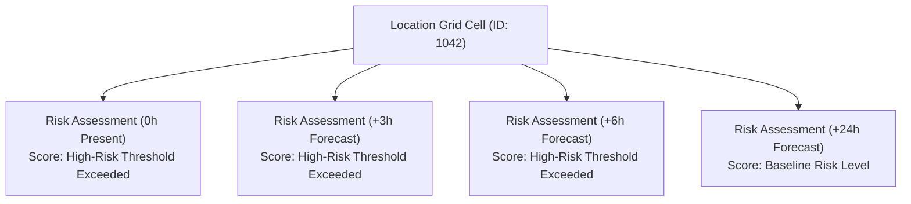
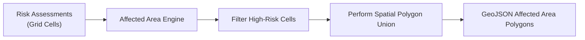
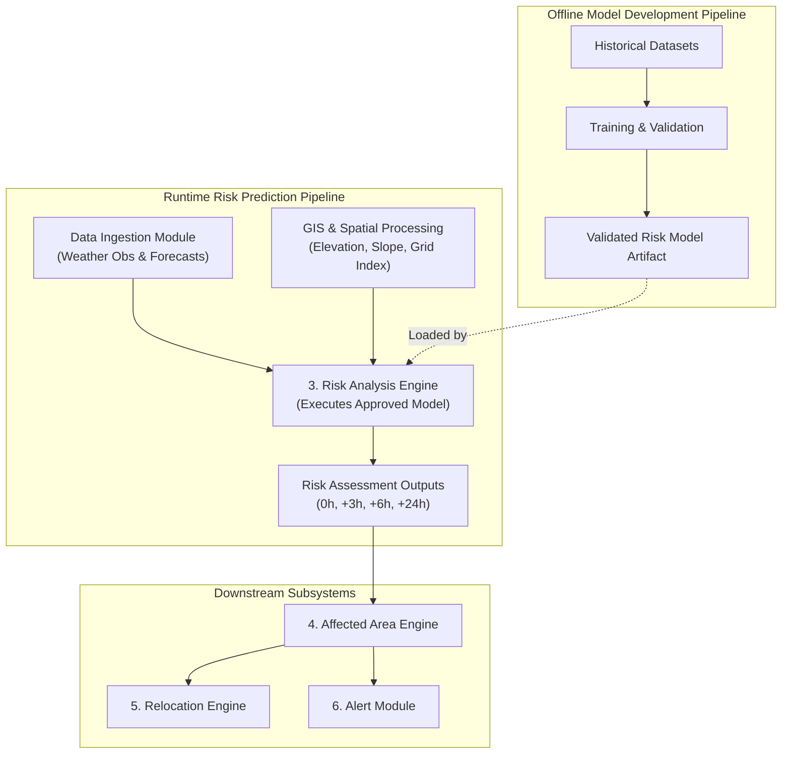

# Stage 1.6 — Risk Architecture Specification

**Project:** Smart Hazard Risk Prediction and Relocation System  
**Event:** Smart India Hackathon (SIH) 2026  
**Document Status:** Approved Risk Architecture Baseline for Stage 1 (System Design)  
**File Path:** `docs/Stage-1-System-Design/06-Risk-Architecture.md`

---

## Executive Summary

This document establishes the **Stage 1.6 Risk Architecture Specification** for the **Smart Hazard Risk Prediction and Relocation System**. Building directly upon the approved High-Level Architecture ([`01-High-Level-Architecture.md`](file:///Users/apple/Desktop/Namandeep%20Tripathi/My%20Projects/Hazard-Project/docs/Stage-1-System-Design/01-High-Level-Architecture.md)), 9-Entity Domain Model ([`02-Domain-Model.md`](file:///Users/apple/Desktop/Namandeep%20Tripathi/My%20Projects/Hazard-Project/docs/Stage-1-System-Design/02-Domain-Model.md)), Module Boundaries ([`03-Module-Boundaries.md`](file:///Users/apple/Desktop/Namandeep%20Tripathi/My%20Projects/Hazard-Project/docs/Stage-1-System-Design/03-Module-Boundaries.md)), Data Flow Specification ([`04-Data-Flow.md`](file:///Users/apple/Desktop/Namandeep%20Tripathi/My%20Projects/Hazard-Project/docs/Stage-1-System-Design/04-Data-Flow.md)), and GIS Architecture ([`05-GIS-Architecture.md`](file:///Users/apple/Desktop/Namandeep%20Tripathi/My%20Projects/Hazard-Project/docs/Stage-1-System-Design/05-GIS-Architecture.md)), this document defines:

1. How the **Risk Analysis Engine** estimates current and future hazard risk.
2. How historical hazard logs and environmental observations are used during offline model training to learn predictive relationships.
3. How real-time weather observations, weather forecasts, and terrain features feed the runtime risk prediction pipeline.
4. How current ($0\text{h}$) and future ($+3\text{h}$, $+6\text{h}$, $+24\text{h}$) risk estimates are encapsulated within the unified `Risk Assessment` domain entity.
5. The strict responsibility boundaries separating risk calculation from data ingestion, GIS geometry processing, polygon delineation, shelter relocation matching, and alert dispatching.

---

## 1. Objective & Risk Prediction Philosophy

The fundamental question answered by the Risk Architecture is:

> *"How will our system use historical data, real-time observations, weather forecasts, and spatial terrain features to estimate future hazard risk?"*

```
OFFLINE TRAINING / MODEL DEVELOPMENT:
[Historical Weather & Hazard Logs] + [GIS Terrain Features] ──> [Model Training & Calibration] ──> [Validated Model Artifact]

RUNTIME PREDICTION / ASSESSMENT:
[Current & Forecast Weather] + [GIS Terrain Features] ──> [Validated Risk Model] ──> [Risk Assessment (0h, +3h, +6h, +24h)]
```

### Core Architecture Principles:
* **Historical Data is NOT a Direct Prediction:** Historical hazard records are not directly copied into future predictions. Instead, historical data is used offline to train, calibrate, and validate risk models by learning mathematical relationships between environmental inputs (rainfall volume, slope, elevation) and past flood/hazard outcomes.
* **Runtime Risk Estimation:** At runtime, the approved risk model evaluates **current observations** (for present $0\text{h}$ risk) and **weather forecasts** (for future $+3\text{h}$, $+6\text{h}$, $+24\text{h}$ risk) combined with static terrain features to generate normalized risk scores.
* **Unified Domain Representation:** Present and future risk projections share the single `Risk Assessment` domain structure, distinguished by the `forecast_horizon_hours` attribute.

---

## 2. Core Concepts: Data Role Definitions

To eliminate confusion among developers, data inputs are categorized into 4 distinct roles:

1. **Historical Data (Offline Training Role):** Historical rainfall series, past flood event logs, and historical inundation extents used offline during model development to learn input-to-outcome mapping.
2. **Current Data (Real-Time Role):** Real-time meteorological observations ($T_0$) describing present environmental conditions (e.g., current 1h rainfall intensity, 24h accumulation).
3. **Forecast Data (Future Expected Role):** Meteorological model predictions for future time offsets ($T+3\text{h}, T+6\text{h}, T+24\text{h}$) describing expected precipitation.
4. **GIS Terrain Features (Spatial Context Role):** Static geographic attributes (elevation, terrain slope angle, regional bounding) providing physical landscape context.

---

## 3. Risk Engine Responsibility Boundary

In strict compliance with Stage 1.3 and Stage 1.5, the **Risk Analysis Engine** owns a single, specialized domain capability:

```
+-----------------------------------------------------------------------------------+
|                        RISK ENGINE RESPONSIBILITY BOUNDARY                        |
+-----------------------------------------------------------------------------------+
|                                                                                   |
|  WHAT THE RISK ENGINE OWNS:                                                       |
|  - Feature preparation at the model calculation level.                            |
|  - Execution of multi-factor risk scoring algorithms.                             |
|  - Normalization of risk scores (0.00 to 1.00).                                   |
|  - Categorical risk level derivation (LOW, MEDIUM, HIGH, CRITICAL).               |
|  - Evaluation across present (0h) and forecast horizons (+3h, +6h, +24h).         |
|  - Risk Assessment entity instantiation and model version tagging.                |
|                                                                                   |
|  WHAT THE RISK ENGINE DOES NOT OWN:                                               |
|  - External data pulling or HTTP payload parsing (owned by Data Ingestion).       |
|  - GIS CRS transformation or shapefile parsing (owned by GIS Module).             |
|  - High-risk cell aggregation into vector polygons (owned by Affected Area Engine).|
|  - Shelter lookup, capacity checks, or distance ranking (owned by Relocation).    |
|  - Warning alert formatting or push notification delivery (owned by Alert Module). |
|  - Web UI map rendering or chart widgets (owned by Frontend Dashboard).           |
|                                                                                   |
+-----------------------------------------------------------------------------------+
```

---

## 4. Input Data Categories

The Risk Analysis Engine consumes 6 primary categories of input data:

| Input Category | Purpose | Temporal Nature | Spatial Nature | Source Type | Scope | Status |
| :--- | :--- | :--- | :--- | :--- | :--- | :--- |
| **Historical Rainfall & Hazard Logs** | Offline model training & threshold calibration. | Historical Series | Regional / Point | Candidate Datasets | MVP Core | Candidate / TBD |
| **Current Weather Observations** | Evaluates real-time ($0\text{h}$) present risk status. | Real-Time ($T_0$) | Point / Grid Cell | Data Ingestion Module | MVP Core | Candidate / TBD |
| **Weather Forecast Feeds** | Evaluates future ($+3\text{h}, +6\text{h}, +24\text{h}$) risk status. | Forecast Series | Grid Cell | Data Ingestion Module | MVP Core | Candidate / TBD |
| **DEM Elevation Rasters** | Provides ground elevation features for flood risk math. | Static | Raster Grid Cell | GIS Processing Module | MVP Core | Candidate / TBD |
| **Derived Terrain Slope** | Provides terrain slope angle features for runoff speed. | Static | Raster Grid Cell | GIS Processing Module | MVP Core | Candidate / TBD |
| **Static Population Density** | Overlaid *after* risk computation for exposure estimates. | Static | Raster Grid / Polygon | GIS Processing Module | MVP Core | Candidate / TBD |

---

## 5. Offline Model Development Pipeline

The process of building, training, calibrating, and approving a risk estimation model occurs offline prior to runtime deployment:

```
[Historical Weather & Inundation Datasets]
                   │
                   v
        [1. Data Cleaning & Sanitization]
                   │
                   v
        [2. Feature Extraction & Engineering]
                   │
                   v
    [3. Historical Outcome / Label Association]
                   │
                   v
     [4. Model Training & Cross-Validation]
                   │
                   v
    [5. Model Evaluation & Performance Checks]
                   │
                   v
    [6. Tagged & Approved Model Version]
```

### Pipeline Steps:
1. **Historical Data Assembly:** Compiles past rainfall events and historical disaster logs for pilot river basins.
2. **Feature Extraction:** Extracts historical antecedent precipitation (24h/72h rainfall), slope angles, and elevation profiles.
3. **Label Association:** Pairs historical input feature vectors with recorded past outcomes (e.g., inundation occurred / high flood risk vs. normal conditions).
4. **Training & Calibration:** Trains candidate statistical/heuristic models or ML classifiers offline.
5. **Evaluation:** Evaluates model performance using temporal cross-validation.
6. **Approval & Versioning:** Packages the trained parameters into an approved model artifact tagged with a version identifier established post-validation. Actual model versioning begins once a model has been developed and validated.

---

## 6. Runtime Future Risk Prediction Flow

During runtime, the approved risk model evaluates ingested real-time and forecast feeds to generate `Risk Assessment` records:

```
[Clean Weather Observations (Data Ingestion)] ────┐
                                                  │
                                                  v
                                      [Risk Analysis Engine]
                                      - Load Validated Model Artifact
                                      - Feature Vector Assembly
                                      - Score Normalization (0.00 - 1.00)
                                      - Level Derivation (LOW..CRITICAL)
                                                  ^
                                                  │
[Spatial & Terrain Features (GIS Module)] ────────┘
                                                  │
                                                  v
                                      [Risk Assessment Output]
                                      - 0h (Present Real-Time)
                                      - +3h (Short-Term Forecast)
                                      - +6h (Medium-Term Forecast)
                                      - +24h (Long-Term Forecast)
```

---

## 7. Current vs. Forecasted Risk Integration

The system cleanly distinguishes present real-time risk from future forecasted risk while maintaining a single domain representation:

* **Current Risk ($0\text{h}$):** Evaluates threat level under real-time conditions ($T_0$). Used to issue immediate emergency alerts and activate evacuation recommendations for zones currently submerged or experiencing high flood threat.
* **Forecasted Risk ($+3\text{h}, +6\text{h}, +24\text{h}$):** Evaluates threat level using forecasted precipitation. Used by disaster authorities to anticipate flood expansion hours before physical inundation begins.
* **Unified Domain Entity:** Both current and forecasted risk assessments instantiate the `Risk Assessment` domain object. Prediction is **NOT** a separate entity; rather, forecast horizons are parameterised via `forecast_horizon_hours`.

---

## 8. Conceptual Risk Assessment Structure

A **`Risk Assessment`** domain object encapsulates the calculated risk state for a specific spatial unit and time horizon:

```
+-----------------------------------------------------------------------------------+
|                        RISK ASSESSMENT CONCEPTUAL STRUCTURE                       |
+-----------------------------------------------------------------------------------+
|                                                                                   |
| - `target_location_ref`: Spatial grid cell identifier or coordinate point.        |
| - `region_ref`: Administrative Region reference (District/Basin ID).             |
| - `hazard_ref`: Static Hazard reference (e.g., Flood / Heavy Rainfall).           |
| - `calculated_at`: Timestamp of assessment execution (UTC ISO-8601).              |
| - `forecast_horizon_hours`: Integer time horizon (0, 3, 6, 24).                   |
| - `normalized_risk_score`: Continuous score bounded between 0.00 and 1.00.       |
| - `derived_risk_level`: Categorical classification (LOW, MEDIUM, HIGH, CRITICAL). |
| - `confidence_index`: Optional candidate metric (Calculation TBD).                |
| - `model_version`: Tag identifying the model artifact version (TBD post-validation)|
|                                                                                   |
+-----------------------------------------------------------------------------------+
```

---

## 9. Conceptual Feature Engineering

Feature engineering translates raw environmental readings and terrain rasters into model-ready numerical feature vectors:

| Feature Category | Candidate Feature Name | Feature Purpose | Scope | Status |
| :--- | :--- | :--- | :--- | :--- |
| **Weather Features** | `rainfall_intensity_1h` | Short-term precipitation rate (mm/hr). | MVP Core | Candidate / TBD |
| **Weather Features** | `accumulated_rainfall_24h` | Medium-term precipitation accumulation (mm). | MVP Core | Candidate / TBD |
| **Weather Features** | `forecasted_rainfall_accumulation` | Expected future precipitation for target horizon (mm). | MVP Core | Candidate / TBD |
| **Terrain Features** | `elevation_meters` | Ground elevation above sea level (m). | MVP Core | Candidate / TBD |
| **Terrain Features** | `slope_degrees` | Terrain slope angle (°). | MVP Core | Candidate / TBD |
| **Historical Features** | `historical_flood_susceptibility` | Frequency of past historical flood occurrences in grid cell. | MVP Core | Candidate / TBD |
| **Advanced Features** | `soil_saturation_index` | Estimated soil moisture percolation limit. | Future Scope | Deferred |
| **Advanced Features** | `river_stage_gauge_height` | Real-time river water level height. | Future Scope | Deferred |

---

## 10. Candidate Label & Target Definitions

During model training, the target variable represents what the risk model is attempting to estimate:

* **Candidate Target 1 (Categorical Risk Level):** Multi-class classification target (`LOW`, `MEDIUM`, `HIGH`, `CRITICAL`).
* **Candidate Target 2 (Continuous Risk Score):** Regression target estimating continuous hazard intensity index ($0.00$ to $1.00$).
* **Candidate Target 3 (Probability of Flooding):** Probabilistic target estimating likelihood of exceeding flood thresholds ($0.0\%$ to $100.0\%$).
* **Architectural Status:** The final mathematical target formulation is **deferred as Candidate / TBD** to be finalized during Stage 2 model selection based on historical dataset labeling quality.

---

## 11. Model Category Decision (Candidate Approaches)

At Stage 1.6, the final risk-model architecture remains **Candidate / TBD**. The system evaluates three candidate model categories for the MVP:

1. **Statistical / Machine Learning Model:** Evaluates non-linear feature interactions from historical training data to estimate risk scores.
2. **Rule-Based Baseline:** Evaluates physical domain-expert heuristic rules (e.g., rainfall volume vs. terrain slope).
3. **Hybrid ML + Domain-Rule Approach:** Combines statistical/ML model scoring with physical domain constraint rules.

```
+------------------------------------------------------------------------------------+
|                        CANDIDATE RISK MODEL APPROACHES                             |
+------------------------------------------------------------------------------------+
|                                                                                    |
|  INPUT FEATURE VECTOR                                                              |
|  (Rainfall Accumulation + Forecast + Slope + Elevation + Historical Susceptibility)|
|                                      │                                             |
|                                      v                                             |
|  +-----------------------------------+-----------------------------------+         |
|  | CANDIDATE 1: STATISTICAL / ML     | CANDIDATE 2: RULE-BASED BASELINE  |         |
|  | (Data-driven pattern matching)    | (Physical domain-expert rules)    |         |
|  +-----------------------------------+-----------------------------------+         |
|                                      │                                             |
|                                      v                                             |
|  CANDIDATE 3: HYBRID APPROACH (ML Scoring + Physical Rules)                        |
|                                                                                    |
+------------------------------------------------------------------------------------+
```

### Evaluation Criteria for Final Model Selection:
The final approach will be selected in later technical design stages after evaluating:
* Quality, volume, and completeness of available historical data.
* Training label quality and historical disaster log availability.
* Input feature completeness across target pilot regions.
* Empirical model validation performance and accuracy.
* Interpretability requirements for emergency decision-makers.
* Implementation feasibility within SIH MVP timelines.

> **Note:** Specific machine learning algorithms (e.g., Random Forest, XGBoost, Neural Networks) remain **Candidate / TBD** and are not finalized in Stage 1.6.

---

## 12. Training vs. Runtime Separation

A strict boundary separates offline model development from online runtime inference:

```
+------------------------------------------+------------------------------------------+
|       OFFLINE DEVELOPMENT PIPELINE       |        ONLINE RUNTIME INFERENCE FLOW     |
+------------------------------------------+------------------------------------------+
| - Executed offline by ML team            | - Executed in-process by backend engine  |
| - Ingests historical multi-year datasets | - Ingests live weather & forecast feeds  |
| - Performs feature engineering & tuning  | - Assembles real-time grid feature vectors|
| - Trains & cross-validates ML models     | - Evaluates validated model artifact     |
| - Evaluates precision/recall metrics     | - Computes 0h, +3h, +6h, +24h assessments|
| - Packages validated model artifact      | - Outputs Risk Assessment domain objects |
+------------------------------------------+------------------------------------------+
```

---

## 13. Model Validation Strategy

Model evaluation during development must enforce strict spatial and temporal validation protocols to prevent misleading accuracy claims:

* **Temporal Validation Split:** Train models on earlier historical time periods and validate on chronologically later unseen hazard events to prevent temporal data leakage.
* **Spatial Cross-Validation:** Validate models on unseen geographic sub-regions / watersheds to ensure generalization across different topographies.
* **Confusion Matrix Evaluation:** Prioritize minimizing **False Negatives** (failing to predict a critical flood event) over False Positives, as unpredicted floods pose catastrophic safety risks.
* **No Premature Accuracy Claims:** The architecture strictly prohibits declaring hardcoded accuracy percentages (e.g., "95% accuracy") prior to empirical validation against benchmark datasets.

---

## 14. Historical & Forecast Data Limitations

The risk architecture explicitly acknowledges real-world data uncertainties:

1. **Weather Forecast Uncertainty:** Future precipitation forecasts carry inherent atmospheric uncertainty that increases with longer time horizons ($+24\text{h}$ forecasts have higher variance than $+3\text{h}$ forecasts).
2. **Historical Reporting Bias:** Historical disaster logs may under-report incidents in sparsely populated rural areas compared to urban centers.
3. **Climate Non-Stationarity:** Historical rainfall patterns may not perfectly reflect extreme weather events driven by changing climate dynamics.
4. **Uncertainty Communication:** The system may expose an optional `confidence_index` parameter to communicate prediction reliability based on input freshness and forecast variance (Calculation TBD).

---

## 15. Risk Score vs. Risk Level

To maintain clear separation between continuous model output and operational business logic:

* **Risk Score:** The continuous, normalized numerical output generated by the risk model, bounded between **`0.00` (Zero Risk)** and **`1.00` (Maximum Risk)**.
* **Risk Level:** The categorical operational classification derived from the risk score:
  ```
  Risk Score ──> [Configured Threshold Rules (Exact Cutoffs TBD)] ──> Risk Level (LOW, MEDIUM, HIGH, CRITICAL)
  ```
* **Threshold Decoupling:** Exact numeric score cutoffs for categorical risk levels are **deferred as TBD configuration parameters** to allow disaster management authorities to adjust sensitivity without retraining the underlying model.

---

## 16. Multi-Horizon Risk Assessments

A single spatial `Location` grid cell maintains distinct `Risk Assessment` records for present and future forecast horizons:

```
Location Grid Cell (Lat/Long / Grid ID)
      ├── Risk Assessment (0h Horizon)   --> Present Real-Time Status
      ├── Risk Assessment (+3h Horizon)  --> Short-Term Forecast
      ├── Risk Assessment (+6h Horizon)  --> Medium-Term Forecast
      └── Risk Assessment (+24h Horizon) --> Long-Term Forecast
```

Each horizon assessment is evaluated independently using weather inputs corresponding to that specific time offset.

---

## 17. Spatial Risk Output Interface

The Risk Analysis Engine outputs structured `Risk Assessment` records to downstream engines:

```
[Risk Analysis Engine] ──> [Risk Assessment Output] ──> [4. Affected Area Engine]
                                                        - Filters High-Risk Cells
                                                        - Performs Spatial Polygon Union
                                                        - Delineates GeoJSON Polygons
```

* The Risk Engine calculates cell-level risk scores.
* The **Affected Area Engine** consumes these cell scores and performs spatial geometry aggregation to construct vector polygons.

---

## 18. Downstream Flow to Relocation and Alert Modules

The Risk Analysis Engine does **not** directly trigger alerts or allocate shelters:

```
                      +-----------------------+
                      | Risk Analysis Engine  |
                      +-----------------------+
                                  │
                                  │ Risk Assessment Records
                                  v
                      +-----------------------+
                      | Affected Area Engine  |
                      +-----------------------+
                                  │
                   ┌──────────────┴──────────────┐
                   │ Affected Area Polygons      │ High Risk State Breach
                   v                             v
      +-----------------------+     +-----------------------+
      | 5. Relocation Engine  |     | 6. Alert Module       |
      +-----------------------+     +-----------------------+
      - Shelter Matching            - Message Formatting
      - Proximity Ranking           - Mock Dispatching
```

---

## 19. Model Versioning & Traceability

Every `Risk Assessment` record generated by the system can store a `model_version` tag (e.g., `model_version` identifier established post-validation):

* **Reproducibility:** Enables disaster management officials to trace historical risk predictions back to the exact model artifact and feature weighting parameters used.
* **Auditability & Debugging:** Allows ML developers to audit false alarms or missed predictions and evaluate performance improvements when deploying updated model versions.

---

## 20. Fallback & Exception Behavior

The Risk Engine specifies clear fallback behavior for data anomalies:

* **Stale Forecast Data:** If external forecast API updates fail, the engine evaluates available real-time observations, sets `forecast_horizon_hours = 0`, attaches a `DEGRADED_INPUT` data quality tag, and flags reduced confidence.
* **Missing Elevation Rasters:** If DEM elevation data is missing for a grid cell, the cell slope is assumed flat ($0^\circ$), elevation is marked unverified, and risk is calculated with a wide confidence interval.
* **Complete Pipeline Failure:** If input data is corrupted beyond recovery, the engine suppresses risk assessment generation for affected grid cells, logs a system error, and alerts backend monitoring.

---

## 21. Confidence / Uncertainty Indicator — Candidate / TBD

The architecture acknowledges that risk estimates carry varying degrees of uncertainty based on input data freshness, forecast horizon distance, and sensor coverage.

* **Candidate Indicator:** The system may expose an optional `confidence_index` (or reliability indicator) on `Risk Assessment` outputs to communicate prediction reliability to decision-makers.
* **Status:** **Candidate / TBD.** The specific mathematical formula, calculation method, and mandatory status of this indicator are deferred to later design stages.

---

## 22. Risk Architecture Diagrams

### Diagram A: Offline Historical Data to Model Development Flow


### Diagram B: Runtime Prediction Flow


### Diagram C: Multi-Horizon Risk Assessment Structure


### Diagram D: Risk Assessment to Affected Area Flow


### Diagram E: Downstream Relocation & Alert Flow

```mermaid
flowchart TB
    AFF_POLY["GeoJSON Affected Area Polygons"] --> REL_ENG["Relocation Engine"]
    AFF_POLY --> ALT_MOD["Alert Module"]
    SHELTER["Shelter Registry"] --> REL_ENG
    REL_ENG --> REC["Relocation Recommendations"]
    ALT_MOD --> ALERT["Formatted Warning Alerts"]
```


### Diagram F: Master Risk Architecture


---

## 23. MVP Scope vs. Future Risk Capabilities

```
+------------------------------------------------------------------------------------+
|                                RISK SCOPE PARTITION                                |
+------------------------------------------------------------------------------------+
|                     MUST HAVE (MVP RISK CAPABILITIES)                              |
|  - Candidate Risk Model Approaches (ML, Rule-Based, or Hybrid — Final TBD)         |
|  - Normalized Risk Score Output (0.00 to 1.00)                                     |
|  - Categorical Risk Level Derivation (LOW, MEDIUM, HIGH, CRITICAL)                 |
|  - Multi-Horizon Risk Evaluation (0h Present, +3h, +6h, +24h Forecasts)            |
|  - Ingestion of Rainfall Intensity, Accumulation, Elevation & Slope Features       |
|  - Optional Model Version & Candidate Confidence Tagging                           |
|  - Clean Interface to Affected Area Engine & API Layer                             |
+------------------------------------------------------------------------------------+
                                         │
                                         v
+------------------------------------------------------------------------------------+
|                     FUTURE RISK CAPABILITIES (DEFERRED)                            |
|  - Deep Learning Spatial Spatio-Temporal Flood Prediction (CNN-LSTM / Graph Neural) |
|  - Real-Time IoT River Level Sensor Integration & Stream Telemetry                 |
|  - Satellite SAR Imagery Inundation Validation                                     |
|  - Probabilistic Ensemble Risk Forecasting                                         |
|  - Automated Real-Time Online Model Retraining Pipelines                           |
+------------------------------------------------------------------------------------+
```

---

## 24. Open Decisions (Deferred to Later Stages)

The following implementation choices remain explicitly deferred to later design stages:

* **Final Risk Model Approach:** Choice of final approach (Statistical/ML Model vs. Rule-based Baseline vs. Hybrid ML + Domain-Rule).
* **Final ML Algorithm:** Choice of specific algorithm (Random Forest vs. XGBoost vs. Rule-based Overlay).
* **Exact Label/Target Formulation:** Classification vs. Regression vs. Flood Probability.
* **Exact Mathematical Formula & Feature Weights:** Specific coefficients for rainfall vs. slope math.
* **Exact Risk Cutoff Thresholds:** Numeric score cutoffs for `LOW`, `MEDIUM`, `HIGH`, `CRITICAL`.
* **Exact Confidence Math:** Mathematical formula and mandatory status for confidence score calculation.
* **Model Serving Infrastructure:** Pickled model file vs. ONNX runtime vs. embedded Java rule evaluator.

---

## 25. Architectural Consistency Verification

* **Alignment with Stage 1.1:** Supports multi-factor flood risk scoring and prediction metadata as defined in [`01-High-Level-Architecture.md`](file:///Users/apple/Desktop/Namandeep%20Tripathi/My%20Projects/Hazard-Project/docs/Stage-1-System-Design/01-High-Level-Architecture.md).
* **Alignment with Stage 1.2:** Maintains `Risk Assessment` as the unified domain entity across 0h, +3h, +6h, +24h horizons as defined in [`02-Domain-Model.md`](file:///Users/apple/Desktop/Namandeep%20Tripathi/My%20Projects/Hazard-Project/docs/Stage-1-System-Design/02-Domain-Model.md).
* **Alignment with Stage 1.3:** Respects logical module boundaries; Risk Engine does not fetch raw data or process GIS geometries as defined in [`03-Module-Boundaries.md`](file:///Users/apple/Desktop/Namandeep%20Tripathi/My%20Projects/Hazard-Project/docs/Stage-1-System-Design/03-Module-Boundaries.md).
* **Alignment with Stage 1.4:** Receives parallel inputs from Data Ingestion and GIS Module without hardcoded numeric thresholds as defined in [`04-Data-Flow.md`](file:///Users/apple/Desktop/Namandeep%20Tripathi/My%20Projects/Hazard-Project/docs/Stage-1-System-Design/04-Data-Flow.md).
* **Alignment with Stage 1.5:** Consumes terrain features (elevation, slope) and grid cell indices prepared by the GIS subsystem as defined in [`05-GIS-Architecture.md`](file:///Users/apple/Desktop/Namandeep%20Tripathi/My%20Projects/Hazard-Project/docs/Stage-1-System-Design/05-GIS-Architecture.md).

---

## 26. Final Review & Verdict

### Summary Checklist:
- **A. Risk Architecture Summary:** Robust risk estimation engine utilizing offline historical model training and online multi-horizon runtime evaluation.
- **B. Historical Data Flow:** Historical datasets used offline to train and calibrate risk models, not directly copied into future predictions.
- **C. Runtime Prediction Flow:** Evaluates real-time weather observations ($0\text{h}$) and weather forecasts ($+3\text{h}, +6\text{h}, +24\text{h}$) alongside static GIS terrain features.
- **D. Input Feature Categories:** Rainfall intensity, accumulation, elevation, slope, and historical flood susceptibility.
- **E. Risk Assessment Definition:** Unified domain entity encapsulating score, level, horizon, timestamp, confidence, and model version.
- **F. Current vs Future Risk:** Present risk ($0\text{h}$) vs future risk forecasts ($+3\text{h}, +6\text{h}, +24\text{h}$) cleanly distinguished.
- **G. Model Validation Strategy:** Temporal and spatial cross-validation to prevent data leakage.
- **H. Limitations & Uncertainty:** Explicitly acknowledges forecast uncertainty and attaches a candidate confidence indicator.
- **I. MVP vs Future Scope:** Candidate risk model approaches (ML / Rule-Based / Hybrid — Final TBD) for MVP; deep learning and IoT streams deferred.
- **J. Open Decisions:** Algorithms, mathematical weights, cutoff thresholds, and serving tech cleanly deferred.
- **K. Consistency Check:** 100% consistent across Stages 1.1 through 1.5.

---

### Final Architectural Verdict: **APPROVED WITH MINOR CORRECTIONS**

> The **Stage 1.6 Risk Architecture Specification** is fully approved as the technical baseline for Stage 1 System Design. It provides a minimal, clean, robust, and scientifically sound risk prediction framework ready for subsequent relocation architecture and component design stages.
