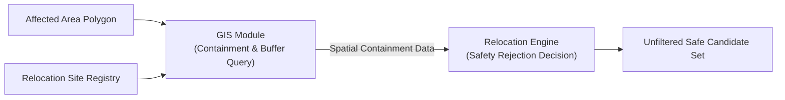
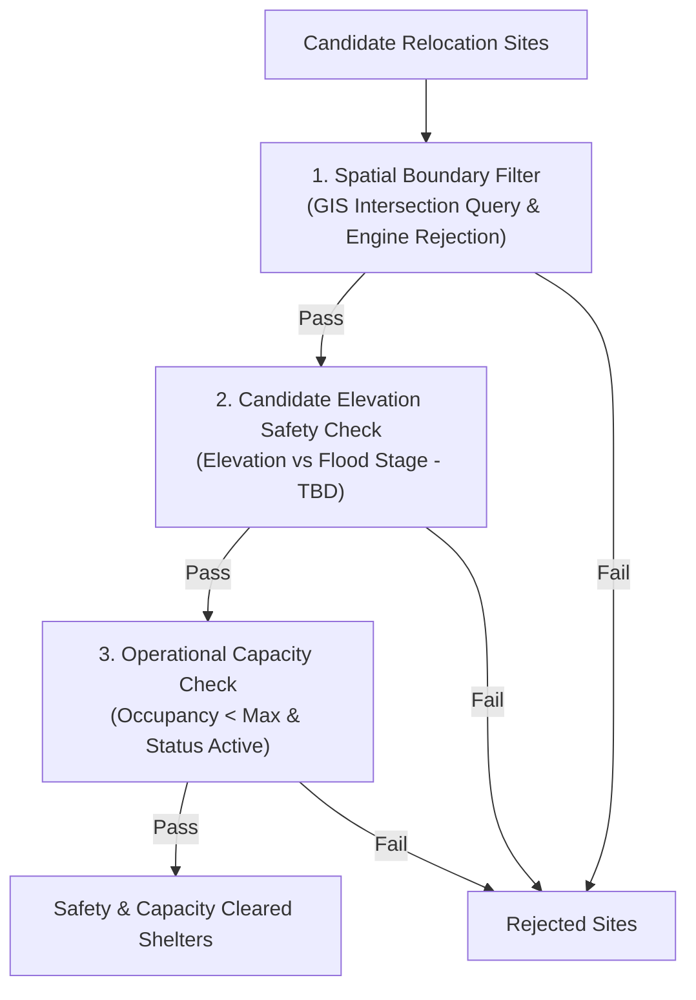
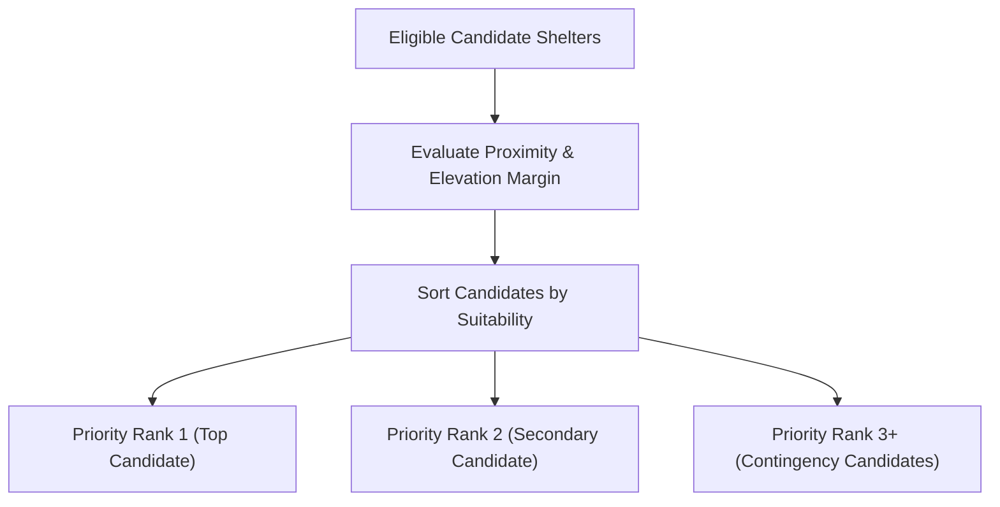
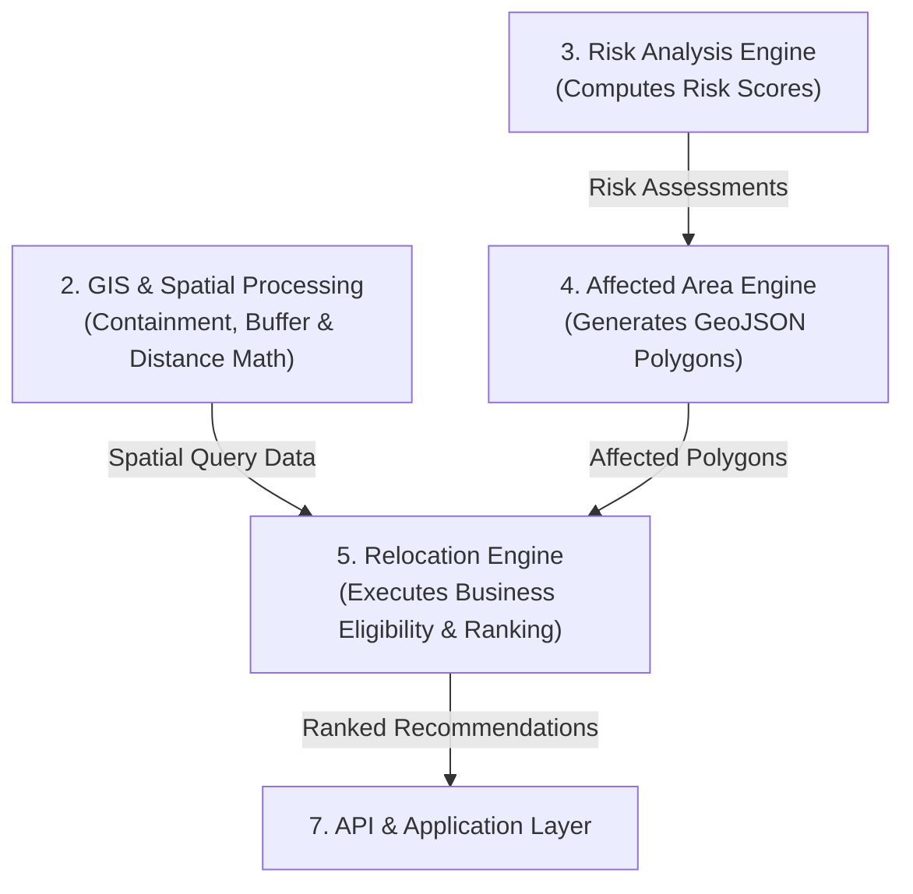
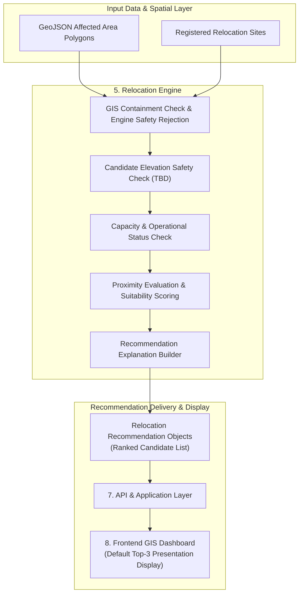

# Stage 1.7 — Relocation Architecture Specification

**Project:** Smart Hazard Risk Prediction and Relocation System  
**Event:** Smart India Hackathon (SIH) 2026  
**Document Status:** Approved Relocation Architecture Baseline for Stage 1 (System Design)  
**File Path:** `docs/Stage-1-System-Design/07-Relocation-Architecture.md`

---

## Executive Summary

This document establishes the **Stage 1.7 Relocation Architecture Specification** for the **Smart Hazard Risk Prediction and Relocation System**. Building directly upon the approved High-Level Architecture ([`01-High-Level-Architecture.md`](file:///Users/apple/Desktop/Namandeep%20Tripathi/My%20Projects/Hazard-Project/docs/Stage-1-System-Design/01-High-Level-Architecture.md)), 9-Entity Domain Model ([`02-Domain-Model.md`](file:///Users/apple/Desktop/Namandeep%20Tripathi/My%20Projects/Hazard-Project/docs/Stage-1-System-Design/02-Domain-Model.md)), Module Boundaries ([`03-Module-Boundaries.md`](file:///Users/apple/Desktop/Namandeep%20Tripathi/My%20Projects/Hazard-Project/docs/Stage-1-System-Design/03-Module-Boundaries.md)), Data Flow Specification ([`04-Data-Flow.md`](file:///Users/apple/Desktop/Namandeep%20Tripathi/My%20Projects/Hazard-Project/docs/Stage-1-System-Design/04-Data-Flow.md)), GIS Architecture ([`05-GIS-Architecture.md`](file:///Users/apple/Desktop/Namandeep%20Tripathi/My%20Projects/Hazard-Project/docs/Stage-1-System-Design/05-GIS-Architecture.md)), and Risk Architecture ([`06-Risk-Architecture.md`](file:///Users/apple/Desktop/Namandeep%20Tripathi/My%20Projects/Hazard-Project/docs/Stage-1-System-Design/06-Risk-Architecture.md)), this document defines:

1. How the system evaluates registered physical shelters (`Relocation Site`) when a hazardous `Affected Area` vector polygon is delineated.
2. The multi-stage candidate filtering pipeline enforcing **Hard Safety Filters** (spatial boundary exclusion, candidate elevation checks) and **Hard Capacity Filters** (`current_occupancy < max_capacity`).
3. The suitability scoring and proximity ranking mechanisms used to generate actionable `Relocation Recommendation` assignments.
4. Transparent, human-interpretable reasoning accompanying every recommendation for disaster authorities and emergency responders.
5. Strict responsibility boundaries: GIS provides spatial capabilities (containment, distance, elevation retrieval), while the Relocation Engine owns business decisions (safety rejection, eligibility, suitability scoring, priority ranking, recommendation generation).

---

## 1. Objective & Relocation Pipeline Overview

The primary objective of the relocation subsystem is to answer the critical emergency operational question:

> *"Once the system delineates an Affected Area polygon, which candidate relocation sites are safe, available, and optimal, and how are they recommended to vulnerable populations and emergency responders?"*

```
[Affected Area Polygon] + [Relocation Site Registry]
                        │
                        v
         [1. Spatial Boundary Exclusion Filter]
         (GIS checks geometry intersection; Engine rejects unsafe sites)
                        │
                        v
         [2. Candidate Elevation Safety Check]
         (Candidate check relative to Flood Stage - Parameters TBD)
                        │
                        v
         [3. Capacity & Operational Availability Filter]
         (Current Occupancy < Max Capacity & Status = ACTIVE)
                        │
                        v
         [4. Proximity & Suitability Ranking]
         (Straight-Line Spatial Distance & Suitability Scoring)
                        │
                        v
         [5. Relocation Recommendation Entity]
         (Ranked Candidate Output - Default Top-3 Presentation)
                        │
                        v
         [Frontend GIS Dashboard & Emergency Panel]
```

---

## 2. Relocation Engine Responsibility Boundary

In strict compliance with Stage 1.3, the **Relocation Engine** owns business decision logic for shelter evaluation:

```
+-----------------------------------------------------------------------------------+
|                     RELOCATION ENGINE RESPONSIBILITY BOUNDARY                     |
+-----------------------------------------------------------------------------------+
|                                                                                   |
|  WHAT THE RELOCATION ENGINE OWNS (BUSINESS DECISION LOGIC):                       |
|  - Business decision on whether a shelter should be rejected for safety reasons.  |
|  - Business decision on shelter eligibility & operational availability status.     |
|  - Hard capacity filtering (current occupancy vs max capacity).                   |
|  - Candidate suitability scoring evaluation.                                      |
|  - Sorting eligible candidate shelters into a ranked priority list (Rank 1, 2...).|
|  - Relocation Recommendation domain entity instantiation.                          |
|  - Transparent human-readable recommendation explanation formatting.              |
|                                                                                   |
|  WHAT THE RELOCATION ENGINE DOES NOT OWN (DELEGATED CAPABILITIES):                |
|  - Spatial geometry calculations / intersection math (owned by GIS Module).       |
|  - Hazard risk scoring or risk score calculation (owned by Risk Engine).          |
|  - Affected Area polygon generation (owned by Affected Area Engine).              |
|  - External weather data ingestion (owned by Data Ingestion Module).              |
|  - Turn-by-turn road network routing or traffic graphs (deferred to Future).      |
|  - Alert formatting or SMS/Push dispatching (owned by Alert Module).              |
|  - Web UI map component rendering (owned by Frontend Dashboard).                  |
|                                                                                   |
+-----------------------------------------------------------------------------------+
```

---

## 3. Domain Entity Ownership & Interactions

The relocation subsystem operates primarily upon 3 core domain entities:

```
[Affected Area] 1 ────< generates >──── N [Relocation Recommendation] N ────< points to >──── 1 [Relocation Site]
```

### Entity Roles:
1. **`Affected Area` (Input Entity):** A high-risk vector polygon (GeoJSON MultiPolygon) representing the spatial zone requiring evacuation and its estimated exposed population.
2. **`Relocation Site` (Infrastructure Entity):** Represents a physical shelter facility, its location coordinates, ground elevation, total capacity, current occupancy, and operational status.
3. **`Relocation Recommendation` (Action Entity):** Represents the system's calculated assignment pairing an `Affected Area` to a safe `Relocation Site`, including priority rank, spatial distance, and recommendation explanation.

---

## 4. Relocation Site Model

A **`Relocation Site`** represents a physical shelter, school, community center, or elevated relief camp registered in the system:

```
+-----------------------------------------------------------------------------------+
|                          RELOCATION SITE CONCEPTUAL MODEL                         |
+-----------------------------------------------------------------------------------+
|                                                                                   |
| - `site_id`: Unique identifier for the shelter facility.                          |
| - `site_name`: Human-readable facility name (e.g., "Central High School Shelter").|
| - `location_ref`: Spatial point location coordinates (latitude, longitude).       |
| - `region_ref`: Administrative Region reference (District / Taluka ID).           |
| - `elevation_meters`: Ground elevation above sea level (m).                       |
| - `max_capacity`: Maximum total headcount capacity (integer).                     |
| - `current_occupancy`: Current housed headcount (integer).                        |
| - `available_capacity`: Derived value (`max_capacity - current_occupancy`).       |
| - `operational_status`: `ACTIVE`, `FULL`, `INACTIVE`, `UNAVAILABLE`.              |
| - `amenities_info`: Basic facilities metadata (water, power, medical assistance).|
|                                                                                   |
+-----------------------------------------------------------------------------------+
```

### Distinguishing Site vs. Recommendation:
* **Relocation Site:** Static/operational physical facility state (infrastructure attributes).
* **Relocation Recommendation:** Dynamic decision output produced at runtime connecting a specific vulnerable area to an assigned site.

---

## 5. Candidate Site Identification & Spatial Filtering

When an `Affected Area` polygon is generated, candidate shelters are identified through spatial intersection evaluation:

```
[Affected Area Polygon] + [Registered Relocation Sites in Region]
                                │
                                v
               [1. GIS Spatial Intersection Evaluation]
               (GIS checks if site falls inside polygon or buffer)
                                │
                                v
               [2. Engine Exclusion Decision]
               (Relocation Engine rejects sites inside affected area/buffer)
                                │
                                v
                    [Candidate Safe Shelter Set]
```

### Candidate Selection Rules:
* **Spatial Boundary Rule:** GIS checks whether a shelter point intersects an active `Affected Area` polygon or buffer zone; the Relocation Engine rejects any shelter failing this spatial check.
* **Buffer Zone Exclusion Rule:** Any shelter located within the configured spatial safety buffer distance surrounding the affected polygon is rejected to prevent assigning shelters at immediate risk of flood encroachment. Exact buffer distances remain **Candidate / TBD** configuration parameters.

---

## 6. Multi-Stage Safety Filtering

The safety filtering pipeline applies deterministic physical rules to candidate shelters before suitability evaluation:

```
                  [Candidate Relocation Sites]
                               │
                               v
            +------------------------------------+
            | 1. Spatial Boundary Exclusion      |
            | (Outside Affected Area & Buffer)   |
            +------------------------------------+
                               │
                               v
            +------------------------------------+
            | 2. Elevation Safety Check (TBD)    |
            | (Elevation vs Flood Stage - TBD)   |
            +------------------------------------+
                               │
                               v
            +------------------------------------+
            | 3. Operational Availability Check  |
            | (Status = ACTIVE & Functional)     |
            +------------------------------------+
                               │
                               v
                   [Safety-Cleared Shelters]
```

### Safety Criteria & Principles:
1. **Spatial Boundary Safety:** Shelter must be strictly outside the high-risk vector polygon and exclusion buffer.
2. **Elevation Safety Check (Candidate / TBD):** For the current flood-focused MVP, elevation-based safety is a candidate/hard safety criterion when reliable flood-stage information is available. The exact flood-stage data source, estimation method, elevation safety margin, and handling when flood-stage information is unavailable remain **Candidate / TBD**.
3. **Hazard-Specific Extensibility:** For non-flood hazards (e.g., Landslide), elevation checks may be dynamically replaced or augmented by terrain slope stability checks in future phases without breaking the core filtering pipeline.

---

## 7. Capacity & Availability Evaluation

A shelter must possess sufficient available capacity to receive new recommendations:

$$\text{Available Capacity} = \text{max\_capacity} - \text{current\_occupancy}$$

```
+-----------------------------------------------------------------------------------+
|                           CAPACITY EVALUATION LOGIC                               |
+-----------------------------------------------------------------------------------+
|                                                                                   |
|  IF `operational_status` != `ACTIVE`:                                              |
|      --> REJECT (Site is inactive or closed)                                      |
|                                                                                   |
|  ELSE IF `current_occupancy` >= `max_capacity`:                                   |
|      --> REJECT & Set status to `FULL`                                            |
|                                                                                   |
|  ELSE IF `available_capacity` > 0:                                                |
|      --> ACCEPT as Capacity-Eligible Candidate                                    |
|                                                                                   |
+-----------------------------------------------------------------------------------+
```

### MVP Population Demand Limitation:
* For the SIH MVP, individual shelter capacity is evaluated to ensure `available_capacity > 0`. 
* Detailed multi-shelter headcount optimization (e.g., distributing 5,000 citizens across 4 shelters simultaneously) is recognized as a complex optimization problem and is **deferred to Future Scope**. In MVP, candidates with open capacity are ranked and presented to emergency officers.

---

## 8. Distance & Spatial Proximity Evaluation

For the SIH MVP, proximity between affected zones and candidate shelters is calculated using **simple spatial distance**:

```
[Affected Area Centroid] ──> [Straight-Line Spatial Distance (GIS Provided)] ──> [Relocation Site Coordinates]
```

### Architectural Proximity Principles:
* **Straight-Line Spatial Distance:** GIS calculates spatial distance between the `Affected Area` polygon centroid and candidate `Relocation Site` coordinates.
* **No Turn-by-Turn Routing Engine in MVP:** We explicitly **reject** complex road network graph traversal, traffic-aware routing, and travel-time prediction engines for the MVP. Straight-line distance provides high performance, zero external API dependencies, and clear demonstration value.
* **Ranking Factor:** Proximity acts as a secondary ranking factor *after* hard safety and capacity criteria have been satisfied.

---

## 9. Conceptual Suitability Scoring & Ranking

Eligible candidate shelters passing all hard filters are evaluated and ranked based on suitability:

```
[Safety-Cleared & Capacity-Eligible Shelters]
                      │
                      v
     [Suitability Factor Evaluation]
     - Relative Elevation Margin (where available)
     - Available Capacity Headcount
     - Straight-Line Spatial Distance
                      │
                      v
      [Candidate Suitability Scoring (TBD Weights)]
                      │
                      v
      [Ranked Candidate List (Rank 1, 2, 3...)]
```

### Filter Classification:
* **Hard Filters (Mandatory Exclusion):**
  - Intersects affected polygon / buffer $\rightarrow$ Exclude.
  - Fails hazard safety / elevation check (when data available) $\rightarrow$ Exclude.
  - Status `INACTIVE` or `FULL` $\rightarrow$ Exclude.
* **Ranking Factors (Relative Scoring):**
  - Higher relative ground elevation $\rightarrow$ Higher rank factor.
  - Larger available capacity $\rightarrow$ Higher rank factor.
  - Closer spatial distance $\rightarrow$ Higher rank factor.
* **Scoring Rules:** Specific mathematical weights assigned to proximity vs. elevation margin are **deferred as Candidate / TBD configuration parameters**.

---

## 10. Priority Ranking Protocol

Candidate shelters passing all hard safety and capacity filters are evaluated and sorted from highest to lowest suitability into a ranked candidate list:

$$\text{Candidate List} \longrightarrow \text{Priority Rank 1}, \quad \text{Priority Rank 2}, \quad \text{Priority Rank 3}, \quad \dots$$

* **Rank 1:** Highest suitability candidate (Optimal safety, capacity, and proximity balance).
* **Rank 2:** Secondary backup candidate (Safe & open, next highest suitability score).
* **Rank 3+:** Contingency candidate shelters.

---

## 11. Ranked Candidate List & Top-N Presentation

The system produces a ranked candidate list and formats it for presentation:

* **Ranked Candidate Output:** The Relocation Engine outputs the ordered list of eligible shelters sorted by suitability score.
* **Configurable Top-N Presentation:** The presentation layer displays a configurable Top-N subset of ranked shelters (e.g., Top-3). **Top-3** serves as the default presentation choice for the SIH MVP UI, but is not a hard backend architectural limit.

---

## 12. Hazard-Specific Relocation Extensibility

The relocation architecture is designed to support multi-hazard suitability rules without altering core entity interfaces:

```
+------------------------------------------------------------------------------------+
|                         HAZARD-SPECIFIC SUITABILITY PLUGINS                        |
+------------------------------------------------------------------------------------+
|                                                                                    |
|  FLOOD HAZARD (MVP Focus):                                                         |
|  - Candidate Elevation Safety Check (Elevation vs Flood Stage - TBD).              |
|  - Spatial Exclusion Buffer surrounding flood inundation polygons.                 |
|                                                                                    |
|  LANDSLIDE HAZARD (Future Plugin):                                                 |
|  - Terrain Slope Check (Shelter must not be on steep/unstable slopes).             |
|  - Runout Zone Exclusion Buffer.                                                   |
|                                                                                    |
|  EXTREME HEAT HAZARD (Future Plugin):                                              |
|  - Indoor Climate Control / Power Backup Facility Check.                           |
|  - High Water Availability Requirement.                                            |
|                                                                                    |
+------------------------------------------------------------------------------------+
```

---

## 13. Conceptual Relocation Recommendation Structure

A **`Relocation Recommendation`** domain object captures the complete decision payload for an assigned shelter:

```
+-----------------------------------------------------------------------------------+
|                   RELOCATION RECOMMENDATION CONCEPTUAL STRUCTURE                  |
+-----------------------------------------------------------------------------------+
|                                                                                   |
| - `recommendation_id`: Unique recommendation identifier.                          |
| - `affected_area_ref`: Reference to the target Affected Area polygon.            |
| - `relocation_site_ref`: Reference to the assigned Relocation Site shelter.       |
| - `priority_rank`: Integer rank order (1, 2, 3...).                              |
| - `distance_km`: Straight-line spatial distance from affected area centroid (km). |
| - `suitability_reason`: Human-readable explanation of selection.                 |
| - `available_capacity_snapshot`: Available capacity at time of recommendation.   |
| - `generated_at`: Timestamp of recommendation execution (UTC ISO-8601).          |
|                                                                                   |
+-----------------------------------------------------------------------------------+
```

---

## 14. Recommendation Explanation & Transparency

Every recommendation generated by the engine includes a human-interpretable explanation string for emergency officers and SIH judges:

```
"RECOMMENDED ASSIGNMENT (Priority Rank 1):
 Site: Central High School Shelter
 Reason for Selection:
 - Located 2.4 km from affected zone centroid (Outside high-risk polygon & buffer zone).
 - Elevation: 45m MSL (Clears candidate elevation safety checks).
 - Capacity: 150 spots available (Total: 300, Occupied: 150).
 - Facilities: Water, Emergency Power, Medical Kit available."
```

---

## 15. Population Exposure & Demand Limitations

The interaction between affected population and shelter capacity operates under explicit MVP boundaries:

* **Exposed Population Overlay:** The `Affected Area Engine` calculates estimated `population_exposed` by overlaying affected polygons against census density grids.
* **MVP Capacity Matching:** The Relocation Engine displays available shelter capacity alongside exposed population totals on the emergency dashboard.
* **MVP Limitation:** Automated micro-allocation of specific citizen groups to individual beds is **deferred to Future Scope**. The MVP successfully demonstrates matching affected geographic zones to ranked candidate shelters with open capacity.

---

## 16. GIS vs. Relocation Responsibility Boundary

To resolve architectural ambiguity, spatial capabilities are strictly separated from business decision logic:

```
+------------------------------------------+------------------------------------------+
|      GIS & SPATIAL PROCESSING MODULE     |            RELOCATION ENGINE             |
|          (Spatial Capabilities)          |            (Business Decisions)         |
+------------------------------------------+------------------------------------------+
| GIS Answers:                             | Relocation Engine Answers:               |
| - "Is this site inside/intersecting this | - "Should this candidate site be         |
|   geometry or exclusion buffer?"         |   rejected for safety reasons?"          |
| - "What is the spatial distance (km)     | - "Is this candidate site eligible       |
|   between centroid and shelter?"         |   and available?"                        |
| - "What is the site's ground elevation   | - "Is this candidate site suitable?"     |
|   from DEM rasters?"                     | - "Which candidate should rank higher?"  |
| - "What is the spatial buffer zone?"     | - "Which candidate sites should be       |
|                                          |   recommended?"                          |
+------------------------------------------+------------------------------------------+
```

### Architectural Contract:
* **GIS** provides spatial calculations, spatial containment checks, buffer geometries, elevation values, and spatial distances.
* **Relocation Engine** consumes these spatial inputs alongside shelter status and capacity to execute business decision rules (safety rejection, eligibility, suitability scoring, priority ranking, and recommendation output).

---

## 17. Risk vs. Relocation Responsibility Boundary

```
[Risk Analysis Engine] ──> [Risk Assessments] ──> [Affected Area Engine] ──> [Affected Area Polygon]
                                                                                   │
                                                                                   v
                                                                        [Relocation Engine]
                                                                        (Recommends Shelters)
```

* **Risk Engine:** Computes risk scores and levels.
* **Affected Area Engine:** Converts high-risk cell clusters into spatial vector polygons.
* **Relocation Engine:** Consumes affected polygons and shelter registries to produce recommendations. **Never recalculates hazard risk scores.**

---

## 18. Relocation vs. Alert Boundary

```
                                 [Affected Area Polygon]
                                            │
                    ┌───────────────────────┴───────────────────────┐
                    v                                               v
       [Relocation Engine]                                [Alert Module]
                │                                               │
                v                                               v
  [Relocation Recommendations] ───────────────> [Formatted Alert Broadcast Payload]
  (Ranked Candidate Shelters)                   ("Evacuate Zone A to Shelter B")
```

* **Relocation Engine:** Calculates shelter suitability and generates `Relocation Recommendation` objects.
* **Alert Module:** Consumes risk alerts and relocation recommendations to construct warning message payloads for public dispatch.

---

## 19. Failure & Edge Case Handling

The relocation architecture specifies clean fallback behaviors for spatial and operational anomalies:

* **All Nearby Shelters Full:** If all candidate shelters within proximity reach 100% capacity (`available_capacity == 0`), the engine expands its spatial search radius, flags recommendations with `CAPACITY_WARNING`, and alerts emergency admins.
* **No Safe Shelter Available:** If no shelters satisfy safety and elevation filters, the engine **refuses to recommend an unsafe site**, returns a `NO_SAFE_SHELTER_AVAILABLE` status, and triggers a high-priority alert for manual admin intervention.
* **Corrupt Shelter Coordinates:** Shelters with invalid lat/long coordinates are excluded from candidate filtering and logged for admin data cleanup.
* **Missing Affected Area Polygon:** If geometry processing fails, shelter recommendations are suspended until valid spatial boundaries are restored.

---

## 20. Recommendation Transparency for Decision-Makers

To build trust with emergency response teams, every recommendation payload delivered to the dashboard contains full operational context:

$$\text{Recommendation Payload} = \{\text{Site Name}, \text{Rank}, \text{Distance}, \text{Available Capacity}, \text{Reason Summary}\}$$

Disaster officials can review, override, or approve recommended evacuation plans directly from the admin panel.

---

## 21. Relocation Architecture Diagrams

### Diagram A: GIS Spatial Check vs. Engine Decision Pipeline


### Diagram B: Multi-Stage Safety & Capacity Filtering


### Diagram C: Suitability Evaluation and Priority Ranking


### Diagram D: Relocation Recommendation Payload Generation


### Diagram E: GIS / Risk / Relocation Subsystem Boundaries


### Diagram F: Master Relocation Architecture


---

## 22. MVP Scope vs. Future Relocation Capabilities

```
+------------------------------------------------------------------------------------+
|                             RELOCATION SCOPE PARTITION                             |
+------------------------------------------------------------------------------------+
|                     MUST HAVE (MVP RELOCATION CAPABILITIES)                        |
|  - GIS Polygon Exclusion & Buffer Intersection Query Support                       |
|  - Candidate Elevation Safety Check relative to Flood Stage (Parameters TBD)       |
|  - Operational Status & Capacity Availability Check (`Occupancy < Max`)            |
|  - Straight-Line Spatial Proximity Distance Evaluation                             |
|  - Priority Ranking Protocol (Rank 1, Rank 2, Rank 3...)                           |
|  - Configurable Top-N Presentation Display (Default Top-3 on UI)                   |
|  - Transparent Human-Readable Recommendation Explanations                          |
|  - Safe Fallbacks when Shelters are Full or Unavailable                             |
+------------------------------------------------------------------------------------+
                                         │
                                         v
+------------------------------------------------------------------------------------+
|                     FUTURE RELOCATION CAPABILITIES (DEFERRED)                      |
|  - Dynamic Turn-by-Turn Road Network Routing & OSRM Engine Integration             |
|  - Live Traffic-Aware Evacuation Travel Time Estimation                            |
|  - Multi-Shelter Mass Population Flow Optimization & Headcount Assignment          |
|  - IoT Live Shelter Sensor Telemetry (Real-time bed/water/power feeds)            |
|  - Multimodal Evacuation Fleet Logistics & Transit Hub Routing                      |
+------------------------------------------------------------------------------------+
```

---

## 23. Open Decisions (Deferred to Later Stages)

The following relocation implementation choices remain explicitly deferred to later design stages:

* **Exact Spatial Exclusion Buffer Distance:** Numeric buffer distance (e.g., 500m vs 1km) deferred as configuration parameter.
* **Exact Flood-Stage Estimation Method & Elevation Safety Margin:** Flood-stage calculation method and numeric safety margin deferred as TBD parameters.
* **Exact Suitability Scoring Formula & Weights:** Weighting ratio between proximity vs elevation margin deferred.
* **Exact Capacity Allocation Strategy:** Mathematical multi-shelter population distribution algorithms deferred.
* **Routing Engine Technology:** Selection of road network engines (OSRM vs GraphHopper) deferred to Future Scope.
* **Shelter Data Ingestion Schema:** SQL tables and database DDL scripts deferred to Stage 1.8.

---

## 24. Architectural Consistency Verification

* **Alignment with Stage 1.1:** Delivers ranked safe shelter recommendations without complex traffic routing as defined in [`01-High-Level-Architecture.md`](file:///Users/apple/Desktop/Namandeep%20Tripathi/My%20Projects/Hazard-Project/docs/Stage-1-System-Design/01-High-Level-Architecture.md).
* **Alignment with Stage 1.2:** Operates upon `Relocation Site` and `Relocation Recommendation` domain entities as defined in [`02-Domain-Model.md`](file:///Users/apple/Desktop/Namandeep%20Tripathi/My%20Projects/Hazard-Project/docs/Stage-1-System-Design/02-Domain-Model.md).
* **Alignment with Stage 1.3:** Respects logical module boundaries; Relocation Engine does not calculate hazard risk scores or process GIS CRS transformations as defined in [`03-Module-Boundaries.md`](file:///Users/apple/Desktop/Namandeep%20Tripathi/My%20Projects/Hazard-Project/docs/Stage-1-System-Design/03-Module-Boundaries.md).
* **Alignment with Stage 1.4:** Consumes `Affected Area` polygons and shelter registries to output ranked recommendations without hardcoded thresholds as defined in [`04-Data-Flow.md`](file:///Users/apple/Desktop/Namandeep%20Tripathi/My%20Projects/Hazard-Project/docs/Stage-1-System-Design/04-Data-Flow.md).
* **Alignment with Stage 1.5:** Relies on GIS processing for spatial containment checks, buffer queries, elevation retrieval, and straight-line distance math as defined in [`05-GIS-Architecture.md`](file:///Users/apple/Desktop/Namandeep%20Tripathi/My%20Projects/Hazard-Project/docs/Stage-1-System-Design/05-GIS-Architecture.md).
* **Alignment with Stage 1.6:** Consumes `Risk Assessment` outputs via `Affected Area` without recalculating risk scores as defined in [`06-Risk-Architecture.md`](file:///Users/apple/Desktop/Namandeep%20Tripathi/My%20Projects/Hazard-Project/docs/Stage-1-System-Design/06-Risk-Architecture.md).

---

## 25. Final Review & Verdict

### Summary Checklist:
- **A. Relocation Architecture Summary:** Multi-stage recommendation subsystem evaluating shelter safety, capacity, elevation, and proximity.
- **B. Relocation Site Definition:** Physical shelter infrastructure entity holding coordinates, elevation, capacity, occupancy, and status.
- **C. Candidate Filtering Process:** Hard spatial boundary exclusion followed by candidate elevation checks and capacity verification.
- **D. Safety Rules:** Boundary exclusion, spatial buffer queries, and candidate elevation safety checks (parameters TBD).
- **E. Capacity / Availability Logic:** Available capacity (`max - occupancy > 0`) and active operational status requirements.
- **F. Ranking Logic:** Sorting cleared candidates by suitability into a priority ranked candidate list (Rank 1, Rank 2, Rank 3...).
- **G. Recommendation Explanation:** Transparent, human-interpretable reasoning accompanying every recommendation payload.
- **H. GIS / Risk / Relocation Boundaries:** GIS provides spatial math and containment data; Risk Engine provides risk scores; Relocation Engine owns business decision logic, eligibility, suitability, and ranking.
- **I. Failure Cases:** Safe fallbacks when shelters are full or unsafe; never recommends an unsafe site.
- **J. MVP vs. Future:** Straight-line proximity, ranked candidate lists, and Top-3 UI presentation display in MVP; turn-by-turn road network routing deferred.
- **K. Open Decisions:** Buffer distances, flood-stage data methods, suitability weights, and routing tech cleanly deferred.
- **L. Consistency Check:** 100% consistent across Stages 1.1 through 1.6.

---

### Final Architectural Verdict: **APPROVED WITH MINOR CORRECTIONS**

> The **Stage 1.7 Relocation Architecture Specification** is fully approved as the technical baseline for Stage 1 System Design. It provides a minimal, clean, robust, and transparent relocation recommendation framework ready for subsequent database strategy and technology selection stages.
