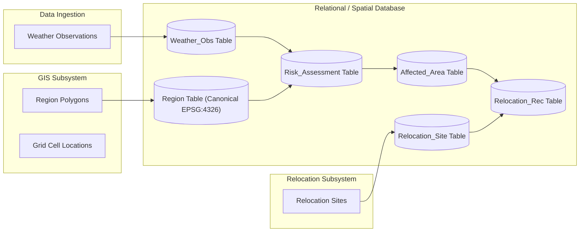
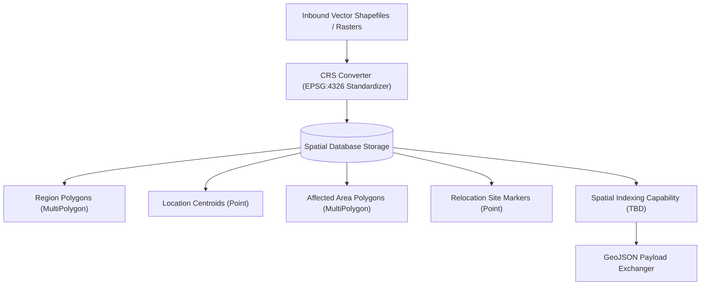
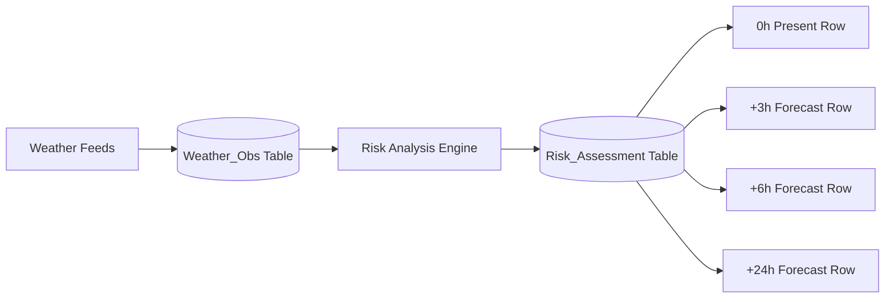
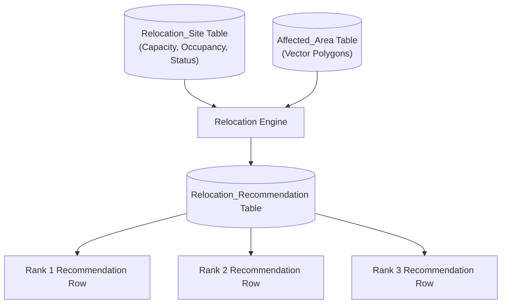
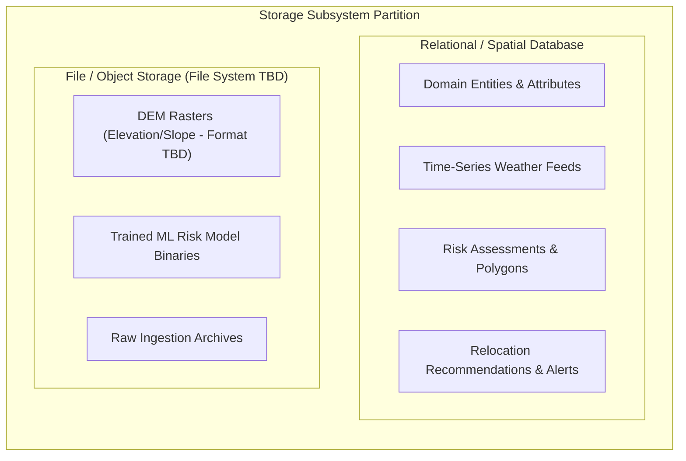
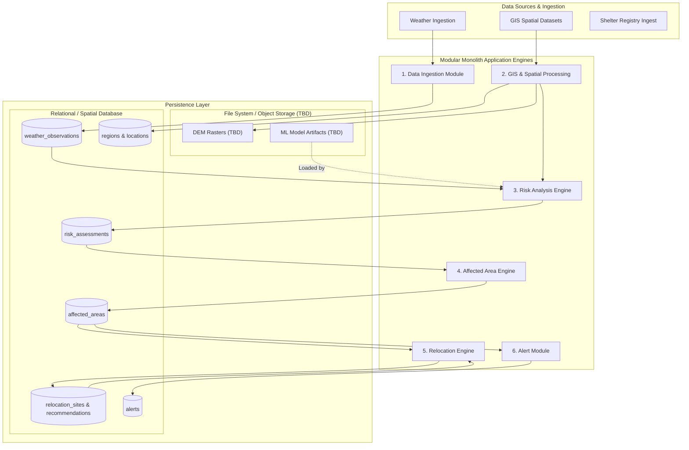

# Stage 1.8 — Database Strategy Specification

**Project:** Smart Hazard Risk Prediction and Relocation System  
**Event:** Smart India Hackathon (SIH) 2026  
**Document Status:** Approved Database Strategy Baseline for Stage 1 (System Design)  
**File Path:** `docs/Stage-1-System-Design/08-Database-Strategy.md`

---

## Executive Summary

This document establishes the **Stage 1.8 Database Strategy Specification** for the **Smart Hazard Risk Prediction and Relocation System**. Building directly upon the approved High-Level Architecture ([`01-High-Level-Architecture.md`](file:///Users/apple/Desktop/Namandeep%20Tripathi/My%20Projects/Hazard-Project/docs/Stage-1-System-Design/01-High-Level-Architecture.md)), 9-Entity Domain Model ([`02-Domain-Model.md`](file:///Users/apple/Desktop/Namandeep%20Tripathi/My%20Projects/Hazard-Project/docs/Stage-1-System-Design/02-Domain-Model.md)), Module Boundaries ([`03-Module-Boundaries.md`](file:///Users/apple/Desktop/Namandeep%20Tripathi/My%20Projects/Hazard-Project/docs/Stage-1-System-Design/03-Module-Boundaries.md)), Data Flow Specification ([`04-Data-Flow.md`](file:///Users/apple/Desktop/Namandeep%20Tripathi/My%20Projects/Hazard-Project/docs/Stage-1-System-Design/04-Data-Flow.md)), GIS Architecture ([`05-GIS-Architecture.md`](file:///Users/apple/Desktop/Namandeep%20Tripathi/My%20Projects/Hazard-Project/docs/Stage-1-System-Design/05-GIS-Architecture.md)), Risk Architecture ([`06-Risk-Architecture.md`](file:///Users/apple/Desktop/Namandeep%20Tripathi/My%20Projects/Hazard-Project/docs/Stage-1-System-Design/06-Risk-Architecture.md)), and Relocation Architecture ([`07-Relocation-Architecture.md`](file:///Users/apple/Desktop/Namandeep%20Tripathi/My%20Projects/Hazard-Project/docs/Stage-1-System-Design/07-Relocation-Architecture.md)), this document defines:

1. The conceptual persistence strategy for managing domain entities, spatial geometries, time-series observations, and decision records.
2. The persistence mapping and primary module ownership across all 9 core MVP domain entities.
3. The requirements for relational storage and spatial database capabilities (canonical EPSG:4326 interchange, point/polygon storage, spatial containment & distance indexing capability).
4. The strategy for distinguishing persisted source data from derived/computed values and external file/object storage assets (DEM rasters, ML model binaries).
5. Data integrity, transaction boundaries, auditability, data retention policies, and security guidelines.

---

## 1. Objective & Database Strategy Overview

The primary objective of the Database Strategy is to define how the system conceptually persists, queries, and manages domain data while maintaining the Modular Monolith architecture.

```
                                  DATA PERSISTENCE BOUNDARY
┌───────────────────────────────────────────────────────────────────────────────────────────┐
│                                                                                           │
│   RELATIONAL / SPATIAL DATABASE (Core State Engine)                                       │
│   - Domain Entities (Regions, Locations, Hazards, Shelters)                              │
│   - Time-Series Environmental Feeds (Weather Observations)                               │
│   - Generated Assessments & Polygons (Risk Assessments, Affected Areas)                   │
│   - Decision Outputs & Audit Logs (Relocation Recommendations, Alerts)                    │
│                                                                                           │
└─────────────────────────────────────────────┬─────────────────────────────────────────────┘
                                              │
                                              v
┌───────────────────────────────────────────────────────────────────────────────────────────┐
│                                                                                           │
│   FILE / OBJECT STORAGE (Heavy Binary Assets)                                             │
│   - Digital Elevation Model (DEM) Rasters (e.g., Candidate GeoTIFF rasters)               │
│   - Trained Risk Model Binary Artifacts                                                  │
│   - Raw External Payload Archives                                                         │
│                                                                                           │
└───────────────────────────────────────────────────────────────────────────────────────────┘
```

### Core Persistence Principles:
* **Modular Monolith Alignment:** A unified logical database schema serves the application process while enforcing strict module-level table ownership boundaries.
* **Unified Domain Mapping:** All 9 approved MVP domain entities are explicitly mapped to persistence roles.
* **Spatial & Relational Integration:** Relational integrity handles domain relationships, while spatial extension capabilities handle geometric indexing and point-in-polygon queries.
* **No Premature Technology Lock-in:** Specific database software products, ORM tools, spatial indexing engines, migration tools, and secret management mechanisms are classified as **Candidate / TBD** for finalization in **Stage 1.10 Technology Decisions**.

---

## 2. Conceptual Database Requirements

Deriving requirements from previous architecture specifications, the storage subsystem must support:

| Requirement Category | Core Capability Needed | Architectural Purpose |
| :--- | :--- | :--- |
| **Relational Data Storage** | ACID transactions, foreign keys, unique constraints. | Guarantees integrity across shelters, recommendations, and regions. |
| **Spatial Data Storage** | Point, Polygon, and MultiPolygon geometry types. | Stores region borders, shelter points, and affected area boundaries. |
| **Spatial Querying** | Geometry intersection, containment, bounding box, distance. | Supports candidate shelter exclusion checks and straight-line proximity. |
| **Time-Series Records** | Timestamp-indexed sequential observations. | Stores weather readings, forecasts, and multi-horizon risk assessments. |
| **Spatial Indexing** | Spatial indexing capability for fast spatial queries. | Enables efficient spatial queries (containment, intersection, proximity). |
| **Auditability & Traceability**| Model version references, generation timestamps, historical logs.| Provides reproducible audit trails for emergency management officials. |

---

## 3. Conceptual Persistence Mapping

The system defines the persistence requirements for all 9 approved MVP domain entities:

| Domain Entity | Persist Status | Persistence Rationale | Data Nature | Primary Module Owner |
| :--- | :--- | :--- | :--- | :--- |
| **Region** | Persisted | Seeded administrative/geographic boundaries & population data. | Static Vector Geometry | **GIS & Spatial Processing** |
| **Location** | Persisted | Monitored spatial grid cells & centroid coordinates. | Static Spatial Index | **GIS & Spatial Processing** |
| **Hazard** | Persisted | Reference catalog of supported hazard types (Flood/Rainfall). | Static Reference Data | **Risk Analysis Engine** |
| **Weather Observation** | Persisted | Sequential real-time & forecast meteorological readings. | Time-Series Environmental | **Data Ingestion Module** |
| **Risk Assessment** | Persisted | Computed risk scores across 0h, +3h, +6h, +24h horizons. | Computed Time-Series | **Risk Analysis Engine** |
| **Affected Area** | Persisted | Vector polygons representing high-risk evacuation zones. | Computed Spatial Vector | **Affected Area Engine** |
| **Relocation Site** | Persisted | Registered shelter infrastructure, capacity, and status. | Operational Reference | **Relocation Engine** |
| **Relocation Recommendation**| Persisted | Decision records assigning affected areas to shelters. | Operational Transaction | **Relocation Engine** |
| **Alert** | Persisted | Record of generated warning payloads and dispatch status. | Audit & Notification Log | **Alert & Notification** |

---

## 4. Module Entity Ownership & Boundaries

In strict compliance with Stage 1.3 Module Boundaries, primary entity ownership is cleanly partitioned:

```
+-----------------------------------------------------------------------------------+
|                            DATABASE ENTITY OWNERSHIP                              |
+-----------------------------------------------------------------------------------+
|                                                                                   |
|  [ GIS & SPATIAL PROCESSING MODULE ]                                              |
|  - Primary Owner: `Region`, `Location`                                            |
|                                                                                   |
|  [ DATA INGESTION MODULE ]                                                        |
|  - Primary Owner: `Weather Observation`                                           |
|                                                                                   |
|  [ RISK ANALYSIS ENGINE ]                                                         |
|  - Primary Owner: `Hazard`, `Risk Assessment`                                     |
|                                                                                   |
|  [ AFFECTED AREA ENGINE ]                                                         |
|  - Primary Owner: `Affected Area`                                                 |
|                                                                                   |
|  [ RELOCATION ENGINE ]                                                            |
|  - Primary Owner: `Relocation Site`, `Relocation Recommendation`                  |
|                                                                                   |
|  [ ALERT & NOTIFICATION MODULE ]                                                  |
|  - Primary Owner: `Alert`                                                         |
|                                                                                   |
+-----------------------------------------------------------------------------------+
```

---

## 5. Relational Data Strategy

A relational storage model is selected as the primary persistence paradigm for the modular monolith:

### Strategic Justification:
1. **Domain Integrity & Relationships:** Domain entities (e.g., `Relocation Recommendation` referencing a specific `Relocation Site` and `Affected Area`) require strict foreign key constraints and transactional integrity.
2. **ACID Transactional Guarantees:** Updating shelter capacity (`current_occupancy`) during emergency evacuations demands atomic consistency to prevent double-booking or over-allocation.
3. **Structured Querying & Reporting:** Structured SQL queries allow emergency managers to generate regional reports, count exposed populations, and query active warning alerts efficiently.
4. **Spring Boot Integration:** Seamless compatibility with enterprise Java persistence frameworks.

> **Candidate / TBD:** Specific relational database products (e.g., PostgreSQL, H2) remain **Candidate / TBD** for Stage 1.10.

---

## 6. Spatial Database Capabilities

Per Stage 1.5, the storage engine must support geospatial vector capabilities:

```
[Spatial Data Types] ──> Point (Shelters, Stations) | Polygon / MultiPolygon (Regions, Affected Areas)
                                      │
                                      v
[Spatial Operations] ──> Spatial Contains | Intersects | Distance Operations
                                      │
                                      v
[Spatial Indexing]   ──> Spatial Indexing Capability for Fast Polygon Queries
```

### Spatial Requirements:
* **Native Geometry Storage:** Storing 2D geographic coordinates and complex vector polygon boundaries.
* **Spatial Relationship Functions:** Executing spatial point-in-polygon containment checks and polygon intersection tests.
* **Spatial Distance Math:** Calculating straight-line spatial distance between points and polygon centroids.
* **GeoJSON Interoperability:** Exporting spatial query results directly into standard GeoJSON structures for UI rendering.

> **Candidate / TBD:** Specific spatial index implementations (e.g., GIST, R-Tree) and spatial database extensions (e.g., PostGIS, H2 Spatial) remain **Candidate / TBD** for Stage 1.10.

---

## 7. Canonical Coordinate Reference System (CRS) Storage

In strict alignment with Stage 1.5 (as updated):

> *"WGS 84 (EPSG:4326) is the canonical coordinate reference system for internal spatial interchange and GeoJSON/API payloads. Inbound datasets may use different coordinate reference systems and will be transformed into the canonical CRS during ingestion or spatial preprocessing when required."*

### Spatial Storage Rules:
* All spatial geometries (`Region` boundaries, `Location` centroids, `Affected Area` polygons, `Relocation Site` points) are represented and exchanged according to the canonical **EPSG:4326** standard.
* The exact spatial storage/SRID implementation strategy inside the database engine remains subject to **Stage 1.10 Technology Decisions**.
* Inbound vector/raster datasets using alternative coordinate projections are transformed during ingestion or spatial preprocessing when required.

---

## 8. Historical Weather Data Strategy

The database maintains a structured strategy for weather observations:

```
[External Weather Feeds] ──> [Data Ingestion Module] ──> [Weather Observation Table]
                                                            ├── Real-Time Readings (T0)
                                                            ├── Forecast Readings (+3h, +6h, +24h)
                                                            └── Historical Series (Archive)
```

### Categorization & Usage:
1. **Real-Time Observations ($T_0$):** Used for immediate present risk scoring. Retained in active operational database tables.
2. **Forecast Feeds ($+3\text{h}, +6\text{h}, +24\text{h}$):** Used for future risk horizon assessments. Indexed by target timestamp.
3. **Historical Observation Archives:** Retained for model development, temporal cross-validation, and auditability.
4. **Retention Policy:** The exact historical data retention duration (e.g., active DB storage vs. long-term cold storage archive) is **deferred as Candidate / TBD**.

---

## 9. Risk Assessment Storage Strategy

`Risk Assessment` records are persisted to maintain a historical record of calculated risk across all evaluated forecast horizons:

```
+-----------------------------------------------------------------------------------+
|                        RISK ASSESSMENT PERSISTENCE SCHEMA                         |
+-----------------------------------------------------------------------------------+
| - `location_ref`: Spatial grid cell identifier.                                    |
| - `region_ref`: Administrative Region identifier.                                 |
| - `hazard_ref`: Hazard type identifier.                                           |
| - `calculated_at`: Assessment timestamp (UTC).                                    |
| - `forecast_horizon_hours`: Horizon integer (0, 3, 6, 24).                        |
| - `normalized_risk_score`: Continuous value (0.00 to 1.00).                       |
| - `derived_risk_level`: Categorical string (LOW, MEDIUM, HIGH, CRITICAL).         |
| - `confidence_index`: Optional candidate reliability metric (TBD).               |
| - `model_version`: Reference tag to approved model artifact.                      |
+-----------------------------------------------------------------------------------+
```

### Architectural Guarantees:
* Present ($0\text{h}$) and future ($+3\text{h}$, $+6\text{h}$, $+24\text{h}$) assessments are stored as individual rows parameterised by `forecast_horizon_hours`.
* `Prediction` is **NOT** a separate table or domain entity.

---

## 10. Affected Area Storage Strategy

`Affected Area` entities store high-risk evacuation polygons generated by the Affected Area Engine:

```
[High-Risk Grid Cell Clusters] ──> [Polygon Union] ──> [Affected Area Record]
                                                        - Polygon Geometry (Canonical EPSG:4326)
                                                        - Exposed Population Count
                                                        - Generation Timestamp
                                                        - Active / Historical Status
```

### Persistence Attributes:
* **Spatial Polygon:** Stored as a 2D vector MultiPolygon geometry.
* **Metadata Context:** Includes exposed population estimates, generation timestamp, and risk threshold context.
* **Threshold Independence:** Contains no hardcoded numeric risk thresholds.

---

## 11. Relocation Data Storage Strategy

The database maintains records for shelter infrastructure and recommendation assignments:

### A. Relocation Site Storage:
* Stores facility coordinates, ground elevation ($m$), total capacity, current occupancy, operational status (`ACTIVE`, `FULL`, `INACTIVE`), and amenities metadata.

### B. Relocation Recommendation Storage:
* Stores decision payloads linking an `Affected Area` to an assigned `Relocation Site`.
* Captures priority rank (1, 2, 3...), straight-line spatial distance ($km$), snapshot of available capacity at recommendation time, and human-readable explanation string.

---

## 12. Alert Storage Strategy

The database persists `Alert` records for communication tracking and legal auditability:

```
[Risk State Breach] ──> [Alert Module] ──> [Alert Record Persisted] ──> [Mock Dispatch Payload]
                                            - Target Region / Affected Area Ref
                                            - Severity Level (HIGH / CRITICAL)
                                            - Recommended Shelters Summary
                                            - Dispatch Timestamp & Status
```

* **Auditability:** Preserves a permanent record of all warning alerts generated by the system.
* **Separation:** Persisting the `Alert` record is strictly separated from external notification delivery mechanisms (SMS/Push gateways).

---

## 13. Derived vs. Persisted Data Classification

To optimize database storage and performance, data elements are categorized by persistence nature:

| Data Element | Persistence Classification | Storage Rationale |
| :--- | :--- | :--- |
| **Region Boundaries & Metadata** | **Persisted Source Data** | Heavy administrative vector geometry; ingested once. |
| **Relocation Site Facilities** | **Persisted Source Data** | Core infrastructure registry; updated operationally. |
| **Weather Observations** | **Persisted Source Data** | Essential time-series input data required for audit/ML. |
| **Risk Assessments** | **Persisted Derived Output**| Stored to preserve historical predictions for auditability. |
| **Affected Area Polygons** | **Persisted Derived Output**| Stored for display, relocation matching, and alerts. |
| **Relocation Recommendations** | **Persisted Derived Output**| Stored for emergency manager review and action. |
| **Terrain Slope Angles** | **Derived / Cached Data** | Computed once from DEM rasters; cached or recomputed. |
| **Straight-Line Proximity Distance**| **Computed at Runtime** | Evaluated dynamically between polygon and shelter. |
| **Available Capacity** | **Derived Attribute** | Calculated on-the-fly (`max_capacity - occupancy`). |

---

## 14. Raw Data vs. Processed Domain Data Strategy

The data architecture enforces a clean separation between raw external data payloads and normalized domain tables:

```
[External Weather / GIS APIs] ──> [Raw Payload Ingestion] ──> [Validation & Normalization] ──> [Domain Database Tables]
```

* **Raw Ingestion Stage:** Inbound HTTP payloads and raw Shapefiles/GeoJSON files are validated and parsed in-memory.
* **Domain Storage Stage:** Only clean, normalized, CRS-standardized domain objects are written to primary database tables.
* **Staging Tables:** Creation of complex database staging tables is unnecessary for the MVP scope.

---

## 15. Database vs. File / Object Storage Partition

Heavy binary assets and un-structured files are stored outside the primary relational database:

```
+------------------------------------------------------------------------------------+
|                         STORAGE SUBSYSTEM PARTITION                                |
+------------------------------------------------------------------------------------+
|                                                                                    |
|  RELATIONAL / SPATIAL DATABASE:                                                    |
|  - Domain Entities, Relationships, & Attributes                                   |
|  - Time-Series Weather Readings & Forecasts                                        |
|  - Risk Assessments & GeoJSON Affected Polygons                                    |
|  - Relocation Recommendations & Warning Alerts                                     |
|  - ML Model Version Metadata & Performance Metrics                                 |
|                                                                                    |
|  FILE / OBJECT STORAGE (External File System - Tech TBD):                          |
|  - Digital Elevation Model (DEM) Rasters (e.g., GeoTIFF rasters - Candidate)        |
|  - Trained Risk Model Binary Artifacts (e.g., Candidate model binary formats)      |
|  - Raw Ingested Archive Data Files                                                 |
|                                                                                    |
+------------------------------------------------------------------------------------+
```

---

## 16. Database Transaction Boundaries

Atomic transaction boundaries are defined for critical business operations:

1. **Shelter Occupancy Updates:** Updating `current_occupancy` or `operational_status` on a `Relocation Site` requires atomic transaction isolation to prevent race conditions during high-volume shelter registration.
2. **Relocation Recommendation Generation:** Writing a batch of ranked `Relocation Recommendation` records for an `Affected Area` occurs within a single database transaction.
3. **Alert Record Dispatching:** Writing an `Alert` record and linking it to target `Affected Area` polygons occurs atomically.

---

## 17. Conceptual Indexing Strategy

To maintain sub-second query response times across GIS maps and dashboards, the database relies on 4 primary index categories:

| Index Category | Target Fields | Query Purpose |
| :--- | :--- | :--- |
| **Primary Keys** | `site_id`, `recommendation_id`, `region_id`, `assessment_id` | Unique row lookup & foreign key joins. |
| **Time-Series Indexes** | `calculated_at`, `observation_time`, `generated_at` | Filtering latest risk assessments and weather feeds. |
| **Spatial Indexes** | Region geometry, Site lat/long, Affected Area polygon | Accelerating point-in-polygon & spatial boundary queries (Implementation TBD). |
| **Status / Filter Indexes**| `operational_status`, `forecast_horizon_hours`, `hazard_ref`| Quick lookup of `ACTIVE` shelters and specific horizons. |

> **Note:** Specific SQL DDL index creation syntax belongs to Stage 2 implementation.

---

## 18. Data Retention Policies

Conceptual retention guidelines balance analytical requirements with database storage constraints:

* **Real-Time Weather Observations:** Retained in active tables for operational risk calculation (Retention period TBD).
* **Risk Assessments & Forecasts:** Retained for historical auditability and model evaluation (Retention period TBD).
* **Affected Areas & Relocation Recommendations:** Retained for disaster post-mortem analysis (Retention period TBD).
* **Exact Retention Periods:** Specific archival schedules and deletion triggers remain **Candidate / TBD**.

---

## 19. Data Quality & Database Integrity Rules

The database schema conceptually enforces domain validation constraints:

* **Foreign Key Integrity:** `Relocation Recommendation` must reference a valid `Relocation Site` and `Affected Area`.
* **Capacity Integrity:** `current_occupancy` must be non-negative and should not exceed `max_capacity` under normal operations ($0 \le \text{occupancy} \le \text{max\_capacity}$).
* **Spatial Coordinate Validity:** Latitude must lie between $-90.0$ and $+90.0$; Longitude must lie between $-180.0$ and $+180.0$.
* **Horizon Validity:** `forecast_horizon_hours` must belong to the approved set $\{0, 3, 6, 24\}$.

---

## 20. Database Failure & Exception Handling

The database strategy specifies fallback behaviors when database operations fail:

* **Read Failure:** If database access fails while fetching risk assessments or shelter sites, the application returns a `503 Service Unavailable` or degraded status payload. The system **never presents stale data as live current status**.
* **Write Failure:** If persisting a `Relocation Recommendation` or `Alert` record fails, the transaction is rolled back, the failure is logged, and emergency admins are notified.

---

## 21. Scalability Strategy for Modular Monolith

For the SIH 2026 MVP, the database strategy focuses on clean simplicity without over-engineering:

```
[SIH MVP Monolith] ──> Single Relational/Spatial Database ──> Supports Pilot Regions & Hackathon Workloads
```

### Scalability Principles:
* **No Premature Sharding:** Avoid microservices database-per-service patterns, sharding, or complex NoSQL clusters for the MVP.
* **Clean Schema Namespacing:** Organize tables by logical module prefixes (e.g., `gis_`, `risk_`, `relocation_`, `alert_`) to allow seamless migration to independent databases if microservices are ever required in future enterprise phases.

---

## 22. Database Security & Access Control

Conceptual database security principles enforce data protection:

* **Least-Privilege Access:** Application connection pools use restricted database users with permissions limited to required CRUD operations.
* **Secrets Protection:** Database credentials and secrets must remain outside source control and be supplied through secure environment/configuration mechanisms. The exact secret-management approach remains **Candidate / TBD**.
* **Data Privacy:** Sensitive citizen emergency contact data (if added in future phases) is stored encrypted at rest.

---

## 23. Database Diagrams

### Diagram A: Domain Data to Persistence Mapping


### Diagram B: Spatial Data Storage Strategy


### Diagram C: Weather to Risk Assessment Storage Flow


### Diagram D: Relocation Site to Recommendation Storage Flow


### Diagram E: Relational Database vs. File / Object Storage Partition


### Diagram F: Complete Master Database Architecture


---

## 24. MVP Scope vs. Future Database Capabilities

```
+------------------------------------------------------------------------------------+
|                             DATABASE SCOPE PARTITION                               |
+------------------------------------------------------------------------------------+
|                     MUST HAVE (MVP DATABASE CAPABILITIES)                          |
|  - Unified Relational Schema supporting all 9 MVP Domain Entities                  |
|  - Spatial Point, Polygon, & MultiPolygon Geometry Storage                         |
|  - Spatial Indexing Capability (Containment, Intersection, Bounding Box)           |
|  - Time-Series Storage for Weather Feeds & Multi-Horizon Risk Assessments          |
|  - Relocation Site Capacity & Occupancy Tracking with Atomic Transactions          |
|  - Relocation Recommendation & Warning Alert Audit Log Storage                     |
|  - External File System Storage for DEM Rasters & ML Model Artifacts               |
+------------------------------------------------------------------------------------+
                                         │
                                         v
+------------------------------------------------------------------------------------+
|                     FUTURE DATABASE CAPABILITIES (DEFERRED)                        |
|  - Distributed Database Sharding & Read-Replication Clusters                       |
|  - High-Frequency IoT Sensor Streaming Database (e.g., InfluxDB / TimescaleDB)     |
|  - Enterprise Data Warehouse & OLAP Analytics Platform                             |
|  - Automated Database Migration Pipeline Automation (e.g., Flyway / Liquibase)     |
+------------------------------------------------------------------------------------+
```

---

## 25. Open Decisions (Deferred to Stage 1.10 Technology Decisions)

The following database implementation choices remain explicitly deferred to **Stage 1.10**:

* **Exact Relational Database Engine:** Final selection (PostgreSQL vs. H2 vs. MySQL).
* **Exact Spatial Database Extension:** Final selection (PostGIS vs. H2 Spatial).
* **Exact Spatial Index Technology:** Final selection (GIST vs. R-Tree vs. Spatial Indexing extensions).
* **Exact Data Access Framework:** Final selection (Spring Data JPA / Hibernate vs. JDBC Template).
* **Exact Database Migration Tool:** Final selection (Flyway vs. Liquibase vs. manual DDL).
* **Exact Secret Management Mechanism:** Final selection (Environment configuration vs. Vault vs. Spring Secrets).
* **Exact Historical Retention Schedules:** Archival timelines for weather observations and risk assessments.
* **Exact File / Object Storage Technology:** Local file system vs. cloud object storage.

---

## 26. Architectural Consistency Verification

* **Alignment with Stage 1.1:** Supports single modular monolith database architecture as defined in [`01-High-Level-Architecture.md`](file:///Users/apple/Desktop/Namandeep%20Tripathi/My%20Projects/Hazard-Project/docs/Stage-1-System-Design/01-High-Level-Architecture.md).
* **Alignment with Stage 1.2:** Handles all 9 MVP domain entities without introducing `Prediction` or `Hazard Event` as defined in [`02-Domain-Model.md`](file:///Users/apple/Desktop/Namandeep%20Tripathi/My%20Projects/Hazard-Project/docs/Stage-1-System-Design/02-Domain-Model.md).
* **Alignment with Stage 1.3:** Preserves strict module entity ownership without cross-module table updates as defined in [`03-Module-Boundaries.md`](file:///Users/apple/Desktop/Namandeep%20Tripathi/My%20Projects/Hazard-Project/docs/Stage-1-System-Design/03-Module-Boundaries.md).
* **Alignment with Stage 1.4:** Supports the 7-stage data transformation pipeline from external APIs to UI maps as defined in [`04-Data-Flow.md`](file:///Users/apple/Desktop/Namandeep%20Tripathi/My%20Projects/Hazard-Project/docs/Stage-1-System-Design/04-Data-Flow.md).
* **Alignment with Stage 1.5:** Enforces EPSG:4326 canonical CRS interchange standard and spatial indexing capability requirements as defined in [`05-GIS-Architecture.md`](file:///Users/apple/Desktop/Namandeep%20Tripathi/My%20Projects/Hazard-Project/docs/Stage-1-System-Design/05-GIS-Architecture.md).
* **Alignment with Stage 1.6:** Persists multi-horizon risk assessments ($0\text{h}, +3\text{h}, +6\text{h}, +24\text{h}$) and model version references as defined in [`06-Risk-Architecture.md`](file:///Users/apple/Desktop/Namandeep%20Tripathi/My%20Projects/Hazard-Project/docs/Stage-1-System-Design/06-Risk-Architecture.md).
* **Alignment with Stage 1.7:** Persists shelter capacity, operational status, and ranked recommendation records as defined in [`07-Relocation-Architecture.md`](file:///Users/apple/Desktop/Namandeep%20Tripathi/My%20Projects/Hazard-Project/docs/Stage-1-System-Design/07-Relocation-Architecture.md).
* **Alignment with Master Roadmap:** Fulfills Stage 1.8 Database Strategy milestone as defined in [`SIH26191-13-Stage-Master-Roadmap.md`](file:///Users/apple/Desktop/Namandeep%20Tripathi/My%20Projects/Hazard-Project/docs/SIH26191-13-Stage-Master-Roadmap.md).

---

## 27. Final Review & Verdict

### Summary Checklist:
- **A. Database Strategy Summary:** Integrated relational and spatial persistence strategy for modular monolith.
- **B. Persistence Mapping:** Explicit mapping of all 9 MVP domain entities to persistence roles and module owners.
- **C. Spatial Database Requirements:** Support for EPSG:4326 canonical interchange, point/polygon geometry storage, spatial containment queries, and spatial indexing capabilities (implementation TBD).
- **D. Historical Data Strategy:** Retains time-series weather observations and forecasts for model training and auditability.
- **E. Risk Assessment Storage Strategy:** Single entity storing 0h, +3h, +6h, +24h forecast horizons.
- **F. Relocation / Alert Persistence:** Tracks shelter capacity/status, ranked recommendations, and warning alert audit logs.
- **G. Derived vs. Persisted Data:** Clear separation of persisted source data, derived outputs, and runtime computed values.
- **H. Database vs. File/Object Storage:** Database manages state; external file storage manages DEM rasters and ML binaries.
- **I. Integrity / Security Requirements:** Foreign key constraints, coordinate validation, secret management outside source control.
- **J. MVP vs. Future Scope:** Single database schema for MVP; sharding and analytics warehouses deferred.
- **K. Open Decisions:** Specific DB engine, spatial extension, ORM framework, migration tools, and secret management mechanism cleanly deferred to Stage 1.10.
- **L. Consistency Check:** 100% consistent across Stages 1.1 through 1.7 and the 13-Stage Master Roadmap.

---

### Final Architectural Verdict: **APPROVED WITH MINOR CORRECTIONS**

> The **Stage 1.8 Database Strategy Specification** is fully approved as the technical baseline for Stage 1 System Design. It provides a minimal, clean, robust, and spatially capable data persistence framework ready for subsequent API strategy and technology selection stages.
