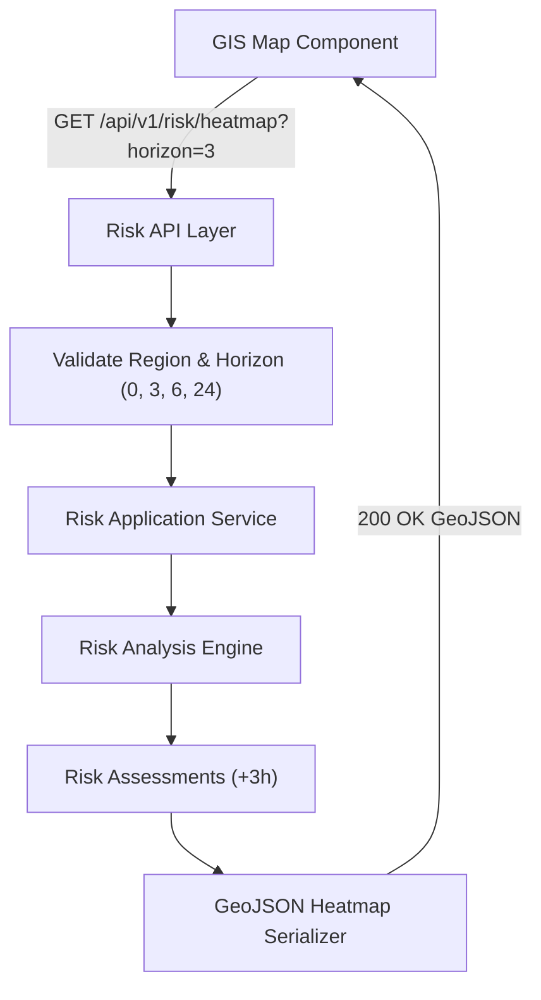
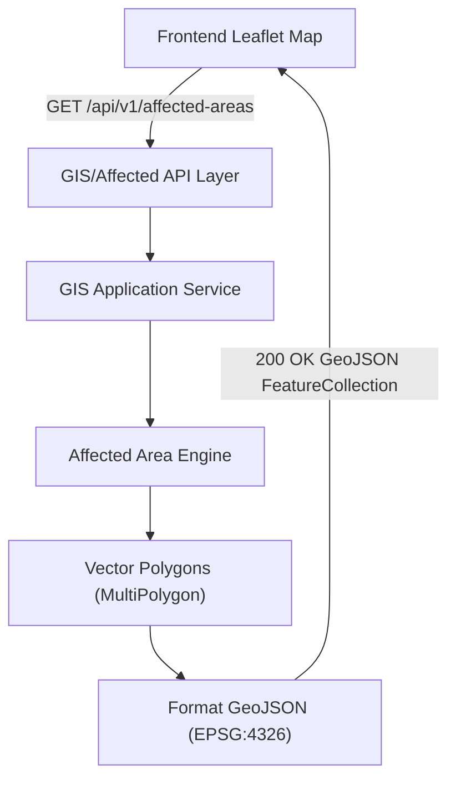
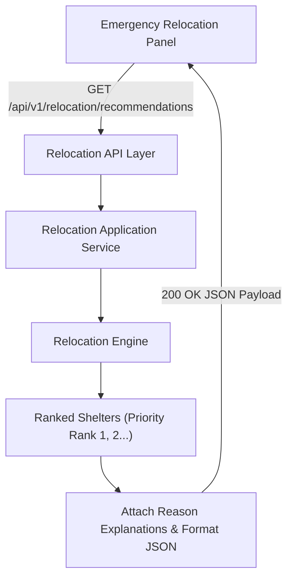
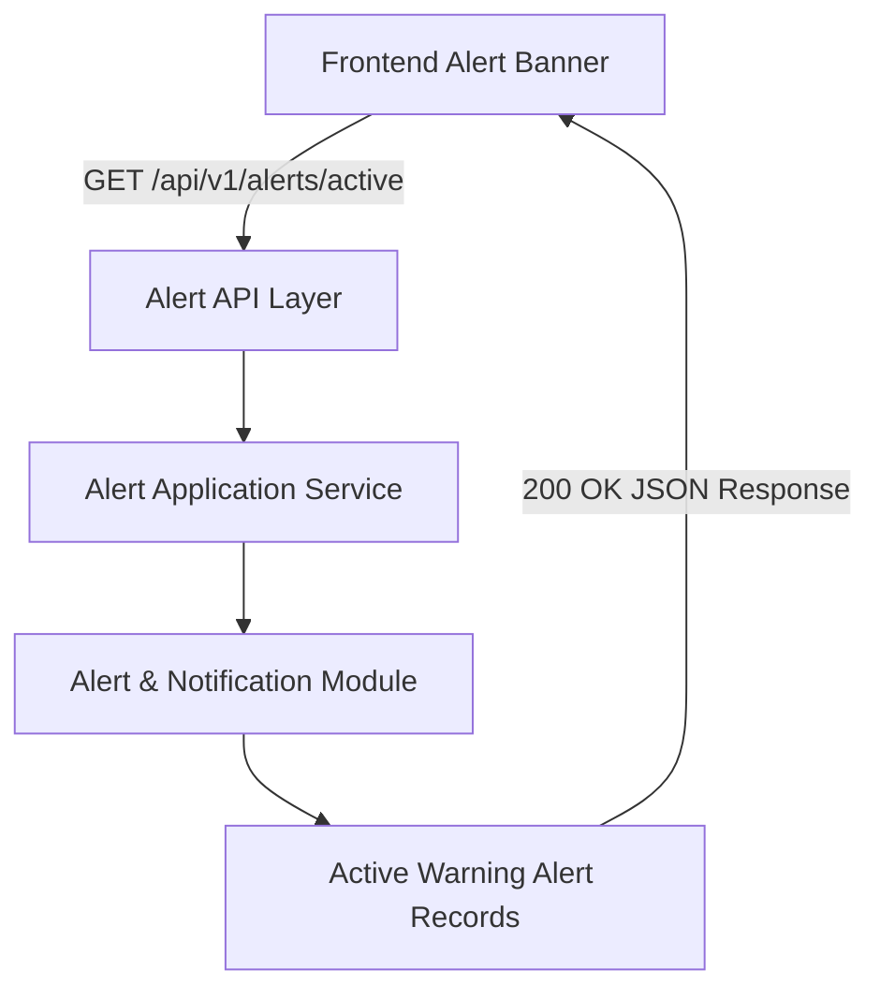
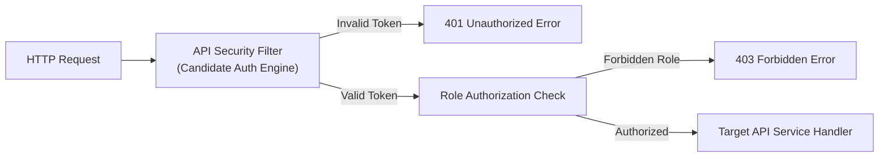

# Stage 1.9 — API Strategy Specification

**Project:** Smart Hazard Risk Prediction and Relocation System  
**Event:** Smart India Hackathon (SIH) 2026  
**Document Status:** Approved API Strategy Baseline for Stage 1 (System Design)  
**File Path:** `docs/Stage-1-System-Design/09-API-Strategy.md`

---

## Executive Summary

This document establishes the **Stage 1.9 API Strategy Specification** for the **Smart Hazard Risk Prediction and Relocation System**. Building directly upon the approved High-Level Architecture ([`01-High-Level-Architecture.md`](file:///Users/apple/Desktop/Namandeep%20Tripathi/My%20Projects/Hazard-Project/docs/Stage-1-System-Design/01-High-Level-Architecture.md)), 9-Entity Domain Model ([`02-Domain-Model.md`](file:///Users/apple/Desktop/Namandeep%20Tripathi/My%20Projects/Hazard-Project/docs/Stage-1-System-Design/02-Domain-Model.md)), Module Boundaries ([`03-Module-Boundaries.md`](file:///Users/apple/Desktop/Namandeep%20Tripathi/My%20Projects/Hazard-Project/docs/Stage-1-System-Design/03-Module-Boundaries.md)), Data Flow Specification ([`04-Data-Flow.md`](file:///Users/apple/Desktop/Namandeep%20Tripathi/My%20Projects/Hazard-Project/docs/Stage-1-System-Design/04-Data-Flow.md)), GIS Architecture ([`05-GIS-Architecture.md`](file:///Users/apple/Desktop/Namandeep%20Tripathi/My%20Projects/Hazard-Project/docs/Stage-1-System-Design/05-GIS-Architecture.md)), Risk Architecture ([`06-Risk-Architecture.md`](file:///Users/apple/Desktop/Namandeep%20Tripathi/My%20Projects/Hazard-Project/docs/Stage-1-System-Design/06-Risk-Architecture.md)), Relocation Architecture ([`07-Relocation-Architecture.md`](file:///Users/apple/Desktop/Namandeep%20Tripathi/My%20Projects/Hazard-Project/docs/Stage-1-System-Design/07-Relocation-Architecture.md)), Database Strategy ([`08-Database-Strategy.md`](file:///Users/apple/Desktop/Namandeep%20Tripathi/My%20Projects/Hazard-Project/docs/Stage-1-System-Design/08-Database-Strategy.md)), and Master Roadmap ([`SIH26191-13-Stage-Master-Roadmap.md`](file:///Users/apple/Desktop/Namandeep%20Tripathi/My%20Projects/Hazard-Project/docs/SIH26191-13-Stage-Master-Roadmap.md)), this document defines:

1. The API architecture bridging the **Frontend GIS Dashboard** with the **API & Application Layer** and internal backend modules.
2. The conceptual REST resource mapping across all 9 MVP domain entities and weather summaries.
3. GeoJSON spatial payload interchange standards for vector map layers (regions, risk grid heatmaps, affected area polygons, shelter markers).
4. Conceptual endpoints, HTTP status strategies, error structures, filtering, pagination, and caching boundaries.
5. The strict responsibility boundaries separating API use-case orchestration from internal domain computation.

---

## 1. Objective & API Architecture Overview

The primary objective of the API Strategy is to define how the application exposes backend intelligence to the web presentation layer cleanly, securely, and efficiently.

```
┌───────────────────────────────────────────────────────────────────────────────────────────┐
│                                FRONTEND PRESENTATION LAYER                                │
│                             (Leaflet / Mapbox GIS Dashboard)                              │
└─────────────────────────────────────────────┬─────────────────────────────────────────────┘
                                              │
                                              │ REST Payloads (JSON / GeoJSON EPSG:4326)
                                              v
┌───────────────────────────────────────────────────────────────────────────────────────────┐
│                                 API & APPLICATION LAYER                                   │
│  - In-Process Application Layer (Modular Monolith)                                        │
│  - Request Validation & Auth Boundary                                                     │
│  - Use-Case Orchestration & Response Shaping                                              │
└─────────────────────────────────────────────┬─────────────────────────────────────────────┘
                                              │
                                              │ Internal Application Service Invocations
                                              v
┌───────────────────────────────────────────────────────────────────────────────────────────┐
│                                 BACKEND DOMAIN MODULES                                    │
│  [GIS Module]  [Ingestion Module]  [Risk Engine]  [Affected Area]  [Relocation]  [Alert]  │
└───────────────────────────────────────────────────────────────────────────────────────────┘
```

### Core API Architectural Guarantees:
* **Modular Monolith API Layer:** The API layer operates in-process as the entry facade of the modular monolith application process. It is **NOT** a distributed API Gateway or microservices proxy.
* **Use-Case & Resource Driven:** Endpoints map cleanly to frontend GIS dashboard use-cases (e.g., fetching current risk grid, GeoJSON affected areas, ranked relocation sites) rather than generic CRUD clutter.
* **Standardized GeoJSON Format:** Spatial endpoints deliver geometries in standard **GeoJSON (WGS 84 / EPSG:4326)** payloads for direct map rendering.
* **No Premature Implementation:** Framework libraries, security implementations (JWT vs. Session), and caching tools are classified as **Candidate / TBD** for finalization in **Stage 1.10 Technology Decisions**.

---

## 2. API Architecture Style

The platform adopts a **REST-oriented HTTP API architecture** tailored for web application integration:

```
[HTTP Client / Frontend Dashboard] ──> REST Endpoints (/api/v1/...) ──> JSON / GeoJSON Payloads
```

### Architectural Principles:
* **Resource & Task Oriented:** Endpoints utilize standard HTTP verbs (`GET` for MVP read endpoints) with intuitive URL paths.
* **No Distributed Gateway Overengineering:** Avoids microservices API gateway products, GraphQL layers, or complex service meshes for the MVP.
* **Stateless API Invocations:** Requests carry explicit authentication tokens/headers when accessing protected resources, enabling stateless request processing at the application controller layer.

---

## 3. API & Application Layer Responsibility Boundary

In strict compliance with Stage 1.3 Module Boundaries, the **API & Application Layer** acts as the application orchestrator:

```
+-----------------------------------------------------------------------------------+
|                     API & APPLICATION LAYER RESPONSIBILITY                        |
+-----------------------------------------------------------------------------------+
|                                                                                   |
|  WHAT THE API LAYER OWNS:                                                         |
|  - Inbound HTTP request parsing, JSON deserialization, & validation.               |
|  - Authentication & authorization security boundary enforcement.                  |
|  - Orchestrating application service workflows across backend domain modules.      |
|  - Response payload shaping, DTO mapping, & GeoJSON formatting.                    |
|  - Exception mapping to standard HTTP error contracts.                            |
|  - Query parameter filtering & API pagination handling.                           |
|                                                                                   |
|  WHAT THE API LAYER DOES NOT OWN (DELEGATED TO MODULES):                          |
|  - Multi-factor hazard risk scoring (owned by Risk Analysis Engine).              |
|  - Spatial containment, buffer, & distance math (owned by GIS Module).            |
|  - High-risk cell clustering & polygon union (owned by Affected Area Engine).     |
|  - Shelter suitability scoring & priority ranking (owned by Relocation Engine).   |
|  - External weather feed pulling (owned by Data Ingestion Module).                |
|  - Direct SQL database access (owned by internal Data Access Layer).              |
|                                                                                   |
+-----------------------------------------------------------------------------------+
```

---

## 4. API Consumers

The API layer is designed to serve defined application clients:

* **MVP Primary Consumer:** **Frontend GIS Dashboard** — Web application rendering Leaflet/Mapbox maps, choropleths, shelter pins, emergency panels, and alert banners.
* **Future Consumers (Deferred):**
  - Mobile Emergency Response App (Field workers & evacuees).
  - External Disaster Authority Systems (State/National emergency gateways).
  - Public Emergency Alert Broadcast Subsystems.

---

## 5. Conceptual API Resource & Capability Map

The API surface maps directly to the 9 approved MVP domain entities and weather summaries:

| Domain Entity / Capability | Primary Resource Purpose | Primary Backend Module Owner | Primary Consumer | Scope |
| :--- | :--- | :--- | :--- | :--- |
| **Region** | Administrative & basin boundary vectors. | **GIS & Spatial Processing** | Dashboard Map | MVP Core |
| **Location / Grid** | Monitored spatial grid cells & coordinates. | **GIS & Spatial Processing** | Dashboard Map | MVP Core |
| **Hazard** | Catalog of supported hazards (Flood/Rainfall).| **Risk Analysis Engine** | Filter Dropdowns | MVP Core |
| **Weather Observation** | Clean weather summary & forecast freshness. | **Data Ingestion Module** | Weather Widget | MVP Core |
| **Risk Assessment** | Risk scores across 0h, +3h, +6h, +24h horizons. | **Risk Analysis Engine** | Map Heatmap | MVP Core |
| **Affected Area** | Evacuation polygons (GeoJSON MultiPolygon). | **Affected Area Engine** | Map Vector Overlay | MVP Core |
| **Relocation Site** | Registered shelter status, capacity, location.| **Relocation Engine** | Map Pins / Panel | MVP Core |
| **Relocation Recommendation**| Ranked shelter assignments with explanation. | **Relocation Engine** | Emergency Panel | MVP Core |
| **Alert** | Active warning alerts & dispatch history. | **Alert & Notification** | Alert Banner | MVP Core |

---

## 6. Conceptual Endpoint Specification

The table below outlines the conceptual REST API surface for the MVP:

| Method | Conceptual Endpoint Path | Purpose / Description | Backend Owner | Scope |
| :--- | :--- | :--- | :--- | :--- |
| `GET` | `/api/v1/regions` | List all monitored administrative Regions. | GIS Module | MVP Core |
| `GET` | `/api/v1/regions/{id}/boundary` | Fetch GeoJSON boundary polygon for a Region. | GIS Module | MVP Core |
| `GET` | `/api/v1/locations/grid` | Fetch spatial grid cell centroids & metadata. | GIS Module | MVP Core |
| `GET` | `/api/v1/hazards` | List active hazard reference catalog entries. | Risk Engine | MVP Core |
| `GET` | `/api/v1/weather/summary` | Fetch current weather summary & data freshness. | Data Ingestion | MVP Core |
| `GET` | `/api/v1/risk/assessments` | Query grid risk assessments (0h, +3h, +6h, +24h). | Risk Engine | MVP Core |
| `GET` | `/api/v1/risk/heatmap` | Fetch GeoJSON risk grid heatmap layer. | Risk Engine | MVP Core |
| `GET` | `/api/v1/affected-areas` | Query active GeoJSON evacuation polygons. | Affected Area | MVP Core |
| `GET` | `/api/v1/relocation/sites` | List registered shelters, capacity, and status. | Relocation Engine | MVP Core |
| `GET` | `/api/v1/relocation/recommendations`| Fetch ranked shelter assignments for affected zone. | Relocation Engine | MVP Core |
| `GET` | `/api/v1/alerts/active` | Retrieve currently active warning alerts. | Alert Module | MVP Core |
| `GET` | `/api/v1/alerts/history` | Query historical alert dispatch logs. | Alert Module | MVP Core |

> **Architectural Guarantee:** Endpoint paths are conceptual specifications for API design. No Java Spring controllers or implementation classes are created at this stage.

---

## 7. Risk API Strategy

The Risk API provides multi-horizon hazard risk data for map rendering:

```
GET /api/v1/risk/assessments?region_id=REG_01&forecast_horizon_hours=3
```

```
[Client Request (Horizon = +3h)] ──> [API Layer] ──> [Risk Analysis Engine]
                                                           │
                                                           v
                                              [Risk Assessment Objects]
                                              - grid_cell_id
                                              - forecast_horizon_hours (3)
                                              - normalized_risk_score (0.00 - 1.00)
                                              - derived_risk_level (Categorical String)
                                              - model_version
```

### Risk API Rules:
* **Multi-Horizon Querying:** Supports filtering risk estimates by forecast horizon (`forecast_horizon_hours` $= 0, 3, 6, 24$).
* **No Prediction Resource:** `Prediction` is **NOT** exposed as a separate API resource. Future forecasts are queried through the unified `risk/assessments` resource using horizon parameters.

---

## 8. GIS / GeoJSON API Strategy

Spatial data endpoints deliver GeoJSON payloads adhering to the canonical standard:

> *"WGS 84 (EPSG:4326) is the canonical coordinate reference system for internal spatial interchange and GeoJSON/API payloads. Inbound datasets may use different CRSs and are transformed when required during ingestion or spatial preprocessing."*

```json
{
  "type": "FeatureCollection",
  "features": [
    {
      "type": "Feature",
      "geometry": {
        "type": "MultiPolygon",
        "coordinates": [[[[85.12, 25.59], [85.14, 25.59], [85.14, 25.61], [85.12, 25.61], [85.12, 25.59]]]]
      },
      "properties": {
        "affected_area_id": "AFF_20260824_01",
        "risk_level": "CRITICAL_STATE",
        "population_exposed": 12500,
        "generated_at": "2026-08-24T20:30:00Z"
      }
    }
  ]
}
```

### GIS Interoperability Contract:
* Spatial GeoJSON payloads strictly adhere to the canonical **WGS 84 / EPSG:4326** representation (`[longitude, latitude]`). This canonical interchange standard governs API payloads and does not imply a finalized database storage/SRID implementation choice.
* The **Backend API** is authoritative for coordinate transformations, spatial containment queries, and GeoJSON serialization.
* The **Frontend GIS Map** receives clean GeoJSON features and visualizes them without executing independent spatial geometry math.

---

## 9. Relocation API Strategy

The Relocation API delivers ranked shelter assignments and transparent reasoning:

```
GET /api/v1/relocation/recommendations?affected_area_id=AFF_20260824_01
```

```json
{
  "affected_area_id": "AFF_20260824_01",
  "recommendations": [
    {
      "priority_rank": 1,
      "site_id": "SHELTER_102",
      "site_name": "Central High School Relief Shelter",
      "distance_km": 2.4,
      "available_capacity": 150,
      "max_capacity": 300,
      "suitability_reason": "Located 2.4 km from zone centroid. Ground elevation clears candidate safety checks. 150 open beds."
    },
    {
      "priority_rank": 2,
      "site_id": "SHELTER_108",
      "site_name": "Community Sports Complex",
      "distance_km": 4.1,
      "available_capacity": 300,
      "max_capacity": 500,
      "suitability_reason": "Located 4.1 km from zone centroid. High capacity facility with open beds."
    }
  ]
}
```

---

## 10. Alert API Strategy

The Alert API exposes active warning alerts for display on frontend alert banners:

```
GET /api/v1/alerts/active?region_id=REG_01
```

* **Read-Only Focus:** Exposes currently active warning alerts and recommended evacuation destinations for public/responder views based on Alert records produced by the Alert & Notification Module.
* **No Hardcoded Risk Threshold Filter:** Does not require specific numeric risk score thresholds or hardcoded risk level cutoffs in the API request.
* **Separation:** Actual SMS/Push notification dispatching is executed asynchronously by the backend `Alert & Notification Module`, not synchronously via HTTP response cycles.

---

## 11. Weather Summary API Strategy

The API layer exposes clean, aggregated weather summaries for frontend display widgets:

```
GET /api/v1/weather/summary?region_id=REG_01
```

* **Summary Exposure:** Exposes current rainfall intensity (mm/hr), 24h accumulation (mm), observation timestamp, and data freshness status.
* **No Bulk Ingestion Exposure:** Raw, unparsed weather feeds ingested from external providers are **NOT** directly exposed over public REST endpoints.

---

## 12. Region & Location Metadata API Strategy

Provides initial data required for web map bootstrapping and spatial scope selection:

```
GET /api/v1/regions                          --> Returns dropdown list of regions
GET /api/v1/regions/{id}/boundary            --> Returns GeoJSON polygon for map boundary fitting
GET /api/v1/locations/grid?region_id=REG_01  --> Returns spatial grid centroid points for region
```

---

## 13. API Filtering Strategy

Endpoints support standardized query parameters to scope data payloads:

```
GET /api/v1/risk/assessments?region_id=REG_01&hazard_type=FLOOD&forecast_horizon_hours=6
```

### Supported Filter Parameters:
* `region_id`: Scope results by administrative region.
* `forecast_horizon_hours`: Scope by forecast horizon (`0`, `3`, `6`, `24`).
* `hazard_type`: Scope by hazard catalog reference.
* `status`: Scope shelter operational status (`ACTIVE`, `FULL`).

---

## 14. API Pagination Strategy

Pagination is applied selectively to prevent large JSON payload overheads:

```json
{
  "data": [ ... ],
  "pagination": {
    "page": 1,
    "page_size": 20,
    "total_records": 85,
    "total_pages": 5
  }
}
```

### Pagination Rules:
* **Applied To:** Non-spatial tabular lists (e.g., shelter registries, historical alert logs, historical risk assessments).
* **Not Applied To:** Map layer GeoJSON endpoints (`/risk/heatmap`, `/affected-areas`). Map vector layers return bounding-box or region-scoped feature collections to maintain map layer integrity.

---

## 15. Standardized Response Payload Contracts

All API endpoints return consistent JSON payload structures:

### A. Standard Data Response Contract:
```json
{
  "success": true,
  "timestamp": "2026-08-24T20:30:00Z",
  "data": { ... }
}
```

### B. Standard GeoJSON FeatureCollection Contract:
```json
{
  "type": "FeatureCollection",
  "timestamp": "2026-08-24T20:30:00Z",
  "features": [ ... ]
}
```

---

## 16. Standardized API Error Contract

When request processing fails, the API layer returns a standardized error structure:

```json
{
  "success": false,
  "timestamp": "2026-08-24T20:30:00Z",
  "error": {
    "error_code": "RESOURCE_NOT_FOUND",
    "message": "The requested region identifier 'REG_999' was not found.",
    "details": [
      "Field 'region_id' must reference a valid active Region."
    ]
  }
}
```

### Standard Error Codes:
* `INVALID_REQUEST_PAYLOAD`: Input JSON/parameters failed validation.
* `UNAUTHORIZED_ACCESS`: Missing or invalid authentication token.
* `FORBIDDEN_OPERATION`: Authenticated user lacks permission.
* `RESOURCE_NOT_FOUND`: Target entity ID does not exist.
* `SERVICE_UNAVAILABLE`: System data feed or database unavailable.
* `INTERNAL_SERVER_ERROR`: Unhandled application exception.

---

## 17. HTTP Status Code Strategy

The API layer utilizes standard HTTP status codes:

| Status Code | Meaning | Standard Application Usage |
| :--- | :--- | :--- |
| **`200 OK`** | Success | Request succeeded; payload returned. |
| **`201 Created`** | Created | Resource successfully created. |
| **`400 Bad Request`** | Client Error | Malformed parameters or JSON validation failure. |
| **`401 Unauthorized`** | Security | Unauthenticated request accessing protected endpoint. |
| **`403 Forbidden`** | Security | Authenticated user lacks administrative role. |
| **`404 Not Found`** | Resource | Target entity ID does not exist in database. |
| **`422 Unprocessable`** | Business Error | Business rule failure. |
| **`500 Internal Error`**| Server Error | Unexpected backend engine exception. |
| **`503 Unavailable`** | Infrastructure | Database or upstream data feed unavailable. |

---

## 18. Authentication & Authorization Security Boundary

The API layer establishes the security entry point for the application:

```
[HTTP Request] ──> [API Security Filter / Interceptor] ──> [Token / Session Auth Validation]
                                                                      │
                                                                      v
                                                    [Inject Security Context into App Service]
```

### Security Responsibilities:
* **Authentication Boundary:** Validates inbound client credentials / tokens.
* **Authorization Checks:** Enforces role-based access control (RBAC) on protected capabilities.
* **Secrets Protection:** Database credentials and secrets must remain outside source control and be supplied through secure environment/configuration mechanisms.
* **Security Technology (Candidate / TBD):** Specific authentication frameworks (JWT tokens vs. HTTP Sessions vs. OAuth2) are classified as **Candidate / TBD** for Stage 1.10.

---

## 19. Public vs. Protected API Classifications

API capabilities are conceptually partitioned by operational access restrictions:

* **Currently Specified MVP Read APIs (Public / Read-Oriented):**
  - `GET /api/v1/regions`
  - `GET /api/v1/risk/heatmap`
  - `GET /api/v1/affected-areas`
  - `GET /api/v1/relocation/sites`
  - `GET /api/v1/relocation/recommendations`
  - `GET /api/v1/alerts/active`
  *(Accessible by the Frontend GIS Dashboard and public/responder users for emergency awareness).*

* **Protected Operational Capabilities (Endpoint Design TBD / Future):**
  - Shelter registration / inventory management (`POST/PUT` operations — Endpoint Design TBD / Future).
  - Shelter occupancy updates (`PUT/PATCH` operations — Endpoint Design TBD / Future).
  - Alert broadcast triggers (`POST` operations — Endpoint Design TBD / Future).
  *(Restricted operational write capabilities requiring authenticated Emergency Manager or System Admin privileges).*

---

## 20. Input Validation Rules

The API layer enforces validation before passing requests to backend domain modules:

* **ID References:** `region_id`, `site_id`, `affected_area_id` must conform to non-empty string patterns.
* **Coordinate Bounds:** Latitude must be within $[-90.0, +90.0]$; Longitude within $[-180.0, +180.0]$.
* **Forecast Horizon Values:** `forecast_horizon_hours` must strictly match $\{0, 3, 6, 24\}$.
* **Occupancy Limits:** `current_occupancy` must be an integer $\ge 0$.

---

## 21. API Performance & Payload Optimization

To maintain sub-second response times on web GIS maps:

* **Spatial Payload Compression:** GeoJSON vector coordinates are trimmed to reasonable precision decimal places to reduce transmission size.
* **Region-Scoped Querying:** GIS endpoints require a `region_id` or bounding box parameter, preventing full-table global geometric scans.
* **Lightweight DTO Serialization:** Exposes only fields required for presentation, stripping internal calculation variables.

---

## 22. API Caching Strategy

Caching boundaries balance UI performance against safety freshness requirements:

```
+------------------------------------------------------------------------------------+
|                              API CACHING STRATEGY                                  |
+------------------------------------------------------------------------------------+
|                                                                                    |
|  SAFE TO CACHE (Static Reference Data):                                            |
|  - Administrative Region Boundaries (`/api/v1/regions`)                            |
|  - Hazard Reference Catalog (`/api/v1/hazards`)                                    |
|  - Static Shelter Facility Metadata (`/api/v1/relocation/sites`)                   |
|                                                                                    |
|  DO NOT CACHE / SHORT TTL (Dynamic Safety Critical Data):                          |
|  - Real-Time & Forecast Risk Grid Heatmaps (`/api/v1/risk/heatmap`)                |
|  - Active Affected Area Evacuation Polygons (`/api/v1/affected-areas`)             |
|  - Real-Time Shelter Occupancy                                                     |
|  - Active Warning Alerts (`/api/v1/alerts/active`)                                 |
|                                                                                    |
+------------------------------------------------------------------------------------+
```

> **Candidate / TBD:** Specific caching implementations (e.g., Spring Cache, Redis, HTTP Cache-Control headers) remain **Candidate / TBD** for Stage 1.10.

---

## 23. API Versioning Strategy

The API adopts explicit URL path versioning as an architectural choice:

```
/api/v1/risk/assessments
/api/v1/relocation/recommendations
```

* **Purpose:** Ensures backward compatibility for frontend clients as system capabilities evolve across future hackathon and enterprise phases.

---

## 24. API Documentation Standard

The API strategy specifies standard contract documentation:

* **Documentation Standard:** **OpenAPI 3.0 Specification (Candidate / TBD)** is selected as the conceptual documentation standard.
* **No Premature Generation:** Actual OpenAPI YAML/JSON schema definitions or Swagger UI dependencies are deferred to implementation stages.

---

## 25. API-to-Backend Module Ownership Matrix

The matrix below maps API capabilities to backend application use-cases and owning modules:

| API Capability | Application Use-Case Orchestrated | Owning Backend Module |
| :--- | :--- | :--- |
| `GET /api/v1/regions` | Fetch administrative region boundaries. | **GIS & Spatial Processing** |
| `GET /api/v1/locations/grid` | Fetch monitored grid cell centroids. | **GIS & Spatial Processing** |
| `GET /api/v1/weather/summary` | Fetch current weather summary & freshness. | **Data Ingestion Module** |
| `GET /api/v1/risk/heatmap` | Query multi-horizon grid risk assessments. | **Risk Analysis Engine** |
| `GET /api/v1/affected-areas` | Query active high-risk evacuation polygons. | **Affected Area Engine** |
| `GET /api/v1/relocation/sites` | Query shelter infrastructure & capacity. | **Relocation Engine** |
| `GET /api/v1/relocation/recommendations`| Generate ranked shelter recommendations. | **Relocation Engine** |
| `GET /api/v1/alerts/active` | Retrieve active warning alert payloads. | **Alert & Notification** |

---

## 26. API Architecture Diagrams

### Diagram A: Frontend to API to Backend Module Flow
```mermaid
flowchart LR
    FRONTEND["Frontend GIS Dashboard\n(Leaflet/Mapbox UI)"] -->|REST Payloads\n(JSON / GeoJSON)| API_LAYER["API & Application Layer\n(Request Orchestrator)"]
    
    API_LAYER -->|Internal Calls| MOD_GIS["GIS Module"]
    API_LAYER -->|Internal Calls| MOD_ING["Ingestion Module"]
    API_LAYER -->|Internal Calls| MOD_RISK["Risk Engine"]
    API_LAYER -->|Internal Calls| MOD_AFF["Affected Area"]
    API_LAYER -->|Internal Calls| MOD_REL["Relocation Engine"]
    API_LAYER -->|Internal Calls| MOD_ALT["Alert Module"]
```

### Diagram B: Risk API Query Flow


### Diagram C: GIS / GeoJSON API Flow


### Diagram D: Relocation API Flow


### Diagram E: Alert API Flow


### Diagram F: Authentication & Security Boundary Flow


### Diagram G: Master API Architecture
```mermaid
flowchart TB
    subgraph PRESENTATION ["Presentation Layer (Frontend)"]
        UI_DASH["Frontend GIS Dashboard\n(Leaflet/Mapbox Map, Panels, Banners)"]
    end

    subgraph API_GATEWAY ["API & Application Layer (Modular Monolith)"]
        AUTH_FACADE["Security & Validation Filter"]
        
        subgraph REST_CONTROLLERS ["REST Application Surface"]
            C_GIS["GIS Interface"]
            C_WTR["Weather Interface"]
            C_RISK["Risk Interface"]
            C_AFF["Affected Area Interface"]
            C_REL["Relocation Interface"]
            C_ALT["Alert Interface"]
        end

        ERR_HANDLER["Global Error Handler & DTO Mapper"]
    end

    subgraph DOMAIN_MODULES ["Backend Domain Modules"]
        M_GIS["2. GIS & Spatial Processing"]
        M_ING["1. Data Ingestion Module"]
        M_RISK["3. Risk Analysis Engine"]
        M_AFF["4. Affected Area Engine"]
        M_REL["5. Relocation Engine"]
        M_ALT["6. Alert Module"]
    end

    UI_DASH <-->|REST HTTP (JSON / GeoJSON)| AUTH_FACADE
    AUTH_FACADE --> REST_CONTROLLERS

    C_GIS <--> M_GIS
    C_WTR <--> M_ING
    C_RISK <--> M_RISK
    C_AFF <--> M_AFF
    C_REL <--> M_REL
    C_ALT <--> M_ALT

    REST_CONTROLLERS -.->|Exceptions| ERR_HANDLER
    ERR_HANDLER -.->|Formatted Error JSON| UI_DASH
```

---

## 27. MVP Scope vs. Future API Capabilities

```
+------------------------------------------------------------------------------------+
|                                API SCOPE PARTITION                                 |
+------------------------------------------------------------------------------------+
|                     MUST HAVE (MVP API CAPABILITIES)                               |
|  - REST-oriented JSON / GeoJSON Read API Surface for Frontend Dashboard            |
|  - GeoJSON Payload Serialization (WGS 84 / EPSG:4326 Standard)                     |
|  - Multi-Horizon Risk Assessment Querying (0h, +3h, +6h, +24h)                     |
|  - GeoJSON Affected Area Polygon & Risk Heatmap Overlay Endpoints                   |
|  - Ranked Relocation Recommendation Querying with Reason Explanations              |
|  - Active Warning Alert Retrieval & Weather Summary Endpoints                      |
|  - Standardized Response & Error Payloads with Standard HTTP Status Codes          |
|  - Basic Authentication & Role Authorization Security Boundary                     |
+------------------------------------------------------------------------------------+
                                         │
                                         v
+------------------------------------------------------------------------------------+
|                     FUTURE API CAPABILITIES (DEFERRED)                             |
|  - Mobile App Citizen Evacuation Endpoints & Push Notification Gateways            |
|  - Real-Time WebSocket / Server-Sent Events (SSE) Streaming API                    |
|  - Protected Write APIs (Shelter Registration, Occupancy Update, Alert Dispatch)   |
|  - External Government System Webhooks & Integration Gateways                      |
|  - Public Open Data Developer APIs & Rate-Limiting Throttles                       |
+------------------------------------------------------------------------------------+
```

---

## 28. Open Decisions (Deferred to Stage 1.10 Technology Decisions)

The following API implementation choices remain explicitly deferred to **Stage 1.10**:

* **Exact Web Framework:** Final selection (e.g., Candidate Spring Web MVC / REST Controllers).
* **Exact Authentication Mechanism:** Final selection (e.g., Candidate JWT Tokens vs. HTTP Session vs. OAuth2).
* **Exact Authorization Framework:** Final selection (e.g., Candidate Spring Security vs. Custom Interceptors).
* **Exact GeoJSON Serialization Library:** Final selection (e.g., Candidate Jackson GeoJSON modules vs. custom serializers).
* **Exact API Documentation Tooling:** Final selection (e.g., Candidate Springdoc OpenAPI / Swagger UI).
* **Exact API Caching Implementation:** Final selection (e.g., Candidate Spring Cache / Redis / HTTP Headers).
* **Exact Rate-Limiting Mechanism:** Final selection (e.g., Candidate Bucket4j vs. Gateway Throttling).

---

## 29. Architectural Consistency Verification

* **Alignment with Stage 1.1:** Operates as an in-process REST API layer within a Modular Monolith as defined in [`01-High-Level-Architecture.md`](file:///Users/apple/Desktop/Namandeep%20Tripathi/My%20Projects/Hazard-Project/docs/Stage-1-System-Design/01-High-Level-Architecture.md).
* **Alignment with Stage 1.2:** Exposes resources matching all 9 MVP domain entities without introducing `Prediction` or `Hazard Event` resources as defined in [`02-Domain-Model.md`](file:///Users/apple/Desktop/Namandeep%20Tripathi/My%20Projects/Hazard-Project/docs/Stage-1-System-Design/02-Domain-Model.md).
* **Alignment with Stage 1.3:** Orchestrates backend application services without violating internal module boundaries as defined in [`03-Module-Boundaries.md`](file:///Users/apple/Desktop/Namandeep%20Tripathi/My%20Projects/Hazard-Project/docs/Stage-1-System-Design/03-Module-Boundaries.md).
* **Alignment with Stage 1.4:** Delivers formatted JSON/GeoJSON responses supporting the 7-stage data transformation flow as defined in [`04-Data-Flow.md`](file:///Users/apple/Desktop/Namandeep%20Tripathi/My%20Projects/Hazard-Project/docs/Stage-1-System-Design/04-Data-Flow.md).
* **Alignment with Stage 1.5:** Delivers EPSG:4326 canonical GeoJSON payloads for frontend map rendering as defined in [`05-GIS-Architecture.md`](file:///Users/apple/Desktop/Namandeep%20Tripathi/My%20Projects/Hazard-Project/docs/Stage-1-System-Design/05-GIS-Architecture.md).
* **Alignment with Stage 1.6:** Exposes multi-horizon risk assessments ($0\text{h}, +3\text{h}, +6\text{h}, +24\text{h}$) without separate prediction endpoints as defined in [`06-Risk-Architecture.md`](file:///Users/apple/Desktop/Namandeep%20Tripathi/My%20Projects/Hazard-Project/docs/Stage-1-System-Design/06-Risk-Architecture.md).
* **Alignment with Stage 1.7:** Exposes ranked relocation recommendations, proximity distances, and transparent explanations as defined in [`07-Relocation-Architecture.md`](file:///Users/apple/Desktop/Namandeep%20Tripathi/My%20Projects/Hazard-Project/docs/Stage-1-System-Design/07-Relocation-Architecture.md).
* **Alignment with Stage 1.8:** Respects logical persistence strategy and module-level table boundaries as defined in [`08-Database-Strategy.md`](file:///Users/apple/Desktop/Namandeep%20Tripathi/My%20Projects/Hazard-Project/docs/Stage-1-System-Design/08-Database-Strategy.md).
* **Alignment with Master Roadmap:** Fulfills Stage 1.9 API Strategy milestone as defined in [`SIH26191-13-Stage-Master-Roadmap.md`](file:///Users/apple/Desktop/Namandeep%20Tripathi/My%20Projects/Hazard-Project/docs/SIH26191-13-Stage-Master-Roadmap.md).

---

## 30. Final Review & Verdict

### Summary Checklist:
- **A. API Architecture Summary:** In-process REST-oriented API layer serving the Frontend GIS Dashboard within a Modular Monolith.
- **B. Resource Map:** Explicit mapping of all 9 MVP domain entities and weather summaries to API capabilities and owning modules.
- **C. Endpoint Table:** Conceptual REST endpoints for regions, grid centroids, multi-horizon risk maps, evacuation polygons, shelters, and alerts.
- **D. Risk API Strategy:** Queries multi-horizon assessments ($0\text{h}, +3\text{h}, +6\text{h}, +24\text{h}$) via unified `risk/assessments` resource.
- **E. GIS / GeoJSON Strategy:** Standard EPSG:4326 GeoJSON payloads for vector layers; backend remains authoritative for spatial processing.
- **F. Relocation API Strategy:** Delivers ranked shelter assignments, proximity distances, and human-interpretable explanations.
- **G. Alert API Strategy:** Exposes active warning alerts without threshold-dependent wording; notification dispatching remains asynchronous in the backend.
- **H. Auth Boundary:** Establishes authentication and authorization boundaries for public vs protected capabilities.
- **I. Error Contract:** Standardized JSON error payload with machine codes and human-readable messages.
- **J. Filtering & Caching:** Standardized query parameters; caching allowed for static data, prohibited for dynamic safety maps.
- **K. Module Mapping:** Direct matrix mapping API capabilities to backend module use-cases.
- **L. MVP vs Future:** Core REST Read API for web GIS dashboard in MVP; protected write endpoints, mobile APIs, and webhooks deferred.
- **M. Open Decisions:** Frameworks, auth mechanisms, caching libraries, and OpenAPI tools cleanly deferred to Stage 1.10.
- **N. Consistency Check:** 100% consistent across Stages 1.1 through 1.8 and the Master Roadmap.

---

### Final Architectural Verdict: **APPROVED**

> The **Stage 1.9 API Strategy Specification** is fully approved as the technical baseline for Stage 1 System Design. It provides a clean, robust, secure, and spatially integrated API specification ready for subsequent Repository Structure and Technology Selection stages.
