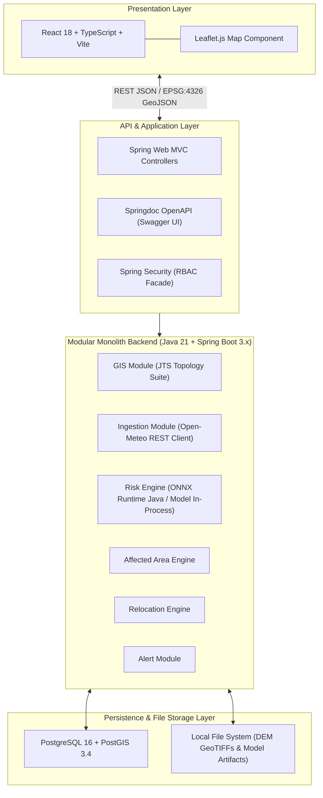
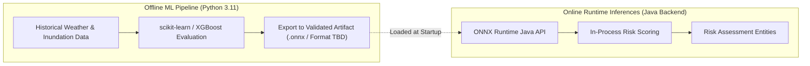

# Stage 1.10 — Technology Decisions Specification

**Project:** Smart Hazard Risk Prediction and Relocation System  
**Event:** Smart India Hackathon (SIH) 2026  
**Document Status:** Approved Final Technology Baseline for Stage 1 (System Design)  
**File Path:** `docs/Stage-1-System-Design/10-Technology-Decisions.md`

---

## Executive Summary

This document establishes the **Stage 1.10 Technology Decisions Specification** for the **Smart Hazard Risk Prediction and Relocation System**. Building directly upon the approved High-Level Architecture ([`01-High-Level-Architecture.md`](file:///Users/apple/Desktop/Namandeep%20Tripathi/My%20Projects/Hazard-Project/docs/Stage-1-System-Design/01-High-Level-Architecture.md)), 9-Entity Domain Model ([`02-Domain-Model.md`](file:///Users/apple/Desktop/Namandeep%20Tripathi/My%20Projects/Hazard-Project/docs/Stage-1-System-Design/02-Domain-Model.md)), Module Boundaries ([`03-Module-Boundaries.md`](file:///Users/apple/Desktop/Namandeep%20Tripathi/My%20Projects/Hazard-Project/docs/Stage-1-System-Design/03-Module-Boundaries.md)), Data Flow Specification ([`04-Data-Flow.md`](file:///Users/apple/Desktop/Namandeep%20Tripathi/My%20Projects/Hazard-Project/docs/Stage-1-System-Design/04-Data-Flow.md)), GIS Architecture ([`05-GIS-Architecture.md`](file:///Users/apple/Desktop/Namandeep%20Tripathi/My%20Projects/Hazard-Project/docs/Stage-1-System-Design/05-GIS-Architecture.md)), Risk Architecture ([`06-Risk-Architecture.md`](file:///Users/apple/Desktop/Namandeep%20Tripathi/My%20Projects/Hazard-Project/docs/Stage-1-System-Design/06-Risk-Architecture.md)), Relocation Architecture ([`07-Relocation-Architecture.md`](file:///Users/apple/Desktop/Namandeep%20Tripathi/My%20Projects/Hazard-Project/docs/Stage-1-System-Design/07-Relocation-Architecture.md)), Database Strategy ([`08-Database-Strategy.md`](file:///Users/apple/Desktop/Namandeep%20Tripathi/My%20Projects/Hazard-Project/docs/Stage-1-System-Design/08-Database-Strategy.md)), API Strategy ([`09-API-Strategy.md`](file:///Users/apple/Desktop/Namandeep%20Tripathi/My%20Projects/Hazard-Project/docs/Stage-1-System-Design/09-API-Strategy.md)), and Master Roadmap ([`SIH26191-13-Stage-Master-Roadmap.md`](file:///Users/apple/Desktop/Namandeep%20Tripathi/My%20Projects/Hazard-Project/docs/SIH26191-13-Stage-Master-Roadmap.md)), this document defines:

1. The finalized software, database, GIS, frontend, machine learning, and infrastructure technology stack for the SIH 2026 MVP.
2. Concrete evaluation criteria and justifications explaining why each selected technology was chosen over alternatives.
3. Strict alignment with the **Modular Monolith** architecture, ensuring low infrastructure overhead, high development velocity, and reliable offline/local laptop demonstration capabilities.
4. An explicit classification separating **Final MVP Architectural Directions** from **Implementation-Time / Data-Dependent Decisions**.
5. An explicit list of over-engineered enterprise patterns (microservices, Kafka, Kubernetes, deep learning networks) deliberately rejected for the MVP.

---

## 1. Objective & Technology Selection Philosophy

The primary objective of Stage 1.10 is to make definitive, pragmatic technology choices that transition the system design into executable implementation readiness (Stage 2 Data & GIS Foundation).

Every selection is governed by 6 strict evaluation criteria:
1. **SIH MVP Feasibility:** Can the technology be fully integrated and demonstrated reliably by August 31st?
2. **Development Velocity & Team Familiarity:** Does it leverage our team's core competencies (Java/Spring Boot, React/TypeScript, Python ML)?
3. **Low Infrastructure Overhead:** Can the complete stack run smoothly on a single laptop during live judge evaluations without external cloud dependencies?
4. **Spatial Capabilities:** Does it natively support EPSG:4326 geometry operations, point-in-polygon queries, and GeoJSON interchange?
5. **Architectural Alignment:** Does it seamlessly integrate into our approved Modular Monolith backend?
6. **Explainability & Maintainability:** Are model outputs and system operations transparent and easy to defend during SIH judge Q&A?

---

## 2. Architectural Baseline Compliance

The technology stack directly implements the approved 4-tier Modular Monolith architecture:

```
┌───────────────────────────────────────────────────────────────────────────────────────────┐
│                           FRONTEND PRESENTATION LAYER (React 18 + Leaflet)                │
└─────────────────────────────────────────────┬─────────────────────────────────────────────┘
                                              │ REST HTTP (JSON / GeoJSON EPSG:4326)
                                              v
┌───────────────────────────────────────────────────────────────────────────────────────────┐
│                      API & APPLICATION LAYER (Spring Web MVC Controllers)                 │
└─────────────────────────────────────────────┬─────────────────────────────────────────────┘
                                              │ In-Process Service Invocations
                                              v
┌───────────────────────────────────────────────────────────────────────────────────────────┐
│                    MODULAR MONOLITH BACKEND (Java 21 + Spring Boot 3.x)                   │
│  [GIS Module]   [Ingestion Module]   [Risk Engine]   [Affected Area]   [Relocation]   [Alert] │
└─────────────────────────────────────────────┬─────────────────────────────────────────────┘
                                              │
                                              v
┌───────────────────────────────────────────────────────────────────────────────────────────┐
│                   PERSISTENCE LAYER (PostgreSQL 16 + PostGIS 3.4 + Local File System)      │
└─────────────────────────────────────────────┴─────────────────────────────────────────────┘
```

> **Architectural Guarantee:** The system remains a single-process Modular Monolith. Microservice architectures, distributed service meshes, and external API gateways are strictly excluded.

---

## 3. Backend Technology Decisions

### Selected Backend Stack: **Java 21 LTS + Spring Boot 3.x + Apache Maven**

```
+------------------------------------------------------------------------------------+
|                               BACKEND STACK SELECTION                              |
+------------------------------------------------------------------------------------+
| - Programming Language: Java 21 LTS (Long-Term Support)                            |
| - Framework: Current supported Spring Boot 3.x release (Modular Monolith Process)  |
| - Build & Dependency System: Apache Maven 3.9.x                                     |
| - Runtime Environment: OpenJDK 21                                                  |
+------------------------------------------------------------------------------------+
```

### Technology Justification:
* **Java 21 LTS:** Provides modern language features (Virtual Threads, Pattern Matching, Record Classes) that simplify concurrent data ingestion and clean immutable DTO modeling while maintaining enterprise-grade stability.
* **Spring Boot 3.x:** Provides out-of-the-box support for module partitioning, dependency injection, REST controllers, data persistence, and background scheduling within a single deployable application process. The exact minor/patch version will be finalized during implementation based on the supported release compatible with the selected Java 21 LTS runtime.
* **Apache Maven:** Industry standard build tool offering deterministic dependency management, repeatable build lifecycles, and zero team learning curve.

### Evaluated Alternatives:
* **Node.js / Express (Rejected):** Lacks strong compile-time type safety for complex spatial engine calculations and multi-module monolithic domain isolation.
* **Python / FastAPI (Rejected for Monolith Backend):** Excellent for ML research, but less suitable for building robust, multi-threaded enterprise modular monolith application engines.
* **Go / Gin (Rejected):** High execution speed, but lacks rich ecosystem integrations for enterprise spatial ORM mapping and Spring-like dependency injection frameworks.
* **Gradle (Rejected for Build):** Highly flexible, but Maven's declarative `pom.xml` structure provides better team familiarity and zero build script debugging overhead during hackathon crunch.

---

## 4. Database Technology Decisions

### Selected Database Stack: **PostgreSQL 16 + PostGIS 3.4 Extension**

```
+------------------------------------------------------------------------------------+
|                               DATABASE STACK SELECTION                             |
+------------------------------------------------------------------------------------+
| - Primary Relational Database Engine: PostgreSQL 16                                 |
| - Spatial Database Extension: PostGIS 3.4                                          |
| - Primary Coordinate Reference System: WGS 84 (EPSG:4326)                          |
+------------------------------------------------------------------------------------+
```

### Technology Justification:
* **Relational ACID Excellence:** PostgreSQL 16 delivers industry-leading transactional consistency for operational shelter capacity updates (`current_occupancy`) and relational entity mappings.
* **Gold Standard Spatial Engine:** PostGIS 3.4 is the world's most advanced open-source spatial database engine. It provides native `GEOMETRY(MultiPolygon, 4326)` and `GEOMETRY(Point, 4326)` types, spatial R-Tree/GIST indexing, and spatial GeoJSON generation via `ST_AsGeoJSON()`.
* **Open-Source Accessibility:** PostgreSQL/PostGIS can be deployed locally via Docker Compose for fast developer setup.

### Evaluated Alternatives:
* **H2 + H2 Spatial (Rejected for Production/Demo):** Excellent for lightweight unit tests, but lacks PostGIS's advanced spatial aggregation capability and robust GeoJSON output functions.
* **MySQL 8.0 (Rejected):** Contains basic spatial types, but its spatial relationship functions (`ST_Intersects`, `ST_Contains`) and spatial indexing performance fall significantly short of PostGIS capabilities.
* **MongoDB / GeoJSON Indexing (Rejected):** Lacks relational ACID transactional guarantees required for shelter capacity management and multi-entity relational joins.

---

## 5. ORM & Data Access Technology Decisions

### Selected Data Access Stack: **Spring Data JPA / Hibernate + Native PostGIS Queries (Spring JDBC Template)**

```
+------------------------------------------------------------------------------------+
|                             DATA ACCESS STACK SELECTION                            |
+------------------------------------------------------------------------------------+
| - Relational Entity ORM: Spring Data JPA (Hibernate 6.x)                            |
| - High-Performance Spatial Query Engine: Spring JdbcTemplate (Native PostGIS SQL)  |
| - Spatial Primitive Type Mapping: Hibernate-Spatial 6.x                            |
+------------------------------------------------------------------------------------+
```

### Technology Justification:
* **Hybrid Approach for Maximum Efficiency:**
  1. **Spring Data JPA:** Used for standard CRUD operations and relational entity mappings (`Region`, `Relocation Site`, `Alert`, `Relocation Recommendation`).
  2. **Native JdbcTemplate + PostGIS SQL:** Used for high-performance spatial geometry union, spatial bounding box queries, and direct GeoJSON string retrieval, eliminating ORM reflection overhead for heavy map layer reads.

### Evaluated Alternatives:
* **Pure JPA / Hibernate Spatial Only (Rejected):** Heavy ORM object mapping introduces performance overhead when serializing large grid heatmaps or MultiPolygon collections.
* **MyBatis / Pure JDBC Only (Rejected):** Writing manual SQL for standard CRUD operations slows down development velocity unnecessarily.

---

## 6. Database Migration Technology Decisions

### Selected Migration Tool: **Flyway Community 10.x**

```
+------------------------------------------------------------------------------------+
|                              MIGRATION STACK SELECTION                             |
+------------------------------------------------------------------------------------+
| - Database Migration Framework: Flyway Community 10.x                              |
| - Migration Script Location: `classpath:db/migration/`                             |
| - Script Naming Convention: `V1__init_schema.sql`, `V2__seed_regions.sql`          |
+------------------------------------------------------------------------------------+
```

### Technology Justification:
* **Version-Controlled DDL:** Ensures repeatable database setup across developer laptops and demonstration environments by executing versioned SQL migration scripts (`V1__...sql`) automatically at application startup.
* **SQL First:** Allows writing clean, optimized native PostGIS DDL scripts (`CREATE EXTENSION postgis;`, spatial index creation) without XML/YAML abstraction layers.

### Evaluated Alternatives:
* **Liquibase (Rejected):** Highly powerful, but XML/YAML change-log formats add unnecessary verbosity for small development teams.
* **Spring Data `hibernate.hbm2ddl.auto=update` (Rejected for Production):** Unpredictable schema generation that can corrupt spatial column definitions or fail to create spatial PostGIS indexes properly.

---

## 7. GIS & Spatial Engine Technology Decisions

### Selected GIS Stack: **LocationTech JTS Topology Suite (Java Backend) + Leaflet.js (Frontend UI)**

```
+------------------------------------------------------------------------------------+
|                                 GIS STACK SELECTION                                |
+------------------------------------------------------------------------------------+
| - Backend Spatial Math Library: LocationTech JTS (Java Topology Suite 1.19+)      |
| - Database Spatial Engine: PostGIS 3.4                                             |
| - Frontend Web Map Renderer: Leaflet.js 1.9.x                                      |
| - Data Interchange Format: Standard GeoJSON (WGS 84 / EPSG:4326)                  |
+------------------------------------------------------------------------------------+
```

### Technology Justification:
* **JTS (Java Topology Suite):** The industry-standard pure Java spatial geometry library. Used in the backend for spatial centroid calculations, bounding box calculations, and geometry validation.
* **Strict Boundary Separation:**
  - **PostGIS:** Handles heavy spatial database filtering, spatial indexing, and polygon unions.
  - **JTS:** Handles in-memory geometry calculations inside backend application services.
  - **Leaflet.js:** Handles interactive web map rendering, marker rendering, and vector choropleths.

### Evaluated Alternatives:
* **GeoTools (Rejected for Core MVP):** Extremely comprehensive GIS suite, but introduces massive JAR dependency size and complex setup for basic vector/grid operations that JTS and PostGIS handle natively.
* **GDAL Java Wrappers (Rejected for Backend):** Requires native C++ binary bindings installed on the host OS, introducing cross-platform setup failures on developer laptops.

---

## 8. Frontend Technology Decisions

### Selected Frontend Stack: **React 18 + TypeScript + Vite**

```
+------------------------------------------------------------------------------------+
|                               FRONTEND STACK SELECTION                             |
+------------------------------------------------------------------------------------+
| - UI Framework: React 18.x                                                         |
| - Programming Language: TypeScript 5.x                                             |
| - Build Tool & Dev Server: Vite 5.x                                                |
| - State Management: React Context API + Local Component State                      |
+------------------------------------------------------------------------------------+
```

### Technology Justification:
* **Vite + React 18:** Delivers fast dev server startup, hot module replacement (HMR), and rapid production bundle compilation.
* **TypeScript:** Prevents frontend runtime crashes by enforcing strict type definitions for API responses, GeoJSON structures, shelter metadata, and risk score objects.
* **Rich Ecosystem:** Seamless integration with modern UI component libraries and web mapping frameworks.

### Evaluated Alternatives:
* **Vanilla HTML5 / JavaScript (Rejected):** Lacks component reusability and structured state management for complex emergency dashboards with interactive GIS maps, filter panels, and alert banners.
* **Next.js / Server-Side Rendering (Rejected):** Adds unnecessary SSR deployment complexity for a single-page decision-support dashboard that runs entirely as a client-side SPA communicating with a Spring Boot REST API.
* **Angular / Vue (Rejected):** Higher team learning curve or smaller ecosystem for specialized Leaflet GIS integrations compared to React.

---

## 9. Web Mapping & Visualization Technology Decisions

### Selected Map Library: **Leaflet.js 1.9.x + OpenMap Ecosystem**

```
+------------------------------------------------------------------------------------+
|                                MAP LIBRARY SELECTION                               |
+------------------------------------------------------------------------------------+
| - Web Mapping Library: Leaflet.js 1.9.x                                            |
| - React Integration Wrapper: React-Leaflet 4.x                                     |
| - Map Ecosystem: OpenStreetMap data ecosystem (Tile provider subject to terms)    |
| - Custom Map Layers: Leaflet GeoJSON Vector Overlay Layer                         |
+------------------------------------------------------------------------------------+
```

### Technology Justification:
* **Ultra-Lightweight & Reliable:** Leaflet is battle-tested, highly stable, and requires zero WebGL GPU hardware acceleration, guaranteeing smooth map rendering on presentation laptops.
* **Native GeoJSON Support:** Directly consumes backend GeoJSON payloads (`/api/v1/risk/heatmap`, `/api/v1/affected-areas`) and applies custom color styling for risk heatmaps.
* **Open Map Ecosystem:** OpenStreetMap is selected as the primary open map-data ecosystem for the MVP. The actual tile provider/hosting arrangement remains subject to provider terms, usage limits, availability, and licensing verification.

### Evaluated Alternatives:
* **MapLibre GL JS / Mapbox GL JS (Rejected for MVP):** Excellent vector tile rendering, but requires WebGL GPU hardware reliance, complex style JSON definitions, and API key management that can introduce failure modes during offline hackathon setups.
* **OpenLayers (Rejected):** Extremely feature-rich, but carries a steeper learning curve and larger library size compared to Leaflet's clean, simple API.

---

## 10. Machine Learning & Risk Model Technology Decisions

### Selected ML Approach: **Hybrid ML + Domain Rules**

```
+------------------------------------------------------------------------------------+
|                                 ML MODEL SELECTION                                 |
+------------------------------------------------------------------------------------+
| - Selected Approach: Hybrid Model (Data-Driven ML Scoring + Physical Domain Rules)  |
| - Candidate Algorithms: Random Forest, XGBoost, or another suitable tabular model  |
| - Selection Criteria: Evaluated after historical data quality/features are tested  |
| - Development Library: Python scikit-learn / XGBoost ecosystem                     |
+------------------------------------------------------------------------------------+
```

### Technology Justification:
* **Tabular Feature Efficiency:** Environmental hazard features (antecedent rainfall, elevation, slope, historical flood frequency) are tabular datasets. Tree-based ensemble models (Random Forest / Gradient Boosting) are candidate algorithms suited for tabular spatial data.
* **Explainability:** Decision trees and Random Forests provide feature importance metrics (e.g., rainfall accumulation contribution), enabling explainable risk breakdowns for emergency officers and SIH judges.
* **Data-Driven Algorithm Finalization:** The exact machine learning algorithm (Random Forest vs. XGBoost vs. another tabular model) remains a **Data-Dependent Decision** to be finalized during Stage 2 after historical data quality, label availability, and model validation scores are benchmarked.
* **Robustness to Sparse Data:** Physical heuristic rules act as safety guardrails when historical dataset records are sparse in pilot regions.

### Evaluated Alternatives:
* **Deep Learning / Neural Networks (CNN-LSTM / GNN) (Rejected for MVP):** Requires massive annotated training datasets, intensive GPU infrastructure, longer training times, and operates as a "black box" that fails SIH explainability requirements.
* **Linear Regression Only (Rejected):** Fails to capture complex non-linear interactions between heavy rainfall and steep terrain slope angles.

---

## 11. ML Language & Model Runtime Architecture

### Selected Runtime Strategy: **Offline Python Model Training $\rightarrow$ Validated Model Artifact $\rightarrow$ Java Backend Risk Inference (ONNX where practical)**

```
OFFLINE TRAINING PIPELINE (Python):
[Historical Datasets] ──> [scikit-learn / XGBoost] ──> Export to Validated Artifact (.onnx)

ONLINE INFERENCE PIPELINE (Java Backend):
[Spring Boot Startup] ──> Load Artifact File ──> [ONNX Runtime Java API] ──> In-Process In-Memory Risk Scoring
```

### Technology Justification:
* **Zero Python Microservice Overhead:** The Python environment is used *offline* by the ML developer to clean data, train models, and export the validated artifact.
* **In-Process Java Execution:** The Spring Boot backend loads the model artifact file using the official Microsoft **ONNX Runtime Java API** (`com.microsoft.onnxruntime`) where the chosen model can be reliably exported to and consumed through ONNX. If model compatibility requires another inference mechanism, the implementation stage may revise the artifact/runtime choice based on the selected algorithm.
* **Maximum Demonstration Reliability:** Eliminates inter-process HTTP IPC calls, Python environment deployment failures, and secondary service management during live SIH presentations.

### Evaluated Alternatives:
* **Separate Python FastAPI Microservice (Rejected for MVP):** Introduces secondary service container orchestration, latency overhead over HTTP IPC, and potential service startup crashes during live demos.
* **PMML (Predictive Model Markup Language) (Rejected):** Older XML format with limited support for modern gradient boosting extensions compared to ONNX.

---

## 12. Model Artifact Format

### Selected Artifact Format: **ONNX (Open Neural Network Exchange - `.onnx`) — Subject to Algorithm Compatibility**

* **Universal Compatibility:** Standardized open format supported natively by scikit-learn, XGBoost, and Java ONNX Runtime.
* **Compact Single-File Storage:** Model weights and decision trees are compiled into a single compact binary file stored in the local file system repository (`src/main/resources/models/risk_model.onnx`).
* **Compatibility Condition:** The exact artifact format is subject to verification against the finalized model algorithm selected during Stage 2 data evaluation.

---

## 13. External Data Sources & Ingestion Selection

The system ingests 4 primary categories of external data:

| Data Category | Candidate Source Provider | Data Provided | Licensing / Access Status | MVP Status | Fallback Strategy |
| :--- | :--- | :--- | :--- | :--- | :--- |
| **Weather Feeds** | **Open-Meteo API** | Real-time rainfall intensity & hourly forecast feeds. | Open API (Subject to usage terms & licensing) | MVP Core | Local Cached Mock Weather JSON |
| **Terrain / DEM** | **USGS / SRTM 30m DEM** | Digital Elevation Model GeoTIFF rasters (30m resolution). | Public Domain / Open Data | MVP Core | Pre-extracted DEM Grid Feature Files |
| **Boundaries** | **Government / OGD Boundaries**| Administrative District & Taluka vector shapefiles. | Subject to availability, coverage, & verification | MVP Core | Seeded Local GeoJSON Boundary Files |
| **Base Map Tiles**| **OpenMap Ecosystem**| Background cartographic map tiles. | Subject to provider terms & usage limits | MVP Core | Cached Local Tile Cache / Offline Tiles |

---

## 14. API Layer Technology Decisions

### Selected API Stack: **Spring Web MVC + Jackson GeoJSON + Springdoc OpenAPI 3.0**

```
+------------------------------------------------------------------------------------+
|                                 API STACK SELECTION                                |
+------------------------------------------------------------------------------------+
| - Web REST Framework: Spring Web MVC (`@RestController`)                            |
| - JSON & GeoJSON Serializer: Jackson Databind 2.16.x + Jackson-DataType-JTS        |
| - API Contract Documentation: Springdoc OpenAPI 3.0 (Swagger UI at `/swagger-ui`)  |
+------------------------------------------------------------------------------------+
```

---

## 15. Authentication & Security Technology Decisions

### Selected Security Stack: **Spring Security 6.x (Lightweight Session / HTTP Token Boundary)**

* **MVP Strategy:**
  - **Public Access:** Map rendering read endpoints (`GET /api/v1/risk/heatmap`, `/affected-areas`, `/relocation/sites`) allow anonymous public access for seamless SIH judge evaluation.
  - **Protected Access:** Administrative write capabilities utilize Spring Security with HTTP Basic / Token headers for emergency responder roles.
* **No Complex Identity Server:** Avoids complex Keycloak, OAuth2 authorization servers, or external Firebase dependencies for the MVP.

---

## 16. Caching Technology Decisions

### Selected Caching Stack: **Spring Cache + In-Memory ConcurrentHashMap (Zero External Redis Dependency)**

```
+------------------------------------------------------------------------------------+
|                               CACHING STACK SELECTION                              |
+------------------------------------------------------------------------------------+
| - Caching Framework: Spring Cache Abstraction (`@Cacheable`)                       |
| - In-Memory Provider: Simple ConcurrentHashMap Cache (`org.springframework.cache`) |
| - Cached Targets: Region Boundary Geometries, Hazard Reference Catalog              |
+------------------------------------------------------------------------------------+
```

* **Why No Redis in MVP?** Administrative boundaries and region shapefiles never change during runtime. Caching them in-memory inside Java JVM heap memory provides fast response times without requiring a separate Redis Docker container or memory service.

---

## 17. Background Processing & Scheduling Decisions

### Selected Scheduler: **Spring `@EnableScheduling` / `@Scheduled`**

* **Execution Task:** Executes periodic background tasks to pull updated weather forecasts from Open-Meteo and trigger automatic risk assessment re-evaluations across monitored grid cells.
* **Zero Infrastructure Overhead:** Runs in-process on background worker threads managed by the Spring Boot container.

---

## 18. File & Object Storage Decisions

### Selected Storage Engine: **Local File System Storage (`java.nio.file`)**

* **Storage Assets:** Digital Elevation Model GeoTIFF files (`data/dem/`), trained ONNX risk model binaries (`data/models/`), and raw ingestion backup archives.
* **MVP Rationale:** Local file system access provides fast read speed and zero cloud S3 cost or network latency during local laptop demonstrations. Cloud S3 storage is deferred to Future Enterprise Scope.

---

## 19. Containerization & Deployment Decisions

### Selected Deployment Stack: **Docker + Docker Compose**

```
+------------------------------------------------------------------------------------+
|                             DEPLOYMENT STACK SELECTION                             |
+------------------------------------------------------------------------------------+
| - Containerization: Docker (Multi-stage build for Spring Boot & React Vite)         |
| - Orchestration: Docker Compose (`docker-compose.yml`)                             |
| - Containers: Container 1 (PostgreSQL 16 + PostGIS 3.4), Container 2 (Spring Boot)|
+------------------------------------------------------------------------------------+
```

* **Single-Command Setup:** Enables building and starting the complete database and backend application via `docker-compose up` on presentation machines.

---

## 20. Testing Technology Stack

* **Backend Testing:** JUnit 5 (Unit Testing), Mockito 5 (Mocking), Spring Boot Test (Integration Testing), H2 Database (In-Memory Unit Test DB).
* **Frontend Testing:** Vitest + React Testing Library (Basic component sanity tests).

---

## 21. Observability & Logging Stack

* **Logging Framework:** SLF4J + Logback (Standard Spring Boot logging).
* **Log Outputs:** Structured console logs + rolling log files (`logs/hazard-project.log`). Complex ELK or Prometheus/Grafana stacks are excluded for the MVP.

---

## 22. Version Control & Collaboration Guidelines

* **Repository:** GitHub (`Hazard-Project`).
* **Branch Strategy:** `main` (Protected production branch), `feature/{feature-name}` (Short-lived developer working branches).
* **Workflow:** Lightweight Pull Request (PR) code reviews tailored for a 2-developer hackathon team.

---

## 23. Development Environment Specifications

```
+------------------------------------------------------------------------------------+
|                         DEVELOPMENT ENVIRONMENT SPECIFICATIONS                     |
+------------------------------------------------------------------------------------+
| - Backend IDE: IntelliJ IDEA Ultimate / Community Edition                          |
| - Frontend IDE: VS Code / IntelliJ IDEA                                            |
| - Java Development Kit: OpenJDK 21 LTS                                             |
| - Node.js Runtime: Node.js 20.x LTS + npm 10.x                                    |
| - Python Runtime: Python 3.11.x (Anaconda / venv for ML training)                 |
| - Container Engine: Docker Desktop / Podman                                        |
+------------------------------------------------------------------------------------+
```

---

## 24. Open-Source Licensing & Verification Checklist

| Dependency / Asset | License / Usage Terms | Commercial / SIH Usage Permitted? | Verification Status |
| :--- | :--- | :--- | :--- |
| **Spring Boot / Java** | Apache 2.0 | Yes | Verified Safe |
| **PostgreSQL / PostGIS** | PostgreSQL / GPL v2 | Yes | Verified Safe |
| **React / Vite / Leaflet**| MIT / BSD-2-Clause | Yes | Verified Safe |
| **scikit-learn / ONNX** | BSD-3-Clause / Apache 2.0| Yes | Verified Safe |
| **Open-Meteo API** | Open API Terms | Subject to provider terms | Licensing Subject to Verification |
| **OpenMap / OSM Tiles** | ODbL / Open Data | Subject to provider terms | Tile Hosting Subject to Verification |

---

## 25. Complete Master Technology Stack Summary

The master table below summarizes the finalized technology decisions, explicitly distinguishing **Final MVP Architectural Directions** from **Implementation-Time / Data-Dependent Decisions**:

| Layer / Component | Technology Choice | Decision Category | Primary Purpose | Evaluated Alternative | Rejection / Selection Rationale |
| :--- | :--- | :--- | :--- | :--- | :--- |
| **1. Backend Language** | **Java 21 LTS** | **Final Architectural Direction** | Primary application language. | Python / Node.js | Strong type safety, virtual threads, enterprise stability. |
| **2. Backend Framework** | **Spring Boot 3.x** | **Implementation-Time Version** | Application container & REST framework. | FastAPI / Express | Spring Boot 3.x; exact patch/minor version decided at build. |
| **3. Build Tool** | **Apache Maven 3.9** | **Final Architectural Direction** | Dependency & build management. | Gradle | Declarative XML, zero build script debugging overhead. |
| **4. Database Engine** | **PostgreSQL 16** | **Final Architectural Direction** | Relational ACID storage engine. | MySQL 8.0 | Industry standard for relational spatial integration. |
| **5. Spatial Extension** | **PostGIS 3.4** | **Final Architectural Direction** | Database spatial geometry & indexing. | H2 Spatial | Native `GEOMETRY` types, ST_AsGeoJSON, spatial indexing. |
| **6. ORM Framework** | **Spring Data JPA** | **Final Architectural Direction** | Relational entity persistence. | MyBatis | Standard object-relational mapping for domain entities. |
| **7. Spatial Data Access** | **Spring JdbcTemplate** | **Final Architectural Direction** | High-performance native spatial SQL. | Heavy ORM Querying | Eliminates ORM reflection lag for heavy spatial layers. |
| **8. Database Migration** | **Flyway 10.x** | **Final Architectural Direction** | Versioned SQL schema migrations. | Liquibase | Uses plain SQL scripts without complex XML change-logs. |
| **9. GIS Topology Engine**| **LocationTech JTS 1.19**| **Final Architectural Direction** | In-memory Java spatial calculations. | GeoTools | Pure-Java, lightweight footprint without GeoTools bloat. |
| **10. Frontend Framework**| **React 18** | **Final Architectural Direction** | Web UI component framework. | Vanilla JS / Angular | High development velocity & rich component ecosystem. |
| **11. Frontend Language** | **TypeScript 5** | **Final Architectural Direction** | Type-safe frontend programming. | JavaScript (ES6) | Prevents runtime bugs for GeoJSON & shelter DTOs. |
| **12. Frontend Build Tool**| **Vite 5** | **Final Architectural Direction** | Fast dev server & bundler. | Webpack | Rapid dev server startup and hot module reloading. |
| **13. Web Map Library** | **Leaflet.js 1.9** | **Final Architectural Direction** | Interactive web map renderer. | MapLibre GL JS | Lightweight, ultra-stable, zero WebGL requirement. |
| **14. Base Map Provider** | **OpenMap Ecosystem** | **Implementation-Time Provider**| Background cartographic map tiles. | Mapbox Vector Tiles | OpenMap ecosystem; exact tile provider subject to verification.|
| **15. ML Model Approach** | **Hybrid ML + Rules** | **Final Architectural Direction** | Tabular risk scoring & physical rules. | Deep Learning (CNN) | Top tabular accuracy, explainability, fast training. |
| **16. ML Algorithm** | **Random Forest / XGBoost**| **Data-Dependent Decision** | Tabular feature risk classification. | Deep Neural Nets | Candidate algorithms; final selection based on Stage 2 data. |
| **17. ML Dev Language** | **Python 3.11** | **Final Architectural Direction** | Offline data cleaning & model training.| Java Weka | Gold standard ecosystem for offline ML modeling. |
| **18. ML Model Runtime** | **ONNX Runtime Java** | **Conditional Decision** | In-process Java model execution. | Python Microservice | In-process execution; subject to algorithm exportability. |
| **19. Model Artifact Format**| **ONNX (`.onnx`)** | **Conditional Decision** | Compact cross-platform binary format.| `.pkl` / PMML | Portable binary artifact; subject to format compatibility. |
| **20. Weather Data Source**| **Open-Meteo API** | **Data-Dependent Source** | Real-time & forecast precipitation. | IMD Scraped Data | Candidate API; subject to provider terms & licensing. |
| **21. Terrain DEM Source** | **USGS / SRTM 30m DEM** | **Final Architectural Direction** | Elevation & slope GeoTIFF rasters. | Bhuvan DEM | Globally consistent 30m public domain elevation rasters. |
| **22. Boundary Source** | **Government / OGD** | **Data-Dependent Source** | Administrative boundary vectors. | Raw OSM Shapefiles | Candidate sources; subject to availability & coverage verification.|
| **23. REST Web Framework**| **Spring Web MVC** | **Final Architectural Direction** | REST controller endpoint surface. | Jersey | Native integration with Spring Boot container. |
| **24. API Documentation** | **Springdoc OpenAPI 3.0**| **Final Architectural Direction** | Swagger UI API documentation. | Manual Docs | Auto-generates interactive UI at `/swagger-ui`. |
| **25. Authentication** | **Spring Security 6** | **Final Architectural Direction** | Basic token & RBAC security facade. | Keycloak / OAuth2 | Simple RBAC boundary without heavy OAuth servers. |
| **26. Caching Provider** | **Spring ConcurrentHashMap**| **Final Architectural Direction** | In-memory static data caching. | Redis Cluster | Zero container overhead for static region shapefiles. |
| **27. Task Scheduler** | **Spring `@Scheduled`** | **Final Architectural Direction** | In-process background polling. | Quartz Scheduler | Simple annotations; zero DB table configuration. |
| **28. File / Object Storage**| **Local File System** | **Final Architectural Direction** | Storage for DEM rasters & ONNX files. | AWS S3 Cloud | Fast local file access with zero cloud cost for SIH MVP. |
| **29. Deployment Engine** | **Docker Compose** | **Final Architectural Direction** | Single-command container setup. | Kubernetes | Enables simple containerized local setup (`docker-compose up`).|

---

## 26. Technology Decision Matrix

```
+-------------------------------------------------------------------------------------------------------------------+
|                                            TECHNOLOGY DECISION MATRIX                                             |
+-------------------+----------------------------+-----------------------+------------------------------------------+
| Technology Area   | Candidate Options Evaluated| Selection / Category  | Key Selection Rationale                  |
+-------------------+----------------------------+-----------------------+------------------------------------------+
| Backend           | Java/Spring, Python, Node  | **Java 21 + Spring**  | Strong type safety, Modular Monolith fit |
| Database          | PostgreSQL, MySQL, SQLite  | **PostgreSQL 16**     | Enterprise ACID & spatial integration    |
| Spatial Database  | PostGIS, H2 Spatial        | **PostGIS 3.4**       | Industry gold-standard spatial engine    |
| GIS Library       | JTS, GeoTools, GDAL        | **LocationTech JTS**  | Lightweight pure-Java spatial topology   |
| Frontend UI       | React, Angular, Vue        | **React 18 + Vite**   | High dev velocity & component ecosystem  |
| Web Mapping       | Leaflet, MapLibre, OpenLayers| **Leaflet.js 1.9**   | Ultra-lightweight, reliable demo rendering|
| ML Model          | Random Forest, XGBoost, Rules| **Hybrid ML + Rules**| High tabular accuracy & explainability   |
| ML Algorithm      | Random Forest, XGBoost     | **Data-Dependent**    | Finalized in Stage 2 based on data test  |
| ML Runtime        | In-Process ONNX, FastAPI   | **ONNX Runtime Java** | Conditional on algorithm ONNX export     |
| Weather API       | Open-Meteo, IMD, AccuWeather| **Open-Meteo API**   | Candidate API; subject to provider terms |
| Boundary Source   | Govt / OGD, Survey of India| **Data-Dependent**    | Subject to coverage & licensing check    |
| Caching           | Spring Cache, Redis        | **Spring In-Memory**  | Zero external container deployment bloat |
| Deployment        | Docker Compose, Kubernetes | **Docker Compose**    | Simple setup (`docker-compose up`)        |
+-------------------+----------------------------+-----------------------+------------------------------------------+
```

---

## 27. Architecture-to-Technology Mapping Diagram





---

## 28. Why This Technology Stack Fits SIH 2026 Perfectly

1. **Fast Development Velocity:** Java/Spring Boot and React/Vite enable our 2-developer team to build clean, type-safe modules with fast development feedback.
2. **Reliable Local Laptop Demonstration:** Running PostgreSQL/PostGIS and Spring Boot via Docker Compose provides low infrastructure overhead, making it suitable for laptop-based demonstration during live judge evaluations.
3. **Transparent Explainability for Judges:** Using tabular tree models (Random Forest / XGBoost candidates) and transparent relocation suitability reasoning allows us to explain *why* specific risks and shelters were calculated.
4. **Real GIS Depth:** Using PostGIS and JTS proves to judges that our platform performs legitimate spatial geometry calculations rather than basic mock hardcoded coordinates.

---

## 29. What We Are Deliberately NOT Using (Architectural Rejections)

To protect the project from scope creep and deployment failures, we explicitly reject the following over-engineered patterns for the MVP:

* ❌ **Microservices Architecture:** Rejected to avoid complex distributed network latencies, IPC failures, and multi-repository management.
* ❌ **Kafka / RabbitMQ Message Brokers:** Rejected because in-process Spring Event publishing satisfies all intra-monolith module communication needs.
* ❌ **Kubernetes / Helm Charts:** Rejected as completely unnecessary for a local demonstration deployment.
* ❌ **Redis Cache Cluster:** Rejected because Spring's in-memory `ConcurrentHashMap` handles static region shapefiles without requiring external container memory overhead.
* ❌ **Deep Learning / Convolutional Neural Networks:** Rejected due to black-box opacity, high GPU resource demands, and sparse historical flood image training data.
* ❌ **Python Microservice for ML Inference:** Rejected in favor of in-process Java model artifact execution to eliminate inter-process HTTP IPC latency.

---

## 30. Implementation Boundary

> **STRICT ARCHITECTURAL BOUNDARY:** Stage 1.10 completes the **System Design Phase (Stage 1)**. It finalizes all technology decisions conceptually. No Java source code, Spring controllers, JPA entities, database migrations, SQL scripts, Dockerfiles, or React components have been created. Implementation begins strictly in **Stage 2 — Data & GIS Foundation**.

---

## 31. Architectural Consistency Audit

* [x] **Modular Monolith Baseline Intact:** The backend remains a single-process Spring Boot application ([`01-High-Level-Architecture.md`](file:///Users/apple/Desktop/Namandeep%20Tripathi/My%20Projects/Hazard-Project/docs/Stage-1-System-Design/01-High-Level-Architecture.md)).
* [x] **Domain Entity Integrity:** All 9 core MVP domain entities are fully mapped to the persistence layer without introducing `Prediction` or `Hazard Event` ([`02-Domain-Model.md`](file:///Users/apple/Desktop/Namandeep%20Tripathi/My%20Projects/Hazard-Project/docs/Stage-1-System-Design/02-Domain-Model.md)).
* [x] **Module Boundaries Respected:** Primary entity ownership remains assigned to respective backend modules ([`03-Module-Boundaries.md`](file:///Users/apple/Desktop/Namandeep%20Tripathi/My%20Projects/Hazard-Project/docs/Stage-1-System-Design/03-Module-Boundaries.md)).
* [x] **GIS Standard Maintained:** GeoJSON EPSG:4326 is enforced for API interchange ([`05-GIS-Architecture.md`](file:///Users/apple/Desktop/Namandeep%20Tripathi/My%20Projects/Hazard-Project/docs/Stage-1-System-Design/05-GIS-Architecture.md)).
* [x] **Risk & Relocation Architecture Aligned:** Multi-horizon risk scoring ($0\text{h}, +3\text{h}, +6\text{h}, +24\text{h}$) and transparent shelter recommendations are supported ([`06-Risk-Architecture.md`](file:///Users/apple/Desktop/Namandeep%20Tripathi/My%20Projects/Hazard-Project/docs/Stage-1-System-Design/06-Risk-Architecture.md), [`07-Relocation-Architecture.md`](file:///Users/apple/Desktop/Namandeep%20Tripathi/My%20Projects/Hazard-Project/docs/Stage-1-System-Design/07-Relocation-Architecture.md)).
* [x] **Database & API Strategy Finalized:** PostgreSQL/PostGIS, Flyway, and REST APIs fulfill Stage 1.8 & 1.9 strategy blueprints ([`08-Database-Strategy.md`](file:///Users/apple/Desktop/Namandeep%20Tripathi/My%20Projects/Hazard-Project/docs/Stage-1-System-Design/08-Database-Strategy.md), [`09-API-Strategy.md`](file:///Users/apple/Desktop/Namandeep%20Tripathi/My%20Projects/Hazard-Project/docs/Stage-1-System-Design/09-API-Strategy.md)).
* [x] **Master Roadmap Milestone Achieved:** Stage 1 System Design is 100% complete ([`SIH26191-13-Stage-Master-Roadmap.md`](file:///Users/apple/Desktop/Namandeep%20Tripathi/My%20Projects/Hazard-Project/docs/SIH26191-13-Stage-Master-Roadmap.md)).

---

## 32. Final Review & Verdict

### Summary Checklist:
- **A. Executive Summary:** Technology stack finalized and optimized for SIH MVP feasibility.
- **B. Architectural Baseline:** Modular Monolith architecture strictly preserved.
- **C. Backend Stack:** Java 21 LTS + Spring Boot 3.x + Maven.
- **D. Database & GIS Stack:** PostgreSQL 16 + PostGIS 3.4 + LocationTech JTS + Leaflet.js.
- **E. Frontend Stack:** React 18 + TypeScript + Vite.
- **F. Machine Learning Stack:** Hybrid ML + Rules (Candidate algorithms: Random Forest, XGBoost, tabular models evaluated in Stage 2).
- **G. Data Sources:** Open-Meteo API (Candidate), USGS SRTM 30m DEM, Government/OGD boundaries (Candidate), OpenMap ecosystem (Candidate).
- **H. Deployment Stack:** Docker Compose for single-command local demonstration.
- **I. Architectural Rejections:** Microservices, Kafka, Kubernetes, Redis, and Deep Learning explicitly rejected.
- **J. Consistency Audit:** 100% consistent across all Stage 1 design specifications and Master Roadmap.

---

### Final Architectural Verdict: **APPROVED**

> **STAGE 1 SYSTEM DESIGN IS OFFICIALLY COMPLETE AND APPROVED.**  
> The **Stage 1.10 Technology Decisions Specification** completes Stage 1. System design is locked, fully consistent, and ready for transition to **Stage 2 — Data & GIS Foundation**.
